

這是我在高二上進行的自主學習的報告分享，也就是在全高一面前（學弟妹們）分享我的成果！這篇的主題是：「從零開始製作一款遊戲 — 溶蝕」，其實內容很有趣，有興趣的歡迎查看下面的所有資訊喔！

## YouTube 影片鏈結：

<iframe width="100%" height="468" src="https://www.youtube.com/embed/RA4pnzebwfU?si=JGXcD2jF5nYKwxvo" title="YouTube video player" frameborder="0" allow="accelerometer; autoplay; clipboard-write; encrypted-media; gyroscope; picture-in-picture; web-share" referrerpolicy="strict-origin-when-cross-origin" allowfullscreen></iframe>

## 簡報資訊：

| 欄位     | 說明 |
|----------|------|
| 標題     | Discord Bot—一隻北極企鵝 |
| 內容     | 功能示意、程式畫面、錯誤紀錄等等|
| 簡報頁數  | 共 31 頁 |
| 來源     | [pg72.tw](https://pg72.tw/posts/sdlearning-11401/) |
| 作者     | PGpenguin72 |
| 簡報軟體  | [Presenterm](https://github.com/mfontanini/presenterm) |
| 檔案下載  | [MD](https://file.pg72.tw/share/nj0aZsBh) |

## 簡報軟體鏈結：
::github{repo="mfontanini/presenterm"}

## 簡報預覽（用網頁模擬）：

<section class="slide align-center middle center-all fs-3">

<h1>從零開始製作一款遊戲 溶蝕</h1>

author. 杜昱叡

<footer class="slide-footer">
  https://pg72.tw/
  自主學習簡報 @pg_penguin_72
  1 / 25
</footer></section>

<section class="slide fs-2">

<h2>我是誰？</h2>

<h2>杜昱叡</h2>
<ul>
<li>AHSNCCU11313 [#116學測生]</li>
<li>一隻神奇的PG企鵝(來自<em>台中市</em>)</li>
<li>喜歡🎮打音遊,🎵聽音樂,🏸打羽球,💻寫程式</li>
</ul>
<blockquote>
我的Instagram: @pg_penguin_72
</blockquote>

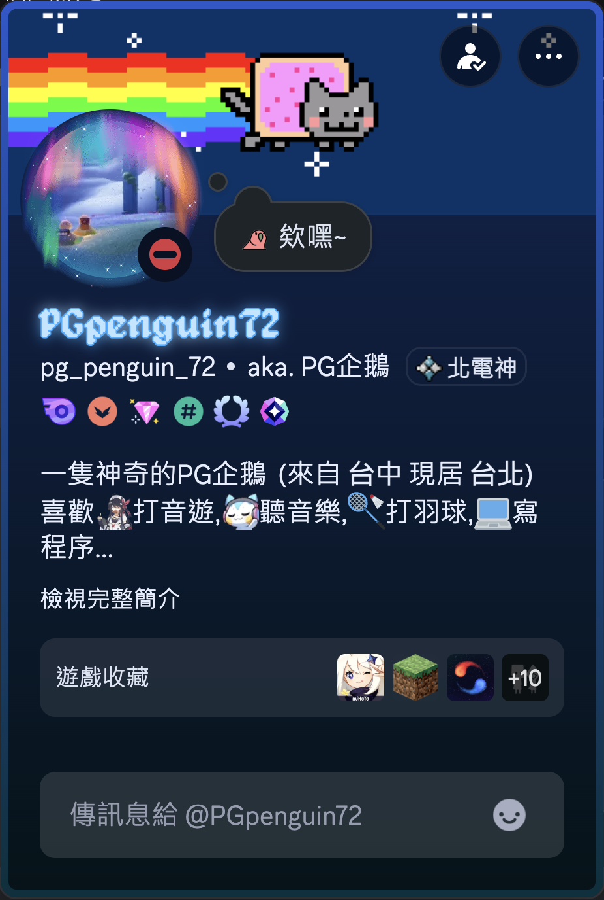

<footer class="slide-footer">
  https://pg72.tw/
  自主學習簡報 @pg_penguin_72
  2 / 25
</footer></section>

<section class="slide fs-2">

<h2>溶蝕 是什麼？</h2>

<blockquote>
溶蝕 是一款我們極區工作室開發的恐怖遊戲
</blockquote>
<ul>
<li>暑假開始籌備，預計製作一年。</li>
<li>2D遊戲，操作簡單，有解謎元素。</li>
<li>正常世界和不正常世界的交錯，異常藏在日常中。</li>
<li>不同選擇，會有不同結局。</li>
</ul>

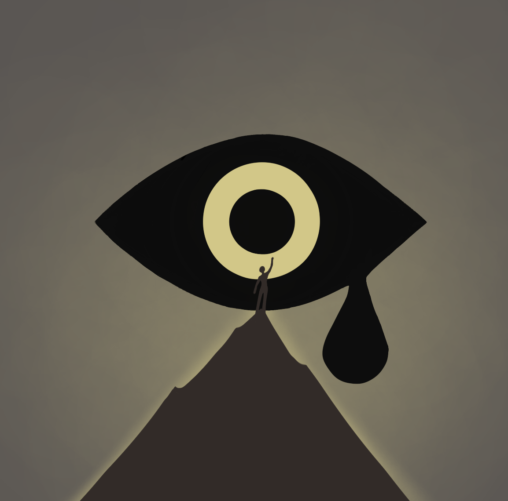

<footer class="slide-footer">
  https://pg72.tw/
  自主學習簡報 @pg_penguin_72
  3 / 25
</footer></section>

<section class="slide align-center middle fs-4">

<h2>自主學習我做了啥？</h2>
<h1>製作這款遊戲.......嗎？</h1>

<footer class="slide-footer">
  https://pg72.tw/
  自主學習簡報 @pg_penguin_72
  4 / 25
</footer></section>

<section class="slide fs-2">

<h2>製作歷程</h2>

<code>暑假（理想）</code>

🌰 高密度討論、Demo成形、我們相信做得出來

🌰 架好Unity／Git／Discord，專案正式啟動

<code>升高二後（現實）</code>

🕰 課業＋補習擠滿生活

📉 會議延期、Unity打開次數下降

🧠 專注力被切碎，專案幾乎停擺

<code>現在</code>

《溶蝕》不是被放棄，它只是被生活慢慢「溶蝕」了

<footer class="slide-footer">
  https://pg72.tw/
  自主學習簡報 @pg_penguin_72
  5 / 25
</footer></section>

<section class="slide align-center middle fs-3">

<h2>這時候就一定會有人說</h2>
<h3>你都沒做遊戲了，那你要講什麼？</h3>
<h1>&gt;謝謝大家聽我的分享！</h1>

<footer class="slide-footer">
  https://pg72.tw/
  自主學習簡報 @pg_penguin_72
  6 / 25
</footer></section>

<section class="slide align-center middle fs-3">

<h2>經驗分享</h2>

好剛剛那段是開玩笑的

那既然遊戲沒東西可講的話，那我們來換主題吧~

<footer class="slide-footer">
  https://pg72.tw/
  自主學習簡報 @pg_penguin_72
  7 / 25
</footer></section>

<section class="slide align-center middle center-all fs-3">

<h1>斜槓學習 不做遊戲做小專案</h1>

author. 杜昱叡

<footer class="slide-footer">
  https://pg72.tw/
  自主學習簡報 @pg_penguin_72
  8 / 25
</footer></section>

<section class="slide fs-3">

<h2>專案介紹</h2>

自主學習簽到

館藏查詢系統

合作社熱食系統

113餐飲系統

<footer class="slide-footer">
  https://pg72.tw/
  自主學習簡報 @pg_penguin_72
  9 / 25
</footer></section>

<section class="slide fs-3">

<h2>專案介紹</h2>

<h1>自主學習簽到</h1>
館藏查詢系統

合作社熱食系統
<h1>113餐飲系統</h1>

<footer class="slide-footer">
  https://pg72.tw/
  自主學習簡報 @pg_penguin_72
  10 / 25
</footer></section>

<section class="slide fs-2">

<h2>專案一</h2>
<h3>自主學習簽到系統</h3>
<blockquote>
發想來源：小老師，點名累，學生自主簽到。
</blockquote>
<blockquote>
花了多久時間？從測試到發布，只花了2天。
</blockquote>
<blockquote>
有什麼特色？可以輸入班級座號簽到，或刷學生證。
</blockquote>

<footer class="slide-footer">
  https://pg72.tw/
  自主學習簡報 @pg_penguin_72
  11 / 25
</footer></section>

<section class="slide fs-2">

<h2>相關照片</h2>
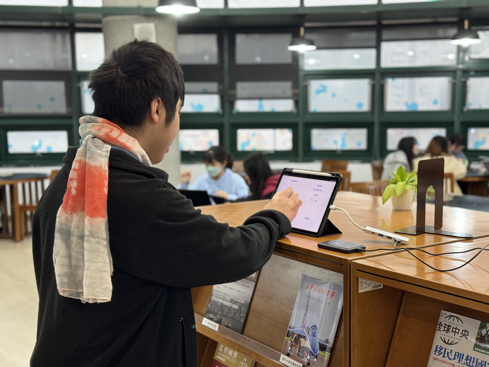

<footer class="slide-footer">
  https://pg72.tw/
  自主學習簡報 @pg_penguin_72
  12 / 25
</footer></section>

<section class="slide fs-2">

<h2>專案二</h2>
<h3>113餐飲系統</h3>
<blockquote>
發想來源：班上正好有這個需求，就請我幫忙了
</blockquote>
<blockquote>
花了多久時間？一個禮拜（vibe coding）。
</blockquote>
<blockquote>
有什麼特色？從點餐收銀 製餐備餐 取餐叫號 一個系統就搞定
</blockquote>

<footer class="slide-footer">
  https://pg72.tw/
  自主學習簡報 @pg_penguin_72
  13 / 25
</footer></section>

<section class="slide fs-2">

<h2>相關數據</h2>
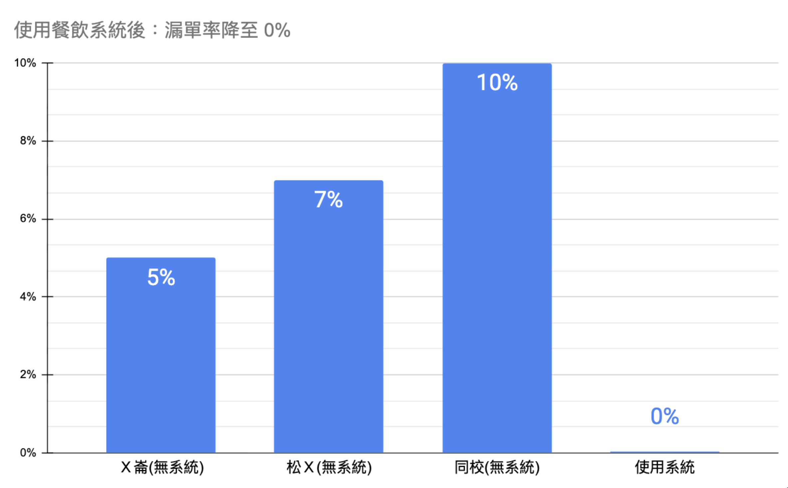

<footer class="slide-footer">
  https://pg72.tw/
  自主學習簡報 @pg_penguin_72
  14 / 25
</footer></section>

<section class="slide fs-2">

<h2>相關照片</h2>

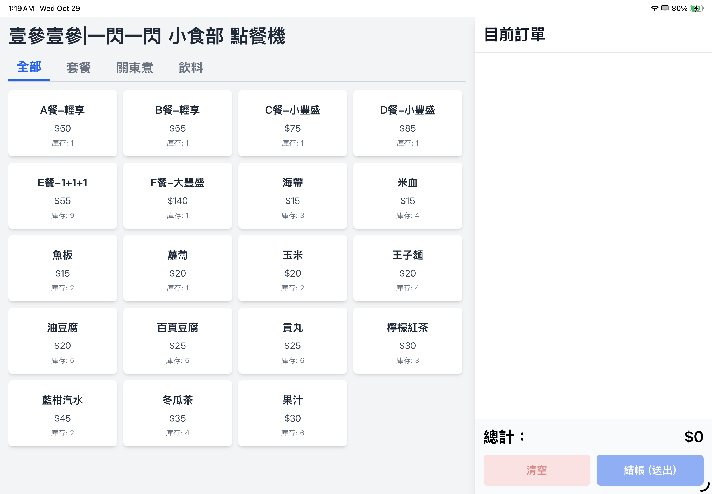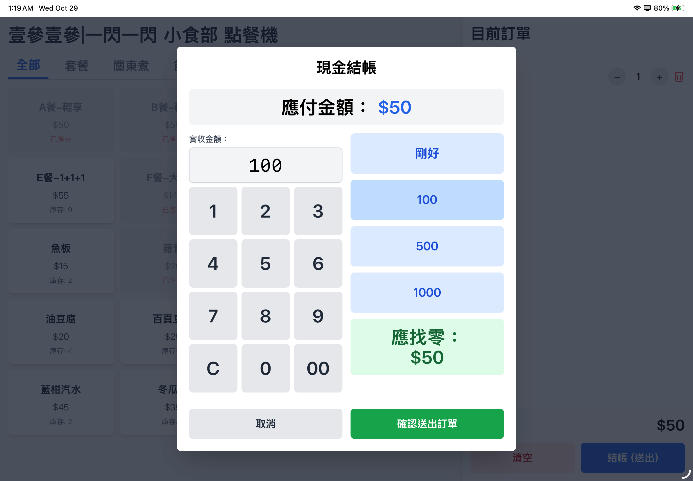

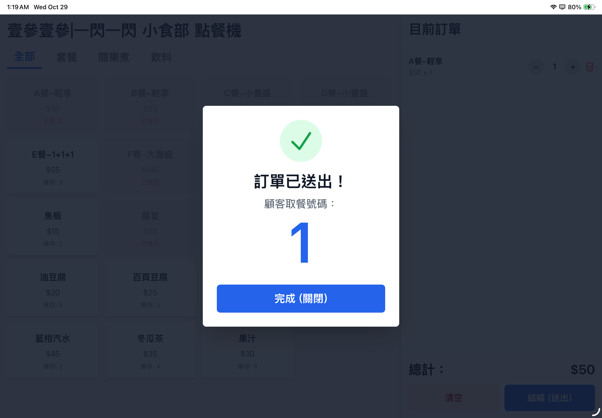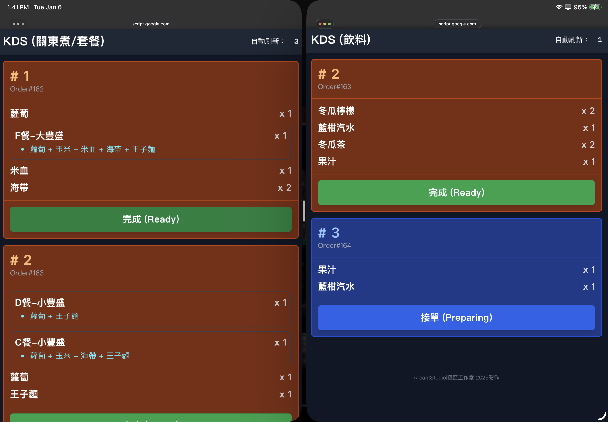

<footer class="slide-footer">
  https://pg72.tw/
  自主學習簡報 @pg_penguin_72
  15 / 25
</footer></section>

<section class="slide fs-2">

<h2>相關照片</h2>

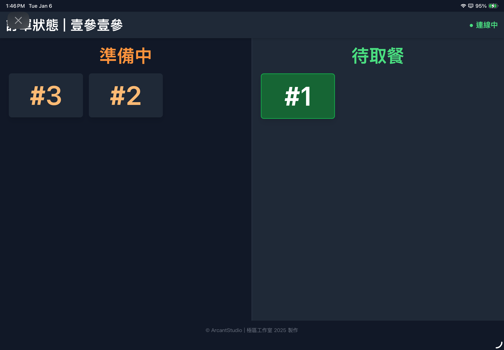

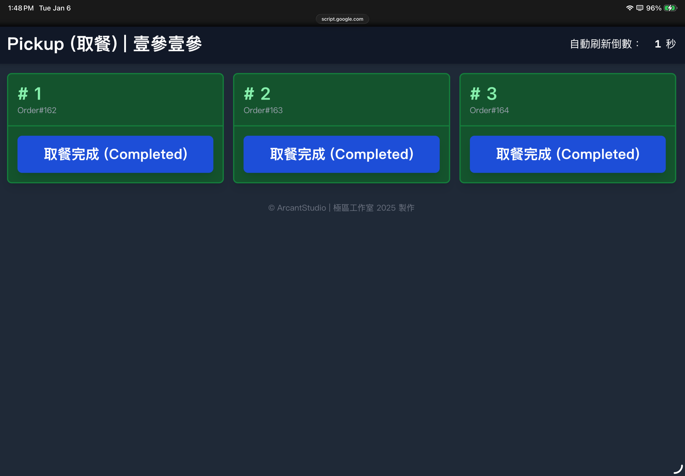

<footer class="slide-footer">
  https://pg72.tw/
  自主學習簡報 @pg_penguin_72
  16 / 25
</footer></section>

<section class="slide fs-2">

<h2>相關照片</h2>

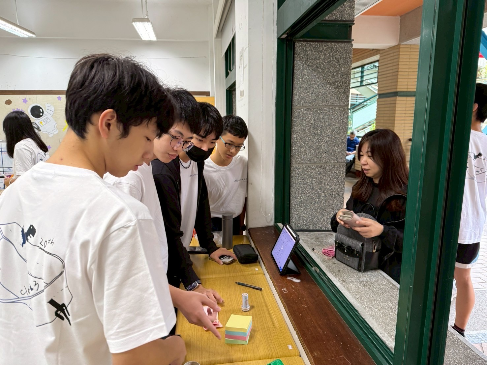

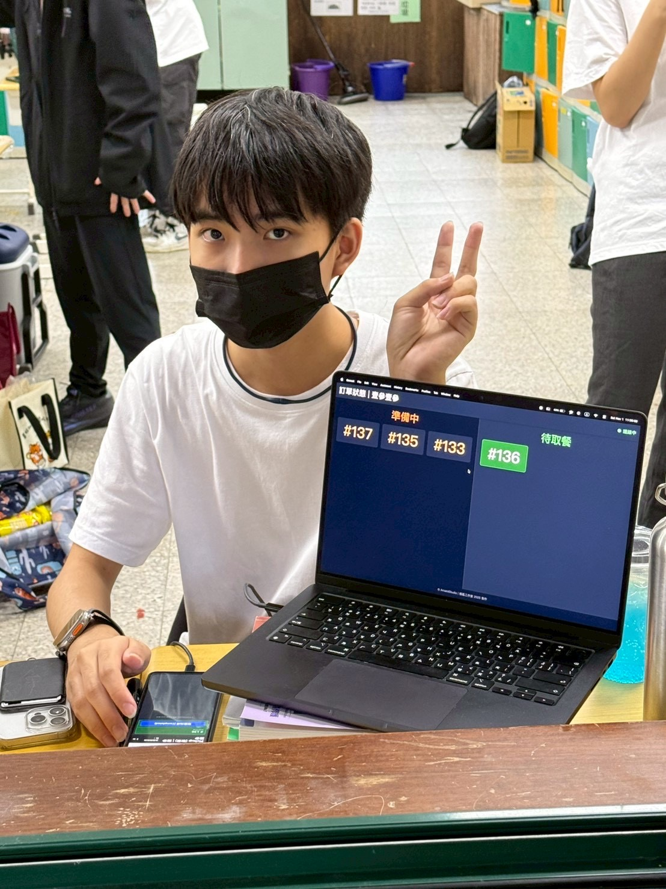

<footer class="slide-footer">
  https://pg72.tw/
  自主學習簡報 @pg_penguin_72
  17 / 25
</footer></section>

<section class="slide fs-1">

<h2>Vibe Coding 介紹</h2>
<blockquote>
簡介:
</blockquote>
<pre><code>\x1b[2J\x1b[H\x1b[?25l\x1b[31m[presenterm]\x1b[0m  L0AD1NG: ./selfstudy.md
\x1b[33m[presenterm]\x1b[0m  WARN: unknown key `f0nt_size` → ignored (??)
\x1b[31m[presenterm]\x1b[0m  ERROR: invalid UTF-8 sequence at byte 0xC3 0x28  (Ã( ���)
...
[presenterm] FATAL: parser blew up
reason: malformed byte sequence
...
thread 'main' panicked at 'called `Option::unwrap()` on a `None` value'</code></pre>

<footer class="slide-footer">
  https://pg72.tw/
  自主學習簡報 @pg_penguin_72
  18 / 25
</footer></section>

<section class="slide fs-2">

<h2>Vibe Coding 介紹</h2>
<h3>PGpenguin72:</h3>

我的簡報壞掉啦！！！ 幫我修好簡報！

<h3>ChatGPT:</h3>

我已經幫你把簡報的 Encoding 問題修好了。

這版應該可以正常跑起來。

要不要我順便幫你把版面和節奏也美化一下？

<footer class="slide-footer">
  https://pg72.tw/
  自主學習簡報 @pg_penguin_72
  19 / 25
</footer></section>

<section class="slide fs-2 vibe-compact">

<h2>Vibe Coding 介紹</h2>
<blockquote>
定義：
</blockquote>
<ul>
<li>跟「AI對話」寫/修程式</li>
<li>先跑起來，再逐步變好</li>
<li>反覆：描述 → 生成 → 測試 → 回報 → 收斂</li>
</ul>
<blockquote>
剛剛那段其實就是：
</blockquote>
<ul>
<li>log（描述現況）</li>
<li>AI 給最短修法（生成方案）</li>
<li>我重跑驗證（測試）</li>
<li>回報結果（回饋）</li>
<li>AI 再收斂下一步（迭代）</li>
</ul>
<h1>Vibe Coding 讓每個人都可以是程式設計師</h1>

<footer class="slide-footer">
  https://pg72.tw/
  自主學習簡報 @pg_penguin_72
  20 / 25
</footer></section>

<section class="slide fs-2">

<h2>心得</h2>
<h1>以上我想說的是：</h1>
<blockquote>
現實可能沒辦法跟預期一樣完美，但只要有前進，都是好事。
</blockquote>
<blockquote>
AI是工具，善用工具會增加效率，而且還可以把想像變成現實。
</blockquote>
<blockquote>
嘗試各種東西增加自己知識儲備量，累積經驗，對自己未來有超多幫助！
</blockquote>
<blockquote>
學程式要多多實作，讓科技運用到生活之中。
</blockquote>

<footer class="slide-footer">
  https://pg72.tw/
  自主學習簡報 @pg_penguin_72
  21 / 25
</footer></section>

<section class="slide">

<h2>心得</h2>
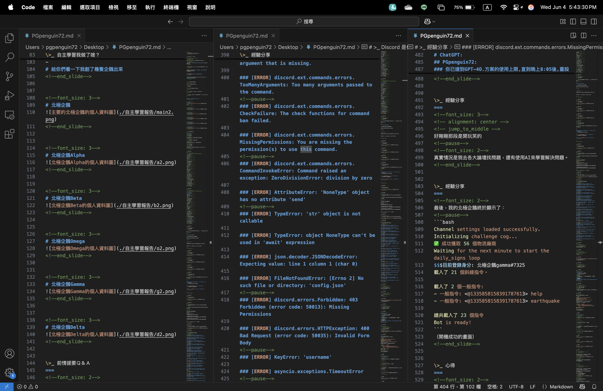

<footer class="slide-footer">
  https://pg72.tw/
  自主學習簡報 @pg_penguin_72
  22 / 25
</footer></section>

<section class="slide fs-2">

<h2>補充</h2>

我在去年創建了一個DC新社群，主要是讓大家有一個ZeroJudge題目討論空間。

我們每天都會發至少1-2題，假日更會有APCS的題目可以練習。

<footer class="slide-footer">
  https://pg72.tw/
  自主學習簡報 @pg_penguin_72
  23 / 25
</footer></section>

<section class="slide fs-2">

<h2>補充</h2>

我在去年創建了一個DC新社群，主要是讓大家有一個ZeroJudge題目討論空間。

我們每天都會發至少1-2題，假日更會有APCS的題目可以練習。

每個題目都有難易度分類，有大佬在群就可以一起互相討論。

只要你對資訊程式有興趣的話，

<footer class="slide-footer">
  https://pg72.tw/
  自主學習簡報 @pg_penguin_72
  24 / 25
</footer></section>

<section class="slide fs-2">

<h2>補充</h2>

我在去年創建了一個DC新社群，主要是讓大家有一個ZeroJudge題目討論空間。

我們每天都會發至少1-2題，假日更會有APCS的題目可以練習。

每個題目都有難易度分類，有大佬在群就可以一起互相討論。

只要你對資訊程式有興趣的話，趕快掃描這個QRcode來一起寫程式吧！

<h1>&gt;謝謝大家聽我的分享！</h1>

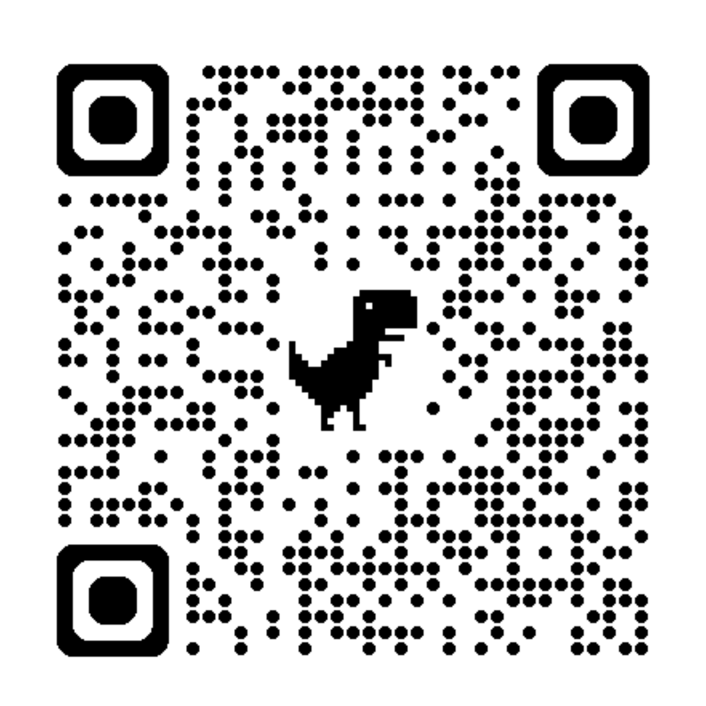

<footer class="slide-footer">
  https://pg72.tw/
  自主學習簡報 @pg_penguin_72
  25 / 25
</footer></section>

