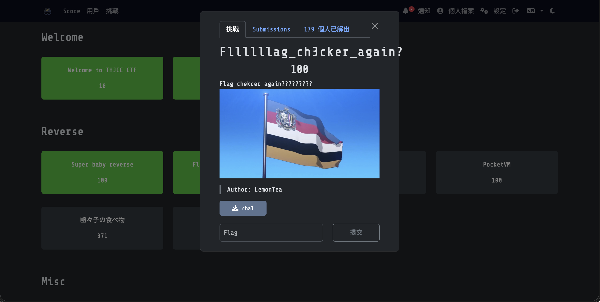
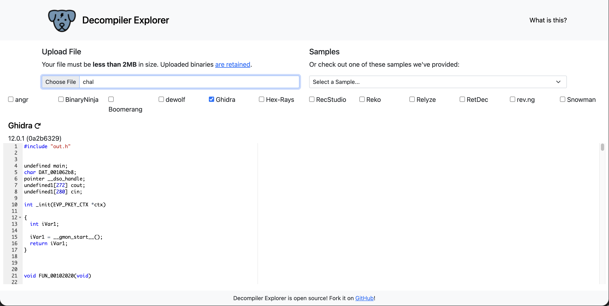
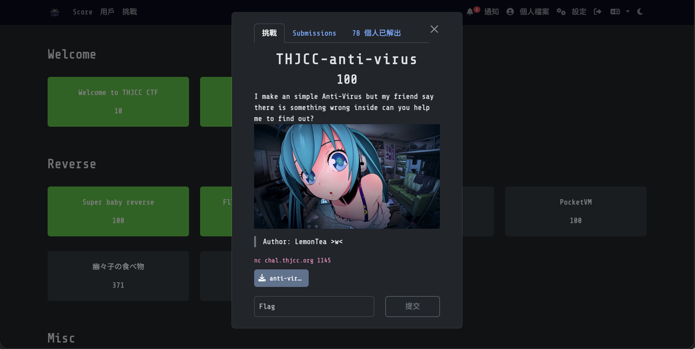
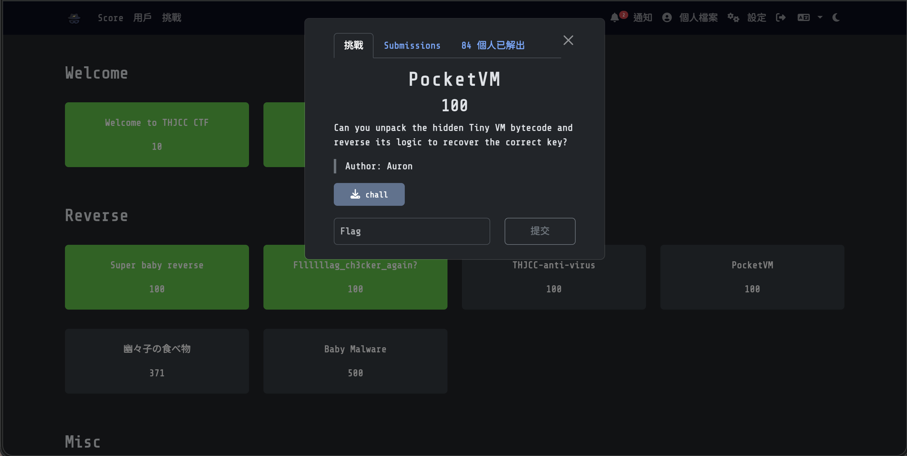
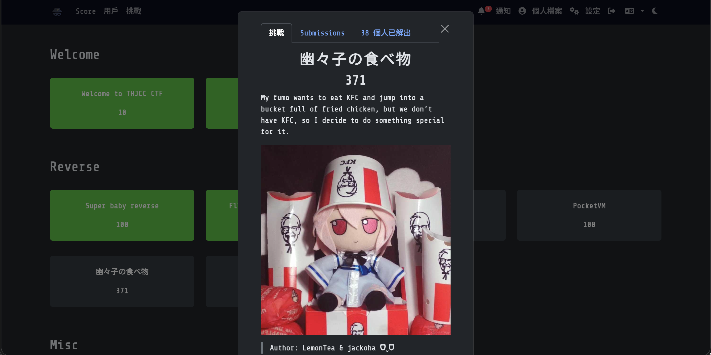

Reverse 題目簡單來說就是練習你的逆向能力，也就是給你一個執行檔，然後你要找回他的運作邏輯這樣。
> WP完成度： (2/6)

# Reverse分類：
## [Super baby reverse](https://ctf2026.thjcc.org/challenges#Super%20baby%20reverse-4) (100)

### 題目：
My first C lang project can you find the hidden message inside?
> Author: Lemontea

:::Tip[Download Flie]
[THJCC_Super_Baby_Reverse](https://file.pg72.tw/share/Xp27hK6k)
:::

### 解題心得：
這題的檔案在不知道的情況下，我們直接在Linux 中先找檔案類型：
```bash
pg72@PGpenguin72:~/Downloads$ file THJCC_Super_Baby_Reverse
THJCC_Super_Baby_Reverse: ELF 64-bit LSB pie executable, x86-64, version 1 (SYSV), dynamically linked, interpreter /lib64/ld-linux-x86-64.so.2, BuildID[sha1]=643efc950df55d8188e8eeac2c0f5f1781f62a35, for GNU/Linux 4.4.0, not stripped
```
我們可以發現這個檔案類型是```Linux ELF 64-bit```的格式，所以我們就直接嘗試提取他的所有文字：
```bash collapse={2-18, 23-78}
pg72@PGpenguin72:~/Downloads$ strings THJCC_Super_Baby_Reverse
*5/lib64/ld-linux-x86-64.so.2
puts
__stack_chk_fail
__isoc23_scanf
__libc_start_main
__cxa_finalize
strcmp
libc.so.6
GLIBC_2.38
GLIBC_2.4
GLIBC_2.2.5
GLIBC_2.34
_ITM_deregisterTMCloneTable
__gmon_start__
_ITM_registerTMCloneTable
PTE1
u3UH
THJCC{BaH
BY_r3v3rH
s3_f0r_bH
eggin3r}H
%254s
Correct
Wrong
;*3$"
GCC: (GNU) 15.2.1 20251112
main.c
_DYNAMIC
__GNU_EH_FRAME_HDR
_GLOBAL_OFFSET_TABLE_
__libc_start_main@GLIBC_2.34
_ITM_deregisterTMCloneTable
puts@GLIBC_2.2.5
_edata
_fini
__stack_chk_fail@GLIBC_2.4
__isoc23_scanf@GLIBC_2.38
__data_start
strcmp@GLIBC_2.2.5
__gmon_start__
__dso_handle
_IO_stdin_used
_end
__bss_start
main
__TMC_END__
_ITM_registerTMCloneTable
__cxa_finalize@GLIBC_2.2.5
_init
.symtab
.strtab
.shstrtab
.note.gnu.property
.note.gnu.build-id
.interp
.gnu.hash
.dynsym
.dynstr
.gnu.version
.gnu.version_r
.rela.dyn
.rela.plt
.init
.text
.fini
.rodata
.eh_frame_hdr
.eh_frame
.note.ABI-tag
.init_array
.fini_array
.dynamic
.got
.got.plt
.data
.bss
.comment
```
我們可以發現，上面19-22行有一串很SUS的文字（就是Flag），於是我們就很開心的會直接上傳了 ```THJCC{BaHBY_r3v3rHs3_f0r_bHeggin3r}```......  
然後你會發現你錯了==  
因為在x86-64 架構下，系統在存字串的時候會把每八位元切割後放一個空白佔位符"H"，所以當我們把那些佔位符刪除後提交，你會發現你過了！

### Flag:
```THJCC{BaBY_r3v3rs3_f0r_beggin3r}```

## [Fllllllag_ch3cker_again?](https://ctf2026.thjcc.org/challenges#Fllllllag_ch3cker_again?-25) (100)

### 題目：
Flag chekcer again?????????
> Author: Lemontea

:::Tip[Download Flie]
[chal](https://file.pg72.tw/share/htQ4ig0A)
:::

### 解題心得：
這題跟上題很像，而且還是同個作者，反正就直接file+strings找內容：

```bash collapse={4-90, 93-248}
pg72@PGpenguin72:~/Downloads$ file chal
chal: ELF 64-bit LSB pie executable, x86-64, version 1 (SYSV), dynamically linked, interpreter /lib64/ld-linux-x86-64.so.2, BuildID[sha1]=ea4ad0bf1d4644b0983b528a245a6ad728accef4, for GNU/Linux 4.4.0, not stripped
pgpenguin72@PGpenguin72:~/Downloads$ strings chal
/lib64/ld-linux-x86-64.so.2
leKF
__gmon_start__
_ITM_deregisterTMCloneTable
_ITM_registerTMCloneTable
_ZSt20__throw_length_errorPKc
_ZNSt7__cxx1112basic_stringIcSt11char_traitsIcESaIcEE7_M_dataEPc
_ZNSt7__cxx1112basic_stringIcSt11char_traitsIcESaIcEE11_M_capacityEm
_ZdlPvm
_ZNSt7__cxx1112basic_stringIcSt11char_traitsIcESaIcEEC1Ev
_ZNSt7__cxx1112basic_stringIcSt11char_traitsIcESaIcEEC2EPKcmRKS3_
_ZNSt7__cxx1112basic_stringIcSt11char_traitsIcESaIcEE12_M_constructIPKcEEvT_S8_St20forward_iterator_tag
_ZNSt7__cxx1112basic_stringIcSt11char_traitsIcESaIcEE10_M_destroyEm
_ZNSt7__cxx1112basic_stringIcSt11char_traitsIcESaIcEE9_M_lengthEm
_ZSt3cin
_ZNSt7__cxx1112basic_stringIcSt11char_traitsIcESaIcEED2Ev
_ZSt17__throw_bad_allocv
_ZNSt7__cxx1112basic_stringIcSt11char_traitsIcESaIcEE12_Alloc_hiderC2EPcRKS3_
_ZSt21ios_base_library_initv
__gxx_personality_v0
_ZNKSt7__cxx1112basic_stringIcSt11char_traitsIcESaIcEE16_M_get_allocatorEv
_ZNKSt7__cxx1112basic_stringIcSt11char_traitsIcESaIcEE11_M_is_localEv
_ZNSt7__cxx1112basic_stringIcSt11char_traitsIcESaIcEEC1EPKcmRKS3_
_ZNKSt7__cxx1112basic_stringIcSt11char_traitsIcESaIcEE4dataEv
_ZNSt7__cxx1112basic_stringIcSt11char_traitsIcESaIcEE12_Alloc_hiderC1EPcOS3_
_ZNKSt7__cxx1112basic_stringIcSt11char_traitsIcESaIcEE7_M_dataEv
_ZStlsISt11char_traitsIcEERSt13basic_ostreamIcT_ES5_PKc
_ZNSt7__cxx1112basic_stringIcSt11char_traitsIcESaIcEEC2Ev
_Znwm
_ZNSt7__cxx1112basic_stringIcSt11char_traitsIcESaIcEE12_Alloc_hiderC2EPcOS3_
_ZNSt7__cxx1112basic_stringIcSt11char_traitsIcESaIcEE7_S_copyEPcPKcm
_ZNSt7__cxx1112basic_stringIcSt11char_traitsIcESaIcEE9_M_createERmm
_ZNSt7__cxx1112basic_stringIcSt11char_traitsIcESaIcEED1Ev
_ZNSt7__cxx1112basic_stringIcSt11char_traitsIcESaIcEE13_M_set_lengthEm
_ZNSt7__cxx1112basic_stringIcSt11char_traitsIcESaIcEE16_M_get_allocatorEv
_ZNSt7__cxx1112basic_stringIcSt11char_traitsIcESaIcEE11_S_allocateERS3_m
_ZNKSt7__cxx1112basic_stringIcSt11char_traitsIcESaIcEE8max_sizeEv
_ZNSt7__cxx1112basic_stringIcSt11char_traitsIcESaIcEE10_M_disposeEv
_ZSt4cout
_ZNKSt7__cxx1112basic_stringIcSt11char_traitsIcESaIcEE4sizeEv
_ZNKSt7__cxx1112basic_stringIcSt11char_traitsIcESaIcEE13_M_local_dataEv
_ZNSt7__cxx1112basic_stringIcSt11char_traitsIcESaIcEE13_M_local_dataEv
_ZStrsIcSt11char_traitsIcESaIcEERSt13basic_istreamIT_T0_ES7_RNSt7__cxx1112basic_stringIS4_S5_T1_EE
_ZSt19__throw_logic_errorPKc
_ZNSt7__cxx1112basic_stringIcSt11char_traitsIcESaIcEE12_Alloc_hiderC1EPcRKS3_
_Unwind_Resume
__stack_chk_fail
__libc_start_main
__cxa_finalize
memcmp
memcpy
libstdc++.so.6
libm.so.6
libgcc_s.so.1
libc.so.6
GCC_3.0
GLIBC_2.4
GLIBC_2.14
GLIBC_2.34
GLIBC_2.2.5
CXXABI_1.3
GLIBCXX_3.4.32
GLIBCXX_3.4.21
CXXABI_1.3.9
GLIBCXX_3.4
PTE1
u3UH
[G@-
]84p)
84p)
7UCH
,Xa"H
Th1s_1s_H
_th3_k3yH
ATSH
[A\]
ATSH
0[A\]
Please Enter the flag: 
You are wrong
basic_string: construction from null is not valid
vector::reserve
vector::_M_realloc_append
basic_string::_M_create
;*3$"
zPLR
    V#{
GCC: (GNU) 15.2.1 20250813
main.cpp
__GNU_EH_FRAME_HDR
_DYNAMIC
_GLOBAL_OFFSET_TABLE_
_ZNSt7__cxx1112basic_stringIcSt11char_traitsIcESaIcEE10_M_disposeEv
_ZNSt11char_traitsIcE2ltERKcS2_
_ZNSt7__cxx1112basic_stringIcSt11char_traitsIcESaIcEEC1Ev
_ZNSt6vectorIhSaIhEE9push_backERKh
_ZNSt15__new_allocatorIcED1Ev
_ZNSt7__cxx1112basic_stringIcSt11char_traitsIcESaIcEEC2Ev
_ZNSt7__cxx1112basic_stringIcSt11char_traitsIcESaIcEE12_Alloc_hiderC2EPcOS3_
_ZNSt6vectorIhSaIhEE12_Guard_allocD2Ev
_edata
_ZNSt6vectorIhSaIhEED2Ev
_IO_stdin_used
_ZSt17__throw_bad_allocv@GLIBCXX_3.4
_ZNSt12_Vector_baseIhSaIhEEC1Ev
_ZNSt6vectorIhSaIhEEC2Ev
_ZNSt7__cxx1112basic_stringIcSt11char_traitsIcESaIcEE12_M_constructIPKcEEvT_S8_St20forward_iterator_tag
__cxa_finalize@GLIBC_2.2.5
_ZSteqIcSt11char_traitsIcESaIcEEbRKNSt7__cxx1112basic_stringIT_T0_T1_EESA_
memcmp@GLIBC_2.2.5
_ZNSt7__cxx1112basic_stringIcSt11char_traitsIcESaIcEE9_M_createERmm
_ZNSt6vectorIhSaIhEE7reserveEm
_ZNSt6vectorIhSaIhEE12_Guard_allocD1Ev
_ZNSt15__new_allocatorIcE10deallocateEPcm
main
_ZNSt7__cxx1112basic_stringIcSt11char_traitsIcESaIcEE13_M_set_lengthEm
_ZSt20__throw_length_errorPKc@GLIBCXX_3.4
__dso_handle
_ZZNSt7__cxx1112basic_stringIcSt11char_traitsIcESaIcEE12_M_constructIPKcEEvT_S8_St20forward_iterator_tagEN6_GuardD2Ev
_ZNSt7__cxx1112basic_stringIcSt11char_traitsIcESaIcEE7_S_copyEPcPKcm
_ZZNSt7__cxx1112basic_stringIcSt11char_traitsIcESaIcEE12_M_constructIPKcEEvT_S8_St20forward_iterator_tagEN6_GuardC1EPS4_
_ZNSt15__new_allocatorIhE8allocateEmPKv
_ZNSt12_Vector_baseIhSaIhEE19_M_get_Tp_allocatorEv
_ZNSt12_Vector_baseIhSaIhEEC2Ev
DW.ref.__gxx_personality_v0
_ZNKSt7__cxx1112basic_stringIcSt11char_traitsIcESaIcEE4dataEv
_ZNSt6vectorIhSaIhEEC1Ev
_ZSt19__throw_logic_errorPKc@GLIBCXX_3.4
_fini
__libc_start_main@GLIBC_2.34
_ZSt3minImERKT_S2_S2_
_ZZNSt7__cxx1112basic_stringIcSt11char_traitsIcESaIcEE12_M_constructIPKcEEvT_S8_St20forward_iterator_tagEN6_GuardC2EPS4_
_ZNSt6vectorIhSaIhEED1Ev
_ZNSt15__new_allocatorIcE8allocateEmPKv
_ZNKSt7__cxx1112basic_stringIcSt11char_traitsIcESaIcEE8max_sizeEv
_ZNSt12_Vector_baseIhSaIhEE12_Vector_implD1Ev
_ZNKSt7__cxx1112basic_stringIcSt11char_traitsIcESaIcEE4sizeEv
_ZNSt15__new_allocatorIhED1Ev
memcpy@GLIBC_2.14
_ZNSt7__cxx1112basic_stringIcSt11char_traitsIcESaIcEE11_M_capacityEm
_ZNSt7__cxx1112basic_stringIcSt11char_traitsIcESaIcEE12_Alloc_hiderD1Ev
_ZNKSt6vectorIhSaIhEE11_M_data_ptrIhEEPT_S4_
_ZNSt7__cxx1112basic_stringIcSt11char_traitsIcESaIcEE13_M_local_dataEv
_ZNKSt6vectorIhSaIhEE12_M_check_lenEmPKc
_ZStlsISt11char_traitsIcEERSt13basic_ostreamIcT_ES5_PKc@GLIBCXX_3.4
_Znwm@GLIBCXX_3.4
_ZNSt7__cxx1112basic_stringIcSt11char_traitsIcESaIcEE12_Alloc_hiderC2EPcRKS3_
_ZdlPvm@CXXABI_1.3.9
_ZNKSt6vectorIhSaIhEE8max_sizeEv
_ZNSt7__cxx1112basic_stringIcSt11char_traitsIcESaIcEE12_Alloc_hiderD2Ev
_ZNSt7__cxx1112basic_stringIcSt11char_traitsIcESaIcEE16_M_get_allocatorEv
_ZNSt11char_traitsIcE6assignERcRKc
_ZNSt7__cxx1112basic_stringIcSt11char_traitsIcESaIcEED2Ev
__stack_chk_fail@GLIBC_2.4
_init
_ZNSt12_Vector_baseIhSaIhEE17_Vector_impl_dataC1Ev
__TMC_END__
_ZNSt12_Vector_baseIhSaIhEE11_M_allocateEm
_ZNKSt7__cxx1112basic_stringIcSt11char_traitsIcESaIcEE11_M_is_localEv
_ZNSt12_Vector_baseIhSaIhEE12_Vector_implD2Ev
_ZNSt7__cxx1112basic_stringIcSt11char_traitsIcESaIcEEC1EPKcmRKS3_
_ZNSt6vectorIhSaIhEE12_Guard_allocC1EPhmRSt12_Vector_baseIhS0_E
_ZNSt15__new_allocatorIhED2Ev
_ZStrsIcSt11char_traitsIcESaIcEERSt13basic_istreamIT_T0_ES7_RNSt7__cxx1112basic_stringIS4_S5_T1_EE@GLIBCXX_3.4.21
_ZSt4cout@GLIBCXX_3.4
_ZSt14__relocate_a_1IhhENSt9enable_ifIXsrSt24__is_bitwise_relocatableIT_vE5valueEPS2_E4typeES4_S4_S4_RSaIT0_E
_ZNSt6vectorIhSaIhEE11_S_max_sizeERKS0_
_ZSt8_DestroyIPhEvT_S1_
_ZSt3maxImERKT_S2_S2_
_ZNSt12_Vector_baseIhSaIhEE13_M_deallocateEPhm
__data_start
_ZNSt12_Vector_baseIhSaIhEE12_Vector_implC1Ev
_end
_ZNSt7__cxx1112basic_stringIcSt11char_traitsIcESaIcEE13_S_copy_charsIPKcEEvPcT_S9_
_ZSt12__relocate_aIPhS0_SaIhEET0_T_S3_S2_RT1_
_ZNSt6vectorIhSaIhEE4dataEv
_ZNSt15__new_allocatorIcED2Ev
_ZNKSt7__cxx1112basic_stringIcSt11char_traitsIcESaIcEE7_M_dataEv
_ZNSt7__cxx1112basic_stringIcSt11char_traitsIcESaIcEE10_M_destroyEm
_ZNSt12_Vector_baseIhSaIhEE12_Vector_implC2Ev
_ZNSt7__cxx1112basic_stringIcSt11char_traitsIcESaIcEED1Ev
_ZNKSt12_Vector_baseIhSaIhEE19_M_get_Tp_allocatorEv
_ZNSt11char_traitsIcE7compareEPKcS2_m
_ZNSt19__ptr_traits_ptr_toIPccLb0EE10pointer_toERc
__bss_start
_ZSt21ios_base_library_initv@GLIBCXX_3.4.32
_ZNSt12_Vector_baseIhSaIhEED2Ev
_ZNSt7__cxx1112basic_stringIcSt11char_traitsIcESaIcEEC2EPKcmRKS3_
_ZnwmPv
_ZNKSt6vectorIhSaIhEE4sizeEv
_ZNKSt6vectorIhSaIhEE8capacityEv
_ZNSt7__cxx1112basic_stringIcSt11char_traitsIcESaIcEE9_M_lengthEm
_ZNSt7__cxx1112basic_stringIcSt11char_traitsIcESaIcEE11_S_allocateERS3_m
__gxx_personality_v0@CXXABI_1.3
_ZNSt19__ptr_traits_ptr_toIPKcS0_Lb0EE10pointer_toERS0_
_ZNSt15__new_allocatorIhE10deallocateEPhm
_ZNSt6vectorIhSaIhEE12_Guard_allocC2EPhmRSt12_Vector_baseIhS0_E
_ZNKSt7__cxx1112basic_stringIcSt11char_traitsIcESaIcEE13_M_local_dataEv
_ZNSt6vectorIhSaIhEE17_M_realloc_appendIJRKhEEEvDpOT_
_ZNSt12_Vector_baseIhSaIhEE17_Vector_impl_dataC2Ev
_ZNSt6vectorIhSaIhEE5beginEv
_ITM_deregisterTMCloneTable
_Unwind_Resume@GCC_3.0
_ZNSt6vectorIhSaIhEE3endEv
_ZNKSt7__cxx1112basic_stringIcSt11char_traitsIcESaIcEE16_M_get_allocatorEv
_ZNSt6vectorIhSaIhEE11_S_relocateEPhS2_S2_RS0_
_ZSt3cin@GLIBCXX_3.4
_ZNSt7__cxx1112basic_stringIcSt11char_traitsIcESaIcEE12_Alloc_hiderC1EPcOS3_
_ZNSt7__cxx1112basic_stringIcSt11char_traitsIcESaIcEE12_Alloc_hiderC1EPcRKS3_
__gmon_start__
_ZdlPvS_
_ITM_registerTMCloneTable
_ZNSt12_Vector_baseIhSaIhEED1Ev
_ZNSt11char_traitsIcE4copyEPcPKcm
_ZZNSt7__cxx1112basic_stringIcSt11char_traitsIcESaIcEE12_M_constructIPKcEEvT_S8_St20forward_iterator_tagEN6_GuardD1Ev
_ZNSt7__cxx1112basic_stringIcSt11char_traitsIcESaIcEE7_M_dataEPc
.symtab
.strtab
.shstrtab
.note.gnu.property
.note.gnu.build-id
.interp
.gnu.hash
.dynsym
.dynstr
.gnu.version
.gnu.version_r
.rela.dyn
.rela.plt
.init
.text
.fini
.rodata
.eh_frame_hdr
.eh_frame
.gcc_except_table
.note.ABI-tag
.init_array
.fini_array
.dynamic
.got
.got.plt
.data
.bss
.comment
```
我們可以發現這個檔案類型也是```Linux ELF 64-bit```的格式，然後裡面有一個cpp檔案欸！  
所以我們就直接把它進行逆向工程，使用 https://dogbolt.org/ ，選`Ghidra`然後上傳`chal`給他逆向:

這是他輸出的結果：
```cpp collapse={1-232, 293-1603}
#include "out.h"


undefined main;
char DAT_001062b8;
pointer __dso_handle;
undefined1[272] cout;
undefined1[280] cin;

int _init(EVP_PKEY_CTX *ctx)

{
  int iVar1;
  
  iVar1 = __gmon_start__();
  return iVar1;
}


void FUN_00102020(void)

{
  (*(code *)(undefined *)0x0)();
  return;
}


// WARNING: Unknown calling convention -- yet parameter storage is locked

void std::__throw_bad_alloc(void)

{
  __throw_bad_alloc();
  return;
}


// WARNING: Unknown calling convention -- yet parameter storage is locked

int memcmp(void *__s1,void *__s2,size_t __n)

{
  int iVar1;
  
  iVar1 = memcmp(__s1,__s2,__n);
  return iVar1;
}


// WARNING: Unknown calling convention -- yet parameter storage is locked

void std::__throw_length_error(char *param_1)

{
  __throw_length_error(param_1);
  return;
}


// WARNING: Unknown calling convention -- yet parameter storage is locked

void std::__throw_logic_error(char *param_1)

{
  __throw_logic_error(param_1);
  return;
}


// WARNING: Unknown calling convention -- yet parameter storage is locked

void * memcpy(void *__dest,void *__src,size_t __n)

{
  void *pvVar1;
  
  pvVar1 = memcpy(__dest,__src,__n);
  return pvVar1;
}


// WARNING: Unknown calling convention -- yet parameter storage is locked

ostream * std::operator<<(ostream *param_1,char *param_2)

{
  ostream *poVar1;
  
  poVar1 = operator<<(param_1,param_2);
  return poVar1;
}


// WARNING: Unknown calling convention -- yet parameter storage is locked

void * operator_new(ulong param_1)

{
  void *pvVar1;
  
  pvVar1 = operator_new(param_1);
  return pvVar1;
}


// WARNING: Unknown calling convention -- yet parameter storage is locked

void operator_delete(void *param_1,ulong param_2)

{
  operator_delete(param_1,param_2);
  return;
}


void __stack_chk_fail(void)

{
                    // WARNING: Subroutine does not return
  __stack_chk_fail();
}


// WARNING: Unknown calling convention -- yet parameter storage is locked

istream * std::operator>>(istream *param_1,string *param_2)

{
  istream *piVar1;
  
  piVar1 = operator>>(param_1,param_2);
  return piVar1;
}


void _Unwind_Resume(void)

{
                    // WARNING: Subroutine does not return
  _Unwind_Resume();
}


void processEntry _start(undefined8 param_1,undefined8 param_2)

{
  undefined1 auStack_8 [8];
  
  __libc_start_main(main,param_2,&stack0x00000008,0,0,param_1,auStack_8);
  do {
                    // WARNING: Do nothing block with infinite loop
  } while( true );
}


// WARNING: Removing unreachable block (ram,0x00102123)
// WARNING: Removing unreachable block (ram,0x0010212f)

void FUN_00102110(void)

{
  return;
}


// WARNING: Removing unreachable block (ram,0x00102164)
// WARNING: Removing unreachable block (ram,0x00102170)

void FUN_00102140(void)

{
  return;
}


void _FINI_0(void)

{
  if (DAT_001062b8 != '\0') {
    return;
  }
  __cxa_finalize(__dso_handle);
  FUN_00102110();
  DAT_001062b8 = 1;
  return;
}


void _INIT_0(void)

{
  FUN_00102140();
  return;
}


undefined8 main(void)

{
  bool bVar1;
  ulong uVar2;
  char *pcVar3;
  long in_FS_OFFSET;
  allocator local_e9;
  ulong local_e8;
  undefined8 local_e0;
  undefined8 local_d8;
  allocator *local_d0;
  vector<unsigned_char,std::allocator<unsigned_char>> local_c8 [32];
  string local_a8 [32];
  string local_88 [33];
  byte local_67 [71];
  long local_20;
  
  local_20 = *(long *)(in_FS_OFFSET + 0x28);
  local_67[0xf] = 0;
  local_67[0x10] = 0x20;
  local_67[0x11] = 0x7b;
  local_67[0x12] = 0x30;
  local_67[0x13] = 0x1c;
  local_67[0x14] = 0x4a;
  local_67[0x15] = 0x32;
  local_67[0x16] = 0;
  local_67[0x17] = 0x27;
  local_67[0x18] = 1;
  local_67[0x19] = 0x5e;
  local_67[0x1a] = 0x2f;
  local_67[0x1b] = 7;
  local_67[0x1c] = 0;
  local_67[0x1d] = 0x26;
  local_67[0x1e] = 6;
  local_67[0x1f] = 0x5b;
  local_67[0x20] = 0x47;
  local_67[0x21] = 0x40;
  local_67[0x22] = 0x2d;
  local_67[0x23] = 2;
  local_67[0x24] = 0x2c;
  local_67[0x25] = 0x2a;
  local_67[0x26] = 7;
  local_67[0x27] = 1;
  local_67[0x28] = 0x5d;
  local_67[0x29] = 0x38;
  local_67[0x2a] = 0x34;
  local_67[0x2b] = 0x70;
  local_67[0x2c] = 0x29;
  local_67[0x2d] = 4;
  local_67[0x2e] = 0x37;
  local_67[0x2f] = 0x55;
  local_67[0x30] = 0x43;
  local_67[0x31] = 0x36;
  local_67[0x32] = 0x5f;
  local_67[0x33] = 0x14;
  local_67[0x34] = 0;
  local_67[0x35] = 0x2c;
  local_67[0x36] = 0x58;
  local_67[0x37] = 0x61;
  local_67[0x38] = 0x22;
  local_e0 = 0x2a;
  local_67[0] = 0x54;
  local_67[1] = 0x68;
  local_67[2] = 0x31;
  local_67[3] = 0x73;
  local_67[4] = 0x5f;
  local_67[5] = 0x31;
  local_67[6] = 0x73;
  local_67[7] = 0x5f;
  local_67[8] = 0x74;
  local_67[9] = 0x68;
  local_67[10] = 0x33;
  local_67[0xb] = 0x5f;
  local_67[0xc] = 0x6b;
  local_67[0xd] = 0x33;
  local_67[0xe] = 0x79;
  local_d8 = 0xf;
  std::vector<unsigned_char,std::allocator<unsigned_char>>::vector(local_c8);
                    // try { // try from 00102298 to 0010230e has its CatchHandler @ 00102486
  std::vector<unsigned_char,std::allocator<unsigned_char>>::reserve(local_c8,0x2a);
  for (local_e8 = 0; local_e8 < 0x2a; local_e8 = local_e8 + 1) {
    local_e9 = (allocator)(local_67[local_e8 % 0xf] ^ local_67[local_e8 + 0xf]);
    std::vector<unsigned_char,std::allocator<unsigned_char>>::push_back(local_c8,(uchar *)&local_e9)
    ;
  }
  local_d0 = &local_e9;
  uVar2 = std::vector<unsigned_char,std::allocator<unsigned_char>>::size(local_c8);
  pcVar3 = (char *)std::vector<unsigned_char,std::allocator<unsigned_char>>::data(local_c8);
                    // try { // try from 0010236c to 00102370 has its CatchHandler @ 0010244c
  std::__cxx11::string::string(local_a8,pcVar3,uVar2,&local_e9);
  std::__new_allocator<char>::~__new_allocator((__new_allocator<char> *)&local_e9);
                    // try { // try from 00102395 to 00102399 has its CatchHandler @ 00102472
  std::operator<<((ostream *)std::cout,"Please Enter the flag: ");
  std::__cxx11::string::string(local_88);
                    // try { // try from 001023b7 to 00102409 has its CatchHandler @ 00102461
  std::operator>>((istream *)std::cin,local_88);
  bVar1 = std::operator==(local_88,local_a8);
  if (bVar1) {
    std::operator<<((ostream *)std::cout,"Yes\n");
  }
  else {
    std::operator<<((ostream *)std::cout,"You are wrong\n");
  }
  std::__cxx11::string::~string(local_88);
  std::__cxx11::string::~string(local_a8);
  std::vector<unsigned_char,std::allocator<unsigned_char>>::~vector(local_c8);
  if (local_20 != *(long *)(in_FS_OFFSET + 0x28)) {
                    // WARNING: Subroutine does not return
    __stack_chk_fail();
  }
  return 0;
}


// operator new(unsigned long, void*)

void * operator_new(ulong param_1,void *param_2)

{
  return param_2;
}


// operator delete(void*, void*)

void operator_delete(void *param_1,void *param_2)

{
  return;
}


// std::char_traits<char>::assign(char&, char const&)

void std::char_traits<char>::assign(char *param_1,char *param_2)

{
  *param_1 = *param_2;
  return;
}


// std::char_traits<char>::lt(char const&, char const&)

bool std::char_traits<char>::lt(char *param_1,char *param_2)

{
  return (byte)*param_1 < (byte)*param_2;
}


// WARNING: Removing unreachable block (ram,0x00102550)
// WARNING: Removing unreachable block (ram,0x001025b7)
// WARNING: Removing unreachable block (ram,0x0010255a)
// WARNING: Removing unreachable block (ram,0x0010257f)
// WARNING: Removing unreachable block (ram,0x00102586)
// WARNING: Removing unreachable block (ram,0x001025ab)
// WARNING: Removing unreachable block (ram,0x001025b2)
// WARNING: Removing unreachable block (ram,0x001025c1)
// std::char_traits<char>::compare(char const*, char const*, unsigned long)

int std::char_traits<char>::compare(char *param_1,char *param_2,ulong param_3)

{
  int iVar1;
  
  if (param_3 == 0) {
    iVar1 = 0;
  }
  else {
    iVar1 = memcmp(param_1,param_2,param_3);
  }
  return iVar1;
}


// std::char_traits<char>::copy(char*, char const*, unsigned long)

char * std::char_traits<char>::copy(char *param_1,char *param_2,ulong param_3)

{
  if (param_3 != 0) {
    param_1 = memcpy(param_1,param_2,param_3);
  }
  return param_1;
}


// WARNING: Unknown calling convention -- yet parameter storage is locked
// unsigned long const& std::min<unsigned long>(unsigned long const&, unsigned long const&)

ulong * std::min<unsigned_long>(ulong *param_1,ulong *param_2)

{
  if (*param_2 < *param_1) {
    param_1 = param_2;
  }
  return param_1;
}


// std::_Vector_base<unsigned char, std::allocator<unsigned char> >::_Vector_impl::~_Vector_impl()

void __thiscall
std::_Vector_base<unsigned_char,std::allocator<unsigned_char>>::_Vector_impl::~_Vector_impl
          (_Vector_impl *this)

{
  __new_allocator<unsigned_char>::~__new_allocator((__new_allocator<unsigned_char> *)this);
  return;
}


// std::_Vector_base<unsigned char, std::allocator<unsigned char> >::_Vector_base()

void __thiscall
std::_Vector_base<unsigned_char,std::allocator<unsigned_char>>::_Vector_base
          (_Vector_base<unsigned_char,std::allocator<unsigned_char>> *this)

{
  _Vector_impl::_Vector_impl((_Vector_impl *)this);
  return;
}


// std::vector<unsigned char, std::allocator<unsigned char> >::vector()

void __thiscall
std::vector<unsigned_char,std::allocator<unsigned_char>>::vector
          (vector<unsigned_char,std::allocator<unsigned_char>> *this)

{
  _Vector_base<unsigned_char,std::allocator<unsigned_char>>::_Vector_base
            ((_Vector_base<unsigned_char,std::allocator<unsigned_char>> *)this);
  return;
}


// std::__cxx11::string::_Alloc_hider::~_Alloc_hider()

void __thiscall std::__cxx11::string::_Alloc_hider::~_Alloc_hider(_Alloc_hider *this)

{
  __new_allocator<char>::~__new_allocator((__new_allocator<char> *)this);
  return;
}


// std::__cxx11::string::string()

void __thiscall std::__cxx11::string::string(string *this)

{
  char *pcVar1;
  long in_FS_OFFSET;
  allocator local_31;
  string *local_30;
  allocator *local_28;
  long local_20;
  
  local_20 = *(long *)(in_FS_OFFSET + 0x28);
  local_28 = &local_31;
  pcVar1 = (char *)_M_local_data(this);
  _Alloc_hider::_Alloc_hider((_Alloc_hider *)this,pcVar1,&local_31);
  __new_allocator<char>::~__new_allocator((__new_allocator<char> *)&local_31);
  local_30 = this;
  _M_set_length(this,0);
  if (local_20 != *(long *)(in_FS_OFFSET + 0x28)) {
                    // WARNING: Subroutine does not return
    __stack_chk_fail();
  }
  return;
}


// std::__cxx11::string::~string()

void __thiscall std::__cxx11::string::~string(string *this)

{
  _M_dispose(this);
  _Alloc_hider::~_Alloc_hider((_Alloc_hider *)this);
  return;
}


// std::__cxx11::string::string(char const*, unsigned long, std::allocator<char> const&)

void __thiscall
std::__cxx11::string::string(string *this,char *param_1,ulong param_2,allocator *param_3)

{
  char *pcVar1;
  
  pcVar1 = (char *)_M_local_data(this);
  _Alloc_hider::_Alloc_hider((_Alloc_hider *)this,pcVar1,param_3);
  if ((param_1 == (char *)0x0) && (param_2 != 0)) {
                    // try { // try from 001027da to 001027fc has its CatchHandler @ 001027ff
    std::__throw_logic_error("basic_string: construction from null is not valid");
  }
  _M_construct<char_const*>(this,param_1,param_1 + param_2);
  return;
}


// WARNING: Unknown calling convention -- yet parameter storage is locked
// unsigned long const& std::max<unsigned long>(unsigned long const&, unsigned long const&)

ulong * std::max<unsigned_long>(ulong *param_1,ulong *param_2)

{
  if (*param_1 < *param_2) {
    param_1 = param_2;
  }
  return param_1;
}


// std::_Vector_base<unsigned char, std::allocator<unsigned char> >::_Vector_impl::_Vector_impl()

void __thiscall
std::_Vector_base<unsigned_char,std::allocator<unsigned_char>>::_Vector_impl::_Vector_impl
          (_Vector_impl *this)

{
  _Vector_impl_data::_Vector_impl_data((_Vector_impl_data *)this);
  return;
}


// std::_Vector_base<unsigned char, std::allocator<unsigned char> >::~_Vector_base()

void __thiscall
std::_Vector_base<unsigned_char,std::allocator<unsigned_char>>::~_Vector_base
          (_Vector_base<unsigned_char,std::allocator<unsigned_char>> *this)

{
  _M_deallocate(this,*(uchar **)this,*(long *)(this + 0x10) - *(long *)this);
  _Vector_impl::~_Vector_impl((_Vector_impl *)this);
  return;
}


// std::vector<unsigned char, std::allocator<unsigned char> >::~vector()

void __thiscall
std::vector<unsigned_char,std::allocator<unsigned_char>>::~vector
          (vector<unsigned_char,std::allocator<unsigned_char>> *this)

{
  _Vector_base<unsigned_char,std::allocator<unsigned_char>>::_M_get_Tp_allocator
            ((_Vector_base<unsigned_char,std::allocator<unsigned_char>> *)this);
  _Destroy<unsigned_char*>(*(uchar **)this,*(uchar **)(this + 8));
  _Vector_base<unsigned_char,std::allocator<unsigned_char>>::~_Vector_base
            ((_Vector_base<unsigned_char,std::allocator<unsigned_char>> *)this);
  return;
}


// std::vector<unsigned char, std::allocator<unsigned char> >::reserve(unsigned long)

void __thiscall
std::vector<unsigned_char,std::allocator<unsigned_char>>::reserve
          (vector<unsigned_char,std::allocator<unsigned_char>> *this,ulong param_1)

{
  ulong uVar1;
  long lVar2;
  uchar *puVar3;
  allocator *paVar4;
  
  uVar1 = max_size(this);
  if (uVar1 < param_1) {
    std::__throw_length_error("vector::reserve");
  }
  uVar1 = capacity(this);
  if (uVar1 < param_1) {
    lVar2 = size(this);
    puVar3 = (uchar *)_Vector_base<unsigned_char,std::allocator<unsigned_char>>::_M_allocate
                                ((_Vector_base<unsigned_char,std::allocator<unsigned_char>> *)this,
                                 param_1);
    paVar4 = (allocator *)
             _Vector_base<unsigned_char,std::allocator<unsigned_char>>::_M_get_Tp_allocator
                       ((_Vector_base<unsigned_char,std::allocator<unsigned_char>> *)this);
    _S_relocate(*(uchar **)this,*(uchar **)(this + 8),puVar3,paVar4);
    _Vector_base<unsigned_char,std::allocator<unsigned_char>>::_M_deallocate
              ((_Vector_base<unsigned_char,std::allocator<unsigned_char>> *)this,*(uchar **)this,
               *(long *)(this + 0x10) - *(long *)this);
    *(uchar **)this = puVar3;
    *(uchar **)(this + 8) = puVar3 + lVar2;
    *(ulong *)(this + 0x10) = *(long *)this + param_1;
  }
  return;
}


// WARNING: Removing unreachable block (ram,0x00102aab)
// std::vector<unsigned char, std::allocator<unsigned char> >::push_back(unsigned char const&)

void __thiscall
std::vector<unsigned_char,std::allocator<unsigned_char>>::push_back
          (vector<unsigned_char,std::allocator<unsigned_char>> *this,uchar *param_1)

{
  uchar *puVar1;
  
  if (*(long *)(this + 8) == *(long *)(this + 0x10)) {
    _M_realloc_append<unsigned_char_const&>(this,param_1);
  }
  else {
    puVar1 = operator_new(1,*(void **)(this + 8));
    *puVar1 = *param_1;
    *(long *)(this + 8) = *(long *)(this + 8) + 1;
  }
  return;
}


// std::vector<unsigned char, std::allocator<unsigned char> >::data()

void __thiscall
std::vector<unsigned_char,std::allocator<unsigned_char>>::data
          (vector<unsigned_char,std::allocator<unsigned_char>> *this)

{
  _M_data_ptr<unsigned_char>(this,*(uchar **)this);
  return;
}


// std::vector<unsigned char, std::allocator<unsigned char> >::size() const

long __thiscall
std::vector<unsigned_char,std::allocator<unsigned_char>>::size
          (vector<unsigned_char,std::allocator<unsigned_char>> *this)

{
  return *(long *)(this + 8) - *(long *)this;
}


// WARNING: Unknown calling convention -- yet parameter storage is locked
// bool std::TEMPNAMEPLACEHOLDERVALUE(std::__cxx11::string const&, std::__cxx11::string const&)

bool std::operator==(string *param_1,string *param_2)

{
  int iVar1;
  long lVar2;
  long lVar3;
  ulong uVar4;
  char *pcVar5;
  char *pcVar6;
  
  lVar2 = __cxx11::string::size(param_1);
  lVar3 = __cxx11::string::size(param_2);
  if (lVar2 == lVar3) {
    uVar4 = __cxx11::string::size(param_1);
    pcVar5 = (char *)__cxx11::string::data(param_2);
    pcVar6 = (char *)__cxx11::string::data(param_1);
    iVar1 = char_traits<char>::compare(pcVar6,pcVar5,uVar4);
    if (iVar1 == 0) {
      return true;
    }
  }
  return false;
}


// std::__cxx11::string::_M_data() const

undefined8 __thiscall std::__cxx11::string::_M_data(string *this)

{
  return *(undefined8 *)this;
}


// std::__cxx11::string::_M_local_data()

void __thiscall std::__cxx11::string::_M_local_data(string *this)

{
  __ptr_traits_ptr_to<char*,char,false>::pointer_to((char *)(this + 0x10));
  return;
}


// std::__cxx11::string::_Alloc_hider::_Alloc_hider(char*, std::allocator<char>&&)

void __thiscall
std::__cxx11::string::_Alloc_hider::_Alloc_hider
          (_Alloc_hider *this,char *param_1,allocator *param_2)

{
  *(char **)this = param_1;
  return;
}


// std::__cxx11::string::_M_set_length(unsigned long)

void __thiscall std::__cxx11::string::_M_set_length(string *this,ulong param_1)

{
  long lVar1;
  long in_FS_OFFSET;
  char local_11;
  long local_10;
  
  local_10 = *(long *)(in_FS_OFFSET + 0x28);
  _M_length(this,param_1);
  local_11 = '\0';
  lVar1 = _M_data(this);
  char_traits<char>::assign((char *)(param_1 + lVar1),&local_11);
  if (local_10 != *(long *)(in_FS_OFFSET + 0x28)) {
                    // WARNING: Subroutine does not return
    __stack_chk_fail();
  }
  return;
}


// std::__cxx11::string::_M_dispose()

void __thiscall std::__cxx11::string::_M_dispose(string *this)

{
  char cVar1;
  
  cVar1 = _M_is_local(this);
  if (cVar1 != '\x01') {
    _M_destroy(this,*(ulong *)(this + 0x10));
  }
  return;
}


// std::__cxx11::string::_M_get_allocator()

string * __thiscall std::__cxx11::string::_M_get_allocator(string *this)

{
  return this;
}


// std::__cxx11::string::_M_is_local() const

bool __thiscall std::__cxx11::string::_M_is_local(string *this)

{
  long lVar1;
  long lVar2;
  
  lVar1 = _M_data(this);
  lVar2 = _M_local_data(this);
  return lVar1 == lVar2;
}


// std::__cxx11::string::_M_data(char*)

void __thiscall std::__cxx11::string::_M_data(string *this,char *param_1)

{
  *(char **)this = param_1;
  return;
}


// std::__cxx11::string::_M_capacity(unsigned long)

void __thiscall std::__cxx11::string::_M_capacity(string *this,ulong param_1)

{
  *(ulong *)(this + 0x10) = param_1;
  return;
}


// std::__cxx11::string::_M_length(unsigned long)

void __thiscall std::__cxx11::string::_M_length(string *this,ulong param_1)

{
  *(ulong *)(this + 8) = param_1;
  return;
}


// std::__cxx11::string::data() const

void __thiscall std::__cxx11::string::data(string *this)

{
  _M_data(this);
  return;
}


// std::__cxx11::string::size() const

undefined8 __thiscall std::__cxx11::string::size(string *this)

{
  undefined8 uVar1;
  
  uVar1 = *(undefined8 *)(this + 8);
  max_size(this);
  return uVar1;
}


// std::__new_allocator<char>::~__new_allocator()

void __thiscall std::__new_allocator<char>::~__new_allocator(__new_allocator<char> *this)

{
  return;
}


// std::__cxx11::string::_Alloc_hider::_Alloc_hider(char*, std::allocator<char> const&)

void __thiscall
std::__cxx11::string::_Alloc_hider::_Alloc_hider
          (_Alloc_hider *this,char *param_1,allocator *param_2)

{
  *(char **)this = param_1;
  return;
}


// std::__cxx11::string::_M_construct<char const*>(char const*, char const*,
// std::forward_iterator_tag)::_Guard::_Guard(std::__cxx11::string*)

void std::__cxx11::string::_M_construct<char_const*>(char_const*,char_const*,std::
     forward_iterator_tag)::_Guard::_Guard(std::__cxx11::string__
               (undefined8 *param_1,undefined8 param_2)

{
  *param_1 = param_2;
  return;
}


// ~_Guard()

void __thiscall
std::__cxx11::string::_M_construct<char_const*>(char_const*,char_const*,std::forward_iterator_tag)::
_Guard::~_Guard(_Guard *this)

{
  if (*(long *)this != 0) {
    _M_dispose(*(string **)this);
  }
  return;
}


// void std::__cxx11::string::_M_construct<char const*>(char const*, char const*,
// std::forward_iterator_tag)

void std::__cxx11::string::_M_construct<char_const*>(string *param_1,char *param_2,char *param_3)

{
  string *psVar1;
  char *pcVar2;
  long in_FS_OFFSET;
  ulong local_40;
  char *local_38;
  char *local_30;
  char *local_28;
  char *local_20;
  string *local_18;
  long local_10;
  
  local_10 = *(long *)(in_FS_OFFSET + 0x28);
  local_40 = (long)param_3 - (long)param_2;
  local_38 = param_2;
  local_30 = param_3;
  local_28 = param_2;
  local_20 = param_3;
  psVar1 = param_1;
  if (0xf < local_40) {
    pcVar2 = (char *)_M_create(param_1,&local_40,0);
    _M_data(param_1,pcVar2);
    _M_capacity(param_1,local_40);
    psVar1 = local_18;
  }
  local_18 = psVar1;
  _M_construct<char_const*>(char_const*,char_const*,std::forward_iterator_tag)::_Guard::_Guard(std::
  __cxx11::string__(&local_38,param_1);
  pcVar2 = (char *)_M_data(param_1);
  _S_copy_chars<char_const*>(pcVar2,param_2,param_3);
  local_38 = (char *)0x0;
  _M_set_length(param_1,local_40);
  _M_construct<char_const*>(char_const*,char_const*,std::forward_iterator_tag)::_Guard::~_Guard
            ((_Guard *)&local_38);
  if (local_10 == *(long *)(in_FS_OFFSET + 0x28)) {
    return;
  }
                    // WARNING: Subroutine does not return
  __stack_chk_fail();
}


// std::__cxx11::string::_M_get_allocator() const

string * __thiscall std::__cxx11::string::_M_get_allocator(string *this)

{
  return this;
}


// std::__cxx11::string::_M_destroy(unsigned long)

void __thiscall std::__cxx11::string::_M_destroy(string *this,ulong param_1)

{
  char *pcVar1;
  __new_allocator<char> *this_00;
  
  pcVar1 = (char *)_M_data(this);
  this_00 = (__new_allocator<char> *)_M_get_allocator(this);
  __new_allocator<char>::deallocate(this_00,pcVar1,param_1 + 1);
  return;
}


// std::__cxx11::string::_S_copy(char*, char const*, unsigned long)

void std::__cxx11::string::_S_copy(char *param_1,char *param_2,ulong param_3)

{
  if (param_3 == 1) {
    char_traits<char>::assign(param_1,param_2);
  }
  else {
    char_traits<char>::copy(param_1,param_2,param_3);
  }
  return;
}


// std::_Vector_base<unsigned char, std::allocator<unsigned char>
// >::_Vector_impl_data::_Vector_impl_data()

void __thiscall
std::_Vector_base<unsigned_char,std::allocator<unsigned_char>>::_Vector_impl_data::_Vector_impl_data
          (_Vector_impl_data *this)

{
  *(undefined8 *)this = 0;
  *(undefined8 *)(this + 8) = 0;
  *(undefined8 *)(this + 0x10) = 0;
  return;
}


// std::__new_allocator<unsigned char>::~__new_allocator()

void __thiscall
std::__new_allocator<unsigned_char>::~__new_allocator(__new_allocator<unsigned_char> *this)

{
  return;
}


// std::_Vector_base<unsigned char, std::allocator<unsigned char> >::_M_deallocate(unsigned char*,
// unsigned long)

void __thiscall
std::_Vector_base<unsigned_char,std::allocator<unsigned_char>>::_M_deallocate
          (_Vector_base<unsigned_char,std::allocator<unsigned_char>> *this,uchar *param_1,
          ulong param_2)

{
  if (param_1 != (uchar *)0x0) {
    __new_allocator<unsigned_char>::deallocate
              ((__new_allocator<unsigned_char> *)this,param_1,param_2);
  }
  return;
}


// std::_Vector_base<unsigned char, std::allocator<unsigned char> >::_M_get_Tp_allocator()

_Vector_base<unsigned_char,std::allocator<unsigned_char>> * __thiscall
std::_Vector_base<unsigned_char,std::allocator<unsigned_char>>::_M_get_Tp_allocator
          (_Vector_base<unsigned_char,std::allocator<unsigned_char>> *this)

{
  return this;
}


// std::vector<unsigned char, std::allocator<unsigned char> >::max_size() const

void __thiscall
std::vector<unsigned_char,std::allocator<unsigned_char>>::max_size
          (vector<unsigned_char,std::allocator<unsigned_char>> *this)

{
  allocator *paVar1;
  
  paVar1 = (allocator *)
           _Vector_base<unsigned_char,std::allocator<unsigned_char>>::_M_get_Tp_allocator
                     ((_Vector_base<unsigned_char,std::allocator<unsigned_char>> *)this);
  _S_max_size(paVar1);
  return;
}


// std::vector<unsigned char, std::allocator<unsigned char> >::capacity() const

long __thiscall
std::vector<unsigned_char,std::allocator<unsigned_char>>::capacity
          (vector<unsigned_char,std::allocator<unsigned_char>> *this)

{
  return *(long *)(this + 0x10) - *(long *)this;
}


// std::_Vector_base<unsigned char, std::allocator<unsigned char> >::_M_allocate(unsigned long)

undefined8 __thiscall
std::_Vector_base<unsigned_char,std::allocator<unsigned_char>>::_M_allocate
          (_Vector_base<unsigned_char,std::allocator<unsigned_char>> *this,ulong param_1)

{
  undefined8 uVar1;
  
  if (param_1 == 0) {
    uVar1 = 0;
  }
  else {
    uVar1 = __new_allocator<unsigned_char>::allocate((ulong)this,(void *)param_1);
  }
  return uVar1;
}


// std::vector<unsigned char, std::allocator<unsigned char> >::_S_relocate(unsigned char*, unsigned
// char*, unsigned char*, std::allocator<unsigned char>&)

void std::vector<unsigned_char,std::allocator<unsigned_char>>::_S_relocate
               (uchar *param_1,uchar *param_2,uchar *param_3,allocator *param_4)

{
  __relocate_a<unsigned_char*,unsigned_char*,std::allocator<unsigned_char>>
            (param_1,param_2,param_3,param_4);
  return;
}


// WARNING: Removing unreachable block (ram,0x00103345)
// WARNING: Restarted to delay deadcode elimination for space: stack
// void std::vector<unsigned char, std::allocator<unsigned char> >::_M_realloc_append<unsigned char
// const&>(unsigned char const&)

void __thiscall
std::vector<unsigned_char,std::allocator<unsigned_char>>::_M_realloc_append<unsigned_char_const&>
          (vector<unsigned_char,std::allocator<unsigned_char>> *this,uchar *param_1)

{
  uchar *puVar1;
  allocator *paVar2;
  long lVar3;
  long in_FS_OFFSET;
  long local_d0;
  ulong local_c8;
  uchar *local_c0;
  uchar *local_b8;
  long local_b0;
  uchar *local_a8;
  uchar *local_a0;
  vector<unsigned_char,std::allocator<unsigned_char>> *local_98;
  uchar *local_90;
  uchar *local_88;
  uchar *local_80;
  uchar *local_78;
  uchar *local_70;
  vector<unsigned_char,std::allocator<unsigned_char>> *local_68;
  uchar *local_60;
  uchar *local_58;
  uchar *local_50;
  long *local_48;
  uchar **local_40;
  uchar *local_38;
  long local_30;
  long local_20;
  
  local_20 = *(long *)(in_FS_OFFSET + 0x28);
  local_c8 = _M_check_len(this,1,"vector::_M_realloc_append");
  local_c0 = *(uchar **)this;
  local_b8 = *(uchar **)(this + 8);
  local_38 = (uchar *)begin(this);
  local_d0 = end(this);
  local_48 = &local_d0;
  local_40 = &local_38;
  local_b0 = local_d0 - (long)local_38;
  local_a8 = (uchar *)_Vector_base<unsigned_char,std::allocator<unsigned_char>>::_M_allocate
                                ((_Vector_base<unsigned_char,std::allocator<unsigned_char>> *)this,
                                 local_c8);
  local_a0 = local_a8;
  _Guard_alloc::_Guard_alloc((_Guard_alloc *)&local_38,local_a8,local_c8,(_Vector_base *)this);
  local_90 = local_a8 + local_b0;
  local_98 = this;
  local_88 = param_1;
  local_80 = param_1;
  local_78 = local_90;
  local_70 = param_1;
  local_68 = this;
  local_58 = local_90;
  local_50 = param_1;
  puVar1 = operator_new(1,local_90);
  local_60 = local_70;
  *puVar1 = *local_70;
  paVar2 = (allocator *)
           _Vector_base<unsigned_char,std::allocator<unsigned_char>>::_M_get_Tp_allocator
                     ((_Vector_base<unsigned_char,std::allocator<unsigned_char>> *)this);
  lVar3 = _S_relocate(local_c0,local_b8,local_a8,paVar2);
  local_a0 = (uchar *)(lVar3 + 1);
  local_38 = local_c0;
  local_30 = *(long *)(this + 0x10) - (long)local_c0;
  _Guard_alloc::~_Guard_alloc((_Guard_alloc *)&local_38);
  *(uchar **)this = local_a8;
  *(uchar **)(this + 8) = local_a0;
  *(uchar **)(this + 0x10) = local_a8 + local_c8;
  if (local_20 == *(long *)(in_FS_OFFSET + 0x28)) {
    return;
  }
                    // WARNING: Subroutine does not return
  __stack_chk_fail();
}


// unsigned char* std::vector<unsigned char, std::allocator<unsigned char> >::_M_data_ptr<unsigned
// char>(unsigned char*) const

uchar * __thiscall
std::vector<unsigned_char,std::allocator<unsigned_char>>::_M_data_ptr<unsigned_char>
          (vector<unsigned_char,std::allocator<unsigned_char>> *this,uchar *param_1)

{
  return param_1;
}


// std::__ptr_traits_ptr_to<char*, char, false>::pointer_to(char&)

char * std::__ptr_traits_ptr_to<char*,char,false>::pointer_to(char *param_1)

{
  return param_1;
}


// std::__cxx11::string::_M_create(unsigned long&, unsigned long)

void __thiscall std::__cxx11::string::_M_create(string *this,ulong *param_1,ulong param_2)

{
  ulong uVar1;
  ulong uVar2;
  allocator *paVar3;
  
  uVar2 = *param_1;
  uVar1 = max_size(this);
  if (uVar1 < uVar2) {
    std::__throw_length_error("basic_string::_M_create");
  }
  if ((param_2 < *param_1) && (*param_1 < param_2 * 2)) {
    *param_1 = param_2 * 2;
    uVar2 = *param_1;
    uVar1 = max_size(this);
    if (uVar1 < uVar2) {
      uVar2 = max_size(this);
      *param_1 = uVar2;
    }
  }
  uVar2 = *param_1;
  paVar3 = (allocator *)_M_get_allocator(this);
  _S_allocate(paVar3,uVar2 + 1);
  return;
}


// std::__cxx11::string::_M_local_data() const

void __thiscall std::__cxx11::string::_M_local_data(string *this)

{
  __ptr_traits_ptr_to<char_const*,char_const,false>::pointer_to((char *)(this + 0x10));
  return;
}


// std::__cxx11::string::max_size() const

long __thiscall std::__cxx11::string::max_size(string *this)

{
  ulong *puVar1;
  long in_FS_OFFSET;
  ulong local_38 [3];
  undefined8 local_20;
  undefined8 local_18;
  long local_10;
  
  local_10 = *(long *)(in_FS_OFFSET + 0x28);
  local_38[0] = 0x7fffffffffffffff;
  local_38[2] = _M_get_allocator(this);
  local_38[1] = 0x7fffffffffffffff;
  local_20 = local_38[2];
  local_18 = local_38[2];
  puVar1 = min<unsigned_long>(local_38,local_38 + 1);
  if (local_10 != *(long *)(in_FS_OFFSET + 0x28)) {
                    // WARNING: Subroutine does not return
    __stack_chk_fail();
  }
  return *puVar1 - 1;
}


// void std::__cxx11::string::_S_copy_chars<char const*>(char*, char const*, char const*)

void std::__cxx11::string::_S_copy_chars<char_const*>(char *param_1,char *param_2,char *param_3)

{
  _S_copy(param_1,param_2,(long)param_3 - (long)param_2);
  return;
}


// WARNING: Unknown calling convention -- yet parameter storage is locked
// void std::_Destroy<unsigned char*>(unsigned char*, unsigned char*)

void std::_Destroy<unsigned_char*>(uchar *param_1,uchar *param_2)

{
  return;
}


// std::vector<unsigned char, std::allocator<unsigned char> >::_S_max_size(std::allocator<unsigned
// char> const&)

ulong std::vector<unsigned_char,std::allocator<unsigned_char>>::_S_max_size(allocator *param_1)

{
  ulong *puVar1;
  long in_FS_OFFSET;
  ulong local_38 [2];
  allocator *local_28;
  allocator *local_20;
  allocator *local_18;
  long local_10;
  
  local_10 = *(long *)(in_FS_OFFSET + 0x28);
  local_38[0] = 0x7fffffffffffffff;
  local_38[1] = 0x7fffffffffffffff;
  local_28 = param_1;
  local_20 = param_1;
  local_18 = param_1;
  puVar1 = min<unsigned_long>(local_38,local_38 + 1);
  if (local_10 != *(long *)(in_FS_OFFSET + 0x28)) {
                    // WARNING: Subroutine does not return
    __stack_chk_fail();
  }
  return *puVar1;
}


// std::_Vector_base<unsigned char, std::allocator<unsigned char> >::_M_get_Tp_allocator() const

_Vector_base<unsigned_char,std::allocator<unsigned_char>> * __thiscall
std::_Vector_base<unsigned_char,std::allocator<unsigned_char>>::_M_get_Tp_allocator
          (_Vector_base<unsigned_char,std::allocator<unsigned_char>> *this)

{
  return this;
}


// WARNING: Unknown calling convention -- yet parameter storage is locked
// unsigned char* std::__relocate_a<unsigned char*, unsigned char*, std::allocator<unsigned char>
// >(unsigned char*, unsigned char*, unsigned char*, std::allocator<unsigned char>&)

uchar * std::__relocate_a<unsigned_char*,unsigned_char*,std::allocator<unsigned_char>>
                  (uchar *param_1,uchar *param_2,uchar *param_3,allocator *param_4)

{
  uchar *puVar1;
  
  puVar1 = (uchar *)__relocate_a_1<unsigned_char,unsigned_char>(param_1,param_2,param_3,param_4);
  return puVar1;
}


// std::vector<unsigned char, std::allocator<unsigned char> >::_M_check_len(unsigned long, char
// const*) const

ulong __thiscall
std::vector<unsigned_char,std::allocator<unsigned_char>>::_M_check_len
          (vector<unsigned_char,std::allocator<unsigned_char>> *this,ulong param_1,char *param_2)

{
  long lVar1;
  long lVar2;
  ulong *puVar3;
  ulong uVar4;
  ulong uVar5;
  long in_FS_OFFSET;
  ulong local_48;
  vector<unsigned_char,std::allocator<unsigned_char>> *local_40;
  ulong local_30;
  ulong local_28;
  long local_20;
  
  local_20 = *(long *)(in_FS_OFFSET + 0x28);
  local_48 = param_1;
  local_40 = this;
  lVar1 = max_size(this);
  lVar2 = size(local_40);
  if ((ulong)(lVar1 - lVar2) < local_48) {
    if (local_20 != *(long *)(in_FS_OFFSET + 0x28)) {
                    // WARNING: Subroutine does not return
      __stack_chk_fail();
    }
    std::__throw_length_error(param_2);
  }
  lVar1 = size(local_40);
  local_30 = size(local_40);
  puVar3 = max<unsigned_long>(&local_30,&local_48);
  local_28 = *puVar3 + lVar1;
  uVar4 = size(local_40);
  if ((local_28 < uVar4) || (uVar5 = max_size(local_40), uVar4 = local_28, uVar5 < local_28)) {
    uVar4 = max_size(local_40);
  }
  if (local_20 == *(long *)(in_FS_OFFSET + 0x28)) {
    return uVar4;
  }
                    // WARNING: Subroutine does not return
  __stack_chk_fail();
}


// std::vector<unsigned char, std::allocator<unsigned char> >::end()

undefined8 __thiscall
std::vector<unsigned_char,std::allocator<unsigned_char>>::end
          (vector<unsigned_char,std::allocator<unsigned_char>> *this)

{
  long in_FS_OFFSET;
  
  if (*(long *)(in_FS_OFFSET + 0x28) != *(long *)(in_FS_OFFSET + 0x28)) {
                    // WARNING: Subroutine does not return
    __stack_chk_fail();
  }
  return *(undefined8 *)(this + 8);
}


// std::vector<unsigned char, std::allocator<unsigned char> >::begin()

undefined8 __thiscall
std::vector<unsigned_char,std::allocator<unsigned_char>>::begin
          (vector<unsigned_char,std::allocator<unsigned_char>> *this)

{
  long in_FS_OFFSET;
  
  if (*(long *)(in_FS_OFFSET + 0x28) != *(long *)(in_FS_OFFSET + 0x28)) {
                    // WARNING: Subroutine does not return
    __stack_chk_fail();
  }
  return *(undefined8 *)this;
}


// std::vector<unsigned char, std::allocator<unsigned char> >::_Guard_alloc::_Guard_alloc(unsigned
// char*, unsigned long, std::_Vector_base<unsigned char, std::allocator<unsigned char> >&)

void __thiscall
std::vector<unsigned_char,std::allocator<unsigned_char>>::_Guard_alloc::_Guard_alloc
          (_Guard_alloc *this,uchar *param_1,ulong param_2,_Vector_base *param_3)

{
  *(uchar **)this = param_1;
  *(ulong *)(this + 8) = param_2;
  *(_Vector_base **)(this + 0x10) = param_3;
  return;
}


// std::vector<unsigned char, std::allocator<unsigned char> >::_Guard_alloc::~_Guard_alloc()

void __thiscall
std::vector<unsigned_char,std::allocator<unsigned_char>>::_Guard_alloc::~_Guard_alloc
          (_Guard_alloc *this)

{
  if (*(long *)this != 0) {
    _Vector_base<unsigned_char,std::allocator<unsigned_char>>::_M_deallocate
              (*(_Vector_base<unsigned_char,std::allocator<unsigned_char>> **)(this + 0x10),
               *(uchar **)this,*(ulong *)(this + 8));
  }
  return;
}


// std::__cxx11::string::_S_allocate(std::allocator<char>&, unsigned long)

undefined8 std::__cxx11::string::_S_allocate(allocator *param_1,ulong param_2)

{
  undefined8 uVar1;
  
  uVar1 = __new_allocator<char>::allocate((ulong)param_1,(void *)param_2);
  return uVar1;
}


// std::__ptr_traits_ptr_to<char const*, char const, false>::pointer_to(char const&)

char * std::__ptr_traits_ptr_to<char_const*,char_const,false>::pointer_to(char *param_1)

{
  return param_1;
}


// std::__new_allocator<char>::deallocate(char*, unsigned long)

void __thiscall
std::__new_allocator<char>::deallocate(__new_allocator<char> *this,char *param_1,ulong param_2)

{
  operator_delete(param_1,param_2);
  return;
}


// std::__new_allocator<unsigned char>::deallocate(unsigned char*, unsigned long)

void __thiscall
std::__new_allocator<unsigned_char>::deallocate
          (__new_allocator<unsigned_char> *this,uchar *param_1,ulong param_2)

{
  operator_delete(param_1,param_2);
  return;
}


// std::__new_allocator<unsigned char>::allocate(unsigned long, void const*)

void std::__new_allocator<unsigned_char>::allocate(ulong param_1,void *param_2)

{
  if ((void *)0x7fffffffffffffff < param_2) {
    std::__throw_bad_alloc();
  }
  operator_new((ulong)param_2);
  return;
}


// WARNING: Unknown calling convention -- yet parameter storage is locked
// std::enable_if<std::__is_bitwise_relocatable<unsigned char, void>::value, unsigned char*>::type
// std::__relocate_a_1<unsigned char, unsigned char>(unsigned char*, unsigned char*, unsigned char*,
// std::allocator<unsigned char>&)

uchar * std::__relocate_a_1<unsigned_char,unsigned_char>
                  (uchar *param_1,uchar *param_2,uchar *param_3,allocator *param_4)

{
  size_t __n;
  
  __n = (long)param_2 - (long)param_1;
  if (0 < (long)__n) {
    memcpy(param_3,param_1,__n);
  }
  return param_3 + __n;
}


// std::__new_allocator<char>::allocate(unsigned long, void const*)

void std::__new_allocator<char>::allocate(ulong param_1,void *param_2)

{
  if ((void *)0x7fffffffffffffff < param_2) {
    std::__throw_bad_alloc();
  }
  operator_new((ulong)param_2);
  return;
}


void _fini(void)

{
  return;
}
```
好了！你看到這裡會發現這裡有幾個酷東西在233-292行，有沒有覺得很眼熟呢？他是十六進制Hex值，所以我們先轉成ASCII來看看：
```txt
00 20 7b 30 1c 4a 32 00 27 01 5e 2f 07 00 26 06 
5b 47 40 2d 02 2c 2a 07 01 5d 38 34 70 29 04 37 
55 43 36 5f 14 00 2c 58 61 22
=> · {0·J2·'·^/··&·[G@-·,*··]84p)·7UC6_··,Xa"

54 68 31 73 5f 31 73 5f 74 68 33 5f 6b 33 79
=> Th1s_1s_th3_k3y
```
我們發現前面那組的Hex轉ASCII是一個亂碼，然後後面那組是`Th1s_1s_th3_k3y`（This is the key），這時我們就想到在 C 語言中處理這種加密字串時，通常會用一個迴圈掃描密文，並利用取餘數 (%) 的方式重複使用密鑰。因為陣列是同一個，所以它的運算公式非常可能是：
```Flag字元 = local_67[i] ^ 密鑰[i % 15]```
> [!NOTE]
> i 是從 16 開始的陣列索引，^ 在程式中代表 XOR 運算

所以我們可以寫一個Python 來幫助我們算出正確的Flag：
```py title="decode.py"
key = b"Th1s_1s_th3_k3y"

secret = [
    0x00, 0x20, 0x7b, 0x30, 0x1c, 0x4a, 0x32, 0x00, 0x27, 0x01, 0x5e, 
    0x2f, 0x07, 0x00, 0x26, 0x06, 0x5b, 0x47, 0x40, 0x2d, 0x02, 0x2c, 
    0x2a, 0x07, 0x01, 0x5d, 0x38, 0x34, 0x70, 0x29, 0x04, 0x37, 0x55, 
    0x43, 0x36, 0x5f, 0x14, 0x00, 0x2c, 0x58, 0x61, 0x22
]

flag = ""
for i in range(len(secret)):
    ans_text = chr(secret[i] ^ key[i % len(key)])
    flag += ans_text

print(flag)
```
執行結果：
```bash
pg72@PGpenguin72:~/Downloads$ python3 decode.py
THJCC{A_Simpl3_R3v3r3_using_CPP_d0ing_X0R}
```
我們找到了Flag，直接送出就完成這題了！

### Flag:
```THJCC{A_Simpl3_R3v3r3_using_CPP_d0ing_X0R}```

## [-THJCC-anti-virus](https://ctf2026.thjcc.org/challenges#THJCC-anti-virus-26) (100)

### 題目：
I make an simple Anti-Virus but my friend say there is something wrong inside can you help me to find out?
> Author: LemonTea >w<

:::Tip[Download Flie]
[anti-virus](https://file.pg72.tw/share/gvQqcosi)
:::

:::Tip[Connection]
nc chal.thjcc.org 1145
:::

### 解題心得：
好吧這題其實沒有解出來，還在學習中，等學好了再放上來！

### Flag:
```THJCC{}```

## [-PocketVM](https://ctf2026.thjcc.org/challenges#PocketVM-64) (100)

### 題目：
Can you unpack the hidden Tiny VM bytecode and reverse its logic to recover the correct key?
> Author: Auron

:::Tip[Download Flie]
[chall](https://file.pg72.tw/share/pXK3yIVq)
:::

### 解題心得：
好吧這題其實沒有解出來，還在學習中，等學好了再放上來！

### Flag:
```THJCC{}```

## [-幽々子の食べ物](https://ctf2026.thjcc.org/challenges#%E5%B9%BD%E3%80%85%E5%AD%90%E3%81%AE%E9%A3%9F%E3%81%B9%E7%89%A9-32) (371)

### 題目：
My fumo wants to eat KFC and jump into a bucket full of fried chicken, but we don’t have KFC, so I decide to do something special for it.
> Author: LemonTea & jackoha ᗜˬᗜ

:::Tip[Download Flie]
[challenge.zip](https://file.pg72.tw/share/9qSUDAOR)
:::

### 解題心得：
好吧這題其實沒有解出來，還在學習中，等學好了再放上來！

### Flag:
```THJCC{}```

## [-Baby Malware](https://ctf2026.thjcc.org/challenges#Baby%20Malware-71) (500)

### 題目：
This is a baby malware, at least, it "WAS".
find the old C2.
https://drive.google.com/file/d/1fspSO8Ynznr4xCd-iTGwoQvk-L7YQtSn/view?usp=sharing
> Author: whale120

### 解題心得：
好吧這題其實沒有解出來，還在學習中，等學好了再放上來！

### Flag:
```THJCC{}```
