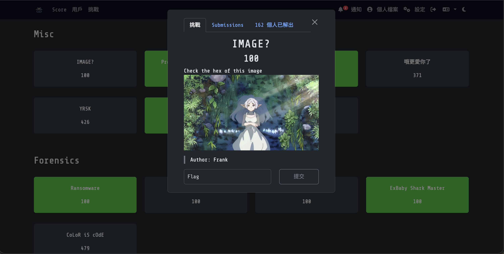
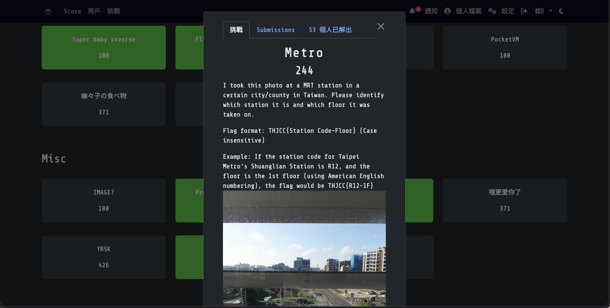
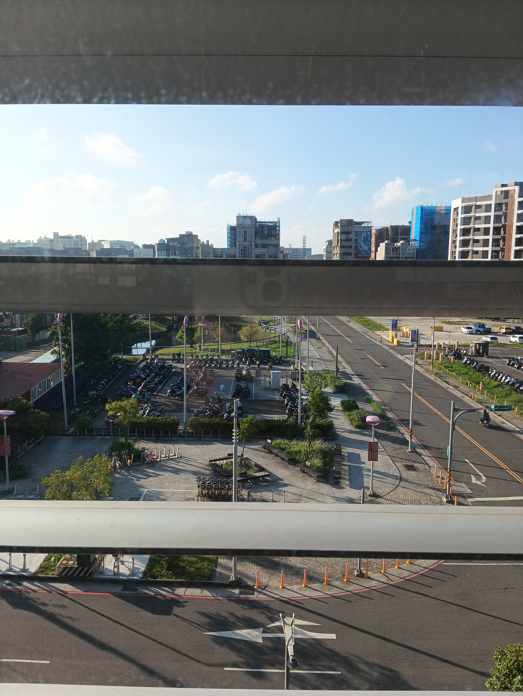
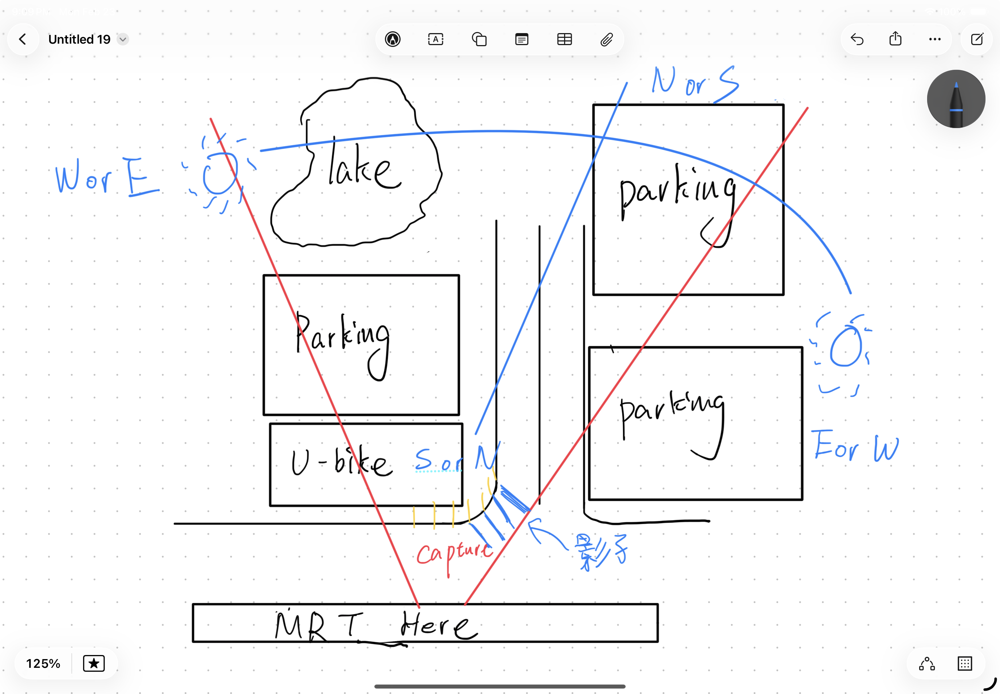
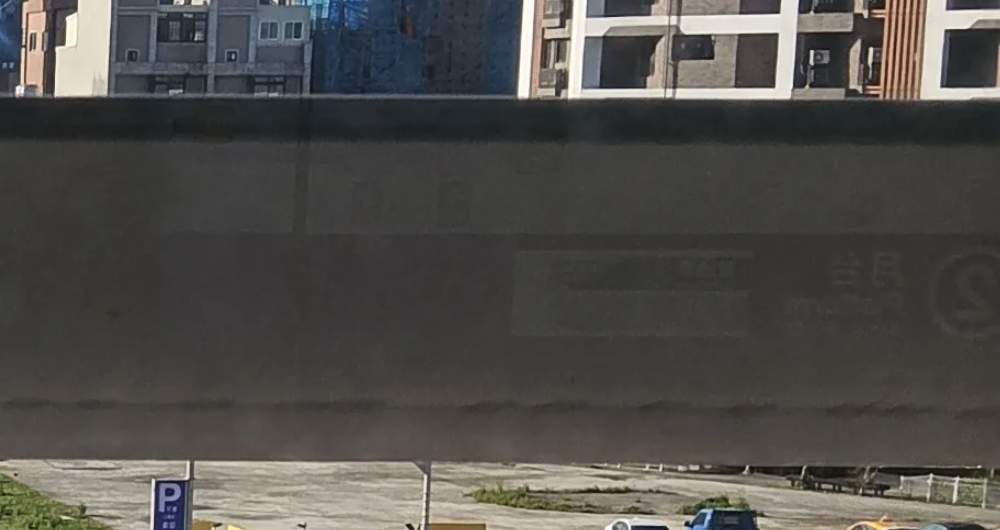
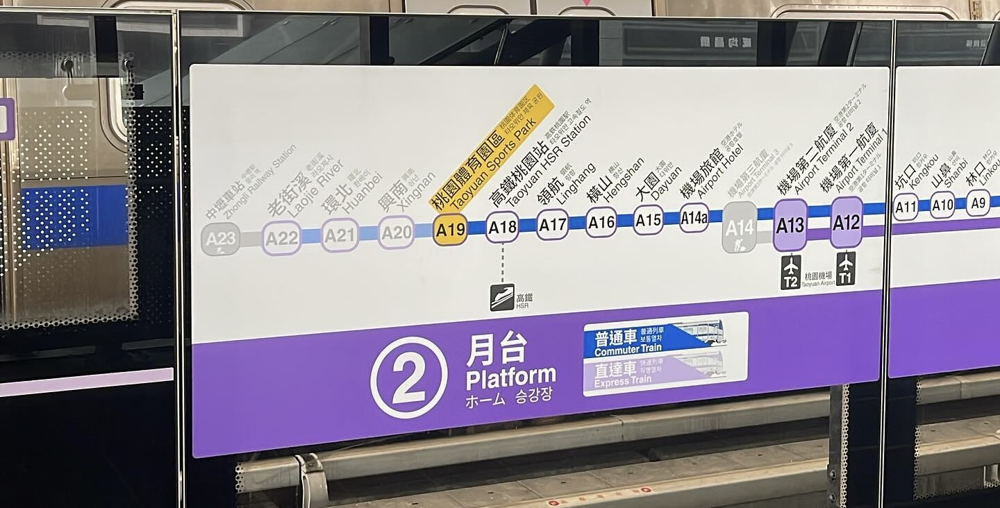
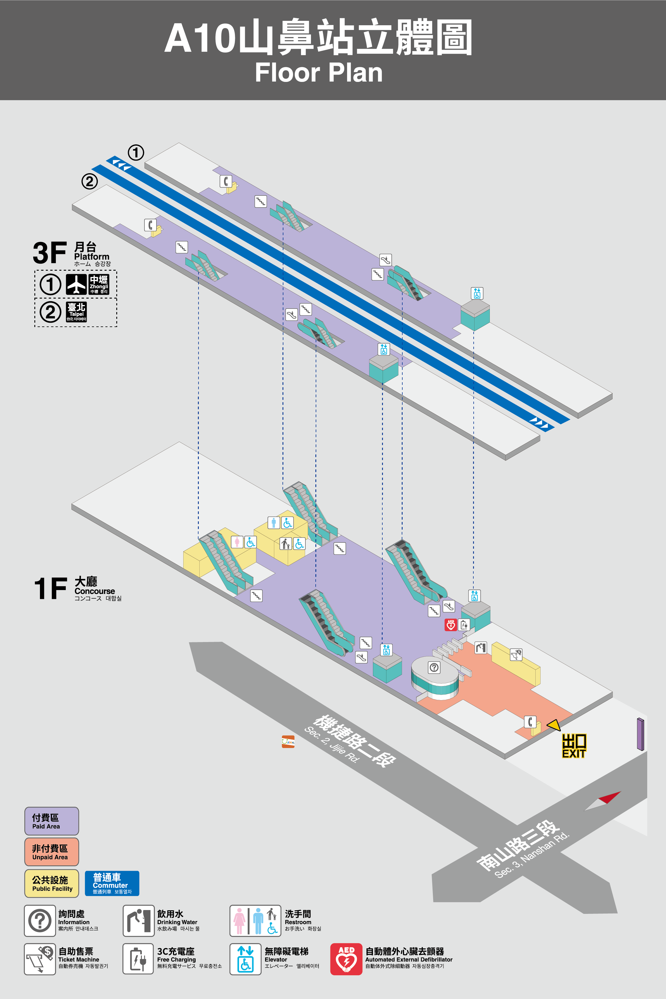
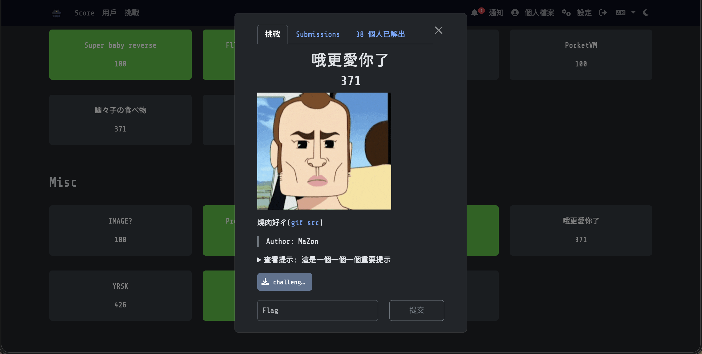
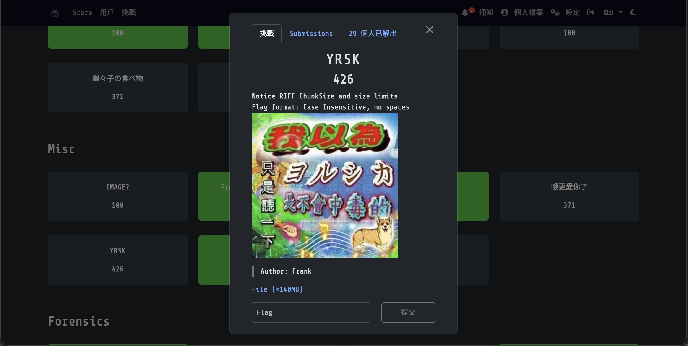
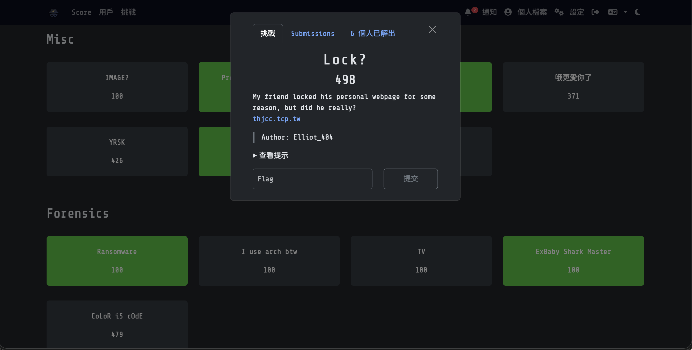

Misc 題目就是一種大雜燴，也就是無法分類，會用到各式各樣的東西，我還蠻喜歡的...?
> WP完成度： (6/7)

# Misc分類：
## [IMAGE?](https://ctf2026.thjcc.org/challenges#IMAGE?-5) (100)

### 題目：
Check the hex of this image

> Author: Frank

:::Tip[Download Flie]
[THJCC_IMAGE.png](https://file.pg72.tw/share/WdHssNXn)
:::

### 解題心得：
這題我那個時候沒有看，啊要不然我應該可以做得出來（？
這題也是簡單來說有檔案先下載檔案，那就直接下載圖片啦！然後他的題目敘述要我們檢查Hex，那就直接打開HxD來檢查吧！

看起來是一個很標準的PNG格式標頭，那我們直接看看裡面有沒有藏zip吧！（我失誤在這裡沒有檢查pk, 要不然我也會解啊啊啊啊ㄚ==）

看到了，裡面還藏著一個zip，而且壓縮包有一個資料夾叫`cute`，資料夾裡面有兩個檔案分別是`F.png`和`F3.png`，廢話不多說就直接改副檔名後解壓縮來查看吧！


這題其實真的很送分題，就只是我懶得去檢查pk導致沒拿到分數，有點後悔了qwq


### Flag:
```THJCC{fRierEN-SO_cUTe:)}```

## [Provisioning in Progress](https://ctf2026.thjcc.org/challenges#Provisioning%20in%20Progress-47) (100)

### 題目：
AS201943 has recently begun deploying its production infrastructure.

According to the NOC provisioning policy, Operational status is based on live network deployment. Address assignments alone do not imply production readiness.

Your task is to determine which infrastructure is actually in production and retrieve the NOC authorization token from the public registry.

flag format\:thjcc{auth_token}
> author\:fishbaby1011

### 解題心得：
這題其實很有趣，他主要考了你調查auth_token的能力（？
反正第一步直接Google查 AS201943是什麼，我們發現他是一個叫自治系統編號的東東，簡單來說就是一個可以自己決定流量可以怎麼走的東東（？  
接下來可以用一個網站來查詢更多詳細ASN內容： https://apps.db.ripe.net/db-web-ui/query

點進網站後搜尋AS201943，我們發現下面有提到一個網站 `https://fishbaby1011.net`，點進去看後發現左下角有個ip被ASSIGNED了，而且他的Netname和上面Active的是相同的，這就是題目所述，所以我們記住這個IP。

我們回到剛剛的網站去查那個IP，然後會發現他有一個Remark是  
`AUTH: v1.fWxhZXJfZXJhX3NleGlmZXJwX2RlY251b25uYV95bG5ve2Njamh0`， 

看到這裡有人就會很開心的歐我們直接送出吧！ `THJCC{v1.fWxhZXJfZXJhX3NleGlmZXJwX2RlY251b25uYV95bG5ve2Njamh0}`......?  
錯了！因為少做個步驟，把他用Base64 解碼。至於我怎麼看出來沒有用Base64解碼的呢...? 問就是經驗👍。  
> [!NOTE]
> 記得`v1.`要刪除，因為Base64不支援`.`，所以那個`v1.`一定要刪除。 

我們解碼後發現他轉換後的文字好像反過來了...?
```txt
fWxhZXJfZXJhX3NleGlmZXJwX2RlY251b25uYV95bG5ve2Njamh0
=> }laer_era_sexiferp_decnuonna_ylno{ccjht
```
但沒事，身為Python精通大師，這點小事難不倒我們的吧\:D
```py
text = "}laer_era_sexiferp_decnuonna_ylno{ccjht"
print(text[::-1])  
```
然後執行一下代碼：
```bash
pg72@PGpenguin72:~/Downloads$ python3 reverse.py
thjcc{only_announced_prefixes_are_real}
```

:spoiler[~其實不得不說這個出題者是真有錢，網路上查到說申請這個要很多錢錢和精力，為了題目然後去搞一個ASN？也有可能是原本需要然後去申請後順便用一個題目來玩吧?反正我不熟不要炎上我\:D~]
### Flag:
```thjcc{only_announced_prefixes_are_real}```

## [Metro](https://ctf2026.thjcc.org/challenges#Metro-45) (244)

### 題目：
I took this photo at a MRT station in a certain city/county in Taiwan. Please identify which station it is and which floor it was taken on.

Flag format: THJCC{Station Code-Floor} (Case insensitive)

Example: If the station code for Taipei Metro's Shuanglian Station is R12, and the floor is the 1st floor (using American English numbering), the flag would be THJCC{R12-1F}

> Author: Frank

### 解題心得：
這題是我最喜歡的一題之一，他需要用到照片推理的知識，那我們就直接來推理吧!  
首先先看圖片有什麼線索，目前已知為台灣的某個捷運站向外拍攝的照片，然後反光可以看到`2月台`，路線顏色疑似是藍色、紫色、紅色的感覺。  
往外的的照片可以清楚看到戶外，故這個捷運一定是高架，那全台灣符合高架捷運共有`淡水信義線`、`新北投支線`、`環狀線`、`小碧潭支線`、`安坑輕軌`、`淡海輕軌`、`桃園機場捷運`、`台中捷運綠線`這幾條捷運。  
然後看一下戶外場景，我們可以畫出以下平面圖，代表他的道路路線和附近場景，以便後續可以對照Google 地圖環境：

透過我畫的這個很醜圖，我確定捷運一定是走東和西，不是從左到右就是由右到左，且這裡荒地很多（因為停車場多），不太可能是在市區。  
接下來有這麼多捷運，還有其他線索嗎？ 我決定再多多查看一下反光：

恩？ 反轉看看，感覺有料喔！

月台符號旁邊有一個白色的標示，那個是桃園機場捷運會有的標示（直達車/普通車）！  
:spoiler[為什麼我會知道呢？ 我認為主要還是經驗法則，就是看多了就知道了（?]

> [!NOTE]
> 圖片攝取自Instagram：[@ultra__g](https://www.instagram.com/ultra__g/)，[原圖鏈結](https://www.instagram.com/p/C1d7_TEy0HQ/)。

那最後統整所有線索來找地點吧！只有一個地方符合：

也就是`A10山鼻站`，從我畫的圖和Google Map衛星圖很像，且周遭也很像，先鎖定看看這站吧！  
來看看這站的街景圖：

恩，街景雖然是7年前拍的，但附近環境還是很像的，那就查查看月台層是幾樓就好了吧！

那答案應該就不言而喻了，3樓的A10山鼻站！
### Flag:
```THJCC{A10-3F}```

## [哦更愛你了](https://ctf2026.thjcc.org/challenges#%E5%93%A6%E6%9B%B4%E6%84%9B%E4%BD%A0%E4%BA%86-66) (371)

### 題目：
燒肉好ㄔ([gif src](https://www.dcard.tw/f/funny_video/p/253981120))
> Author: MaZon  

Hint 這是一個一個一個重要提示:  
:spoiler[在這特別的日子裡，送給你們一首非常特別的歌曲，特別的八字給特別的你（忽略標點符號）]

:::Tip[Download Flie]
[challenge.HEIC](https://file.pg72.tw/share/oQZc_iUn)
:::

### 解題心得：
這題其實超級簡單，但因為我當時的失誤，少檢查一個地方，所以沒有成功解出來啊啊啊啊啊==  
不管反正我一樣講一下要怎麼做，首先先下載這個HEIC檔案，我們來觀察一下：

他其實就是一張圖片，沒啥特別的，那就直接丟HxD（十六進制檢視軟體）吧！

看起來是一個很標準的HEIC標頭，那我們來看看這裡面有沒有藏zip吧:（因為我遇過很多會在圖片裡藏zip的解謎，已經被搞到PTSD了，所以第一個會檢查有沒有 50 4B(PK)標頭 ）

欸嘿，被我猜中了！這個壓縮檔案裡面有一個`flag.txt`，那我們直接改副檔名成`.zip`解壓縮看看裡面有啥！

竟然需要密碼？！完蛋了，我不知道密碼==  
於是當時的我嘗試了暴力破解密碼，但沒有成功（用腳本試）......  
然後當時的我就放棄了:D  
但事實上，如果我當時細心點去看這個詳細資料：

會發現這裡有一個很奇怪的`Date taken: 08/10/3000`，這和提示上寫的“一個一個一個“梗(114514, 19190810)很接近，於是就有一個猜想，密碼會不會是`30000810`?然後我就嘗試了...就對了！！！  
```bash
pg72@PGpenguin72:~/Downloads$ strings flag.txt
THJCC{Y@JUNlKU}
```
哎... 如果當時我願意多看一下就有分了... 破如房==
### Flag:
```THJCC{Y@JUNlKU}```

## [-YRSK](https://ctf2026.thjcc.org/challenges#YRSK-23) (426)

### 題目：
Notice RIFF ChunkSize and size limits
Flag format: Case Insensitive, no spaces
> Author: Frank

:::Tip[Download Flie]
[THJCC_YRSK.zip](https://file.pg72.tw/share/ce8Umiki)
:::

### 解題心得：
好吧這題其實沒有解出來，還在學習中，等學好了再放上來！

### Flag:
```THJCC{}```

## [baby jail](https://ctf2026.thjcc.org/challenges#baby%20jail-49) (463)

### 題目：
This is a baby jail. Just do it.
> author\:icecookies1017

:::Tip[Download Flie]
[mapping.py](https://file.pg72.tw/share/E-zyEarC)
:::

:::Tip[Connection]
nc chal.thjcc.org 15514
:::

### 解題心得：
從題目名稱來看，這應該是一題 Pyjail 題型，需要連線到遠端主機，在受限的 Python 執行環境裡想辦法突破限制，最後通常是讀出例如 flag.txt 之類的檔案來取得 flag。  
那按照慣例，先下載檔案來看一下：
```py
def mapping(k):
mapping = {}
    for i in range(26):
        plain = chr(ord('a') + i)
        mapped_index = (i ^ k) % 26
        mapped = chr(ord('a') + mapped_index)
        mapping[plain] = mapped
    return mapping
```
非常標準的Python 檔案，看起來他好像是一個把字母順序變亂的東東。  
那接下來我們來連線看看會看到什麼：
```bash
pg72@PGpenguin72:~/Downloads$ nc chal.thjcc.org 15514
Welcome to baby Jail. Allowed chars: a-z, 0-9, []().
> A
Invalid chars. Only a-z, 0-9 and []() allowed.
> abcdefghijklmnopqrstuvwxyz1234567890[]()
hgfedcbaponmlkjixwvutsrqfe1234567890[]()
> ^C
pgp72@PGpenguin72:~/Downloads$ nc chal.thjcc.org 15514
Welcome to baby Jail. Allowed chars: a-z, 0-9, []().
> abcdefghijklmnopqrstuvwxyz1234567890[]()
efghabcdmnopijkluvwxqrstcd1234567890[]()
> ^C
```
我們看到了一個叫做Baby Jail 的介面，他只允許輸入`a-z`,`1-9`,`[]`和`()`，
而且他每次輸入的字母都會變動，數字不會。  
那這題可以做什麼呢？ 我先嘗試了Python 的基本指令：
```bash
pg72@PGpenguin72:~/Downloads$ nc chal.thjcc.org 15514
Welcome to baby Jail. Allowed chars: a-z, 0-9, []().
> abcdefghijklmnopqrstuvwxyz1234567890[]()
badcfehgjilknmporqtsvuxwzy1234567890[]()
> print(flag)    
oqjms(ekbh)
> oqkms(ekbh)
prlnt(flag)
> flag[0]
ekbh[0]
> flag(0)
ekbh(0)
> ekbh(0)
flag(0)
> ekbh[0]
T
> 
```
等等？？？ 為什麼會是T？也就是說，我們可以推測他有一個`flag = ["T", ""...]` ，那就簡單了啊，貼一串`ekbh[i]`給他就好了啊！  
於是我就繼續做這件事情：
```bash collapse={2-78}
> ekbh[0]
T
> ekbh[1]
H
> ekbh[2]
J
> ekbh[3]
C
> ekbh[4]
C
> ekbh[5]
{
> ekbh[6]
7
> ekbh[7]
h
> ekbh[8]
3
> ekbh[9]
_
> ekbh[10]
b
> ekbh[11]
4
> ekbh[12]
b
> ekbh[13]
y
> ekbh[14]
_
> ekbh[15]
j
> ekbh[16]
4
> ekbh[17]
1
> ekbh[18]
1
> ekbh[19]
_
> ekbh[20]
1
> ekbh[21]
5
> ekbh[22]
_
> ekbh[23]
v
> ekbh[24]
3
> ekbh[25]
r
> ekbh[26]
y
> ekbh[27]
_
> ekbh[28]
3
> ekbh[29]
4
> ekbh[30]
5
> ekbh[31]
y
> ekbh[32]
_
> ekbh[33]
r
> ekbh[34]
1
> ekbh[35]
9
> ekbh[36]
h
> ekbh[37]
7
> ekbh[38]
?
> ekbh[39]
}
> ekbh[40]
variable protected, sryy
> ^C
```
於是，我們得到了正確的Flag！
### Flag:
```THJCC{7h3_b4by_j411_15_v3ry_345y_r19h7?}```

## [Lock?](https://ctf2026.thjcc.org/challenges#Lock?-30) (498)

### 題目：
My friend locked his personal webpage for some reason, but did he really?
[thjcc.tcp.tw](https://thjcc.tcp.tw)
> Author: Elliot_404

Hint:  
:spoiler[Try clicking on anything clickable on the Google login page. By the way, it's an OSINT challenge.]

### 解題心得：
這題很好玩，但CTF競賽時我沒有調查完，後面看了一下別人的提示我會了！  
首先很簡單，有網址就點網址，點進去那個網址後會發現：

這個是Cloudflare Access 的保護介面，我有玩過，簡單來說就是校驗你登入的帳號是否有被允許。
那我們就簡單的點擊看看Google登入好了，會發現這上面有一個聯絡信箱`418meow@googlegroups.com`：

這個信箱是來自Google網路論壇，我嘗試過加入論壇及向這個電子信箱發送郵件，不過都失敗了...  
我直接查Google，結果沒查到啥，還被誤導了許久...

我以為Github 的User理論上也會顯示在上面，不過並沒有繼續深入，反正如果去查會找到有一個 418meow/418meow的倉庫：
::github{repo="418meow/418meow"}
這個倉庫裡只有一個`Readme.md`文件，共有兩個commit，而上面有一個誘導Flag(會自動導向RickRoll)，於是我就檢查最新Commit的原始檔：
(使用Github api進行查閱)
https://api.github.com/repos/418meow/418meow/commits/8a21c081d00c7ed1fcc5003f23e934d7345644ed
```json collapse={1-3, 10-97}
{
  "sha": "8a21c081d00c7ed1fcc5003f23e934d7345644ed",
  "node_id": "C_kwDORU32HdoAKDhhMjFjMDgxZDAwYzdlZDFmY2M1MDAzZjIzZTkzNGQ3MzQ1NjQ0ZWQ",
  "commit": {
    "author": {
      "name": "m41657557",
      "email": "jaylen0721@tcp.tw",
      "date": "2026-02-20T16:24:46Z"
    },
    "committer": {
      "name": "GitHub",
      "email": "noreply@github.com",
      "date": "2026-02-20T16:24:46Z"
    },
    "message": "Initial commit",
    "tree": {
      "sha": "ed44934aacfc92da34de26f6c7b3e749e1c7ab4a",
      "url": "https://api.github.com/repos/418meow/418meow/git/trees/ed44934aacfc92da34de26f6c7b3e749e1c7ab4a"
    },
    "url": "https://api.github.com/repos/418meow/418meow/git/commits/8a21c081d00c7ed1fcc5003f23e934d7345644ed",
    "comment_count": 0,
    "verification": {
      "verified": true,
      "reason": "valid",
      "signature": "-----BEGIN PGP SIGNATURE-----\n\nwsFcBAABCAAQBQJpmIrOCRC1aQ7uu5UhlAAAAzYQAAt5pYfvt/rGnkcJw1O2dZAN\nnIzDZGharggXxnZSvHNMxwMmLsYG/pKDvuoaDAh81NE4MaT9oxWH6SRY6Rbi6NZw\nk1GlW/Gn4RiFctt2ZGoaxrpvuw61wypQFcUyPOKoQoD5gMV67ZYut8eu7rRB5HGr\nMG1K5qAh0z3DG9DlR8+2KSn6jwwC/9FYWPjHi+Sf8PFA9Kd9ZEcUVqvaeP80Z09I\n2CwcGtSdqXCDR/feW8nWtHEzFXrXqXRU3FKaFumMuudvexd+Fig2ulPjX2pEUy93\nWUOnGVnNsRgEbX6F/DyYD8DH4fvqHCHixS43ndubTH+ElWpOiW1ZzqyQQQZnYr4/\nQ+KfoplNNYl9tGPoCNk/ZutWgQql4CUe2R3SS1QIX14sP4AyLejLrzjaluO5FxRT\n2M1w8fViN6IziVQFpJ9FXgvmx9iQtFX0nDuOcu9ITrhd24MiZLYMuc/HjLyB2Sr8\nrphMkRK4NK/fPdIK5fNT0oSBe/jCPi5k6aeR6jAIsZY2NXqPvEvlBmyZqQZPqW8g\nzu7NpmvfD36Og/1VN+5OG1/AoWUkzNkcR7MVYDqtCWNiJzBvkaQGvalKMyCplpWN\nfjl4JEpHfq+MSRH2HhULDw04wCm74J1MVDRk+24tViYowa4qB7YzugmjiEx049KN\nNKJKVLF3VEafvhAna31v\n=4ELi\n-----END PGP SIGNATURE-----\n",
      "payload": "tree ed44934aacfc92da34de26f6c7b3e749e1c7ab4a\nauthor m41657557 <jaylen0721@tcp.tw> 1771604686 +0800\ncommitter GitHub <noreply@github.com> 1771604686 +0800\n\nInitial commit",
      "verified_at": "2026-02-20T16:24:47Z"
    }
  },
  "url": "https://api.github.com/repos/418meow/418meow/commits/8a21c081d00c7ed1fcc5003f23e934d7345644ed",
  "html_url": "https://github.com/418meow/418meow/commit/8a21c081d00c7ed1fcc5003f23e934d7345644ed",
  "comments_url": "https://api.github.com/repos/418meow/418meow/commits/8a21c081d00c7ed1fcc5003f23e934d7345644ed/comments",
  "author": {
    "login": "418meow",
    "id": 260924461,
    "node_id": "U_kgDOD41kLQ",
    "avatar_url": "https://avatars.githubusercontent.com/u/260924461?v=4",
    "gravatar_id": "",
    "url": "https://api.github.com/users/418meow",
    "html_url": "https://github.com/418meow",
    "followers_url": "https://api.github.com/users/418meow/followers",
    "following_url": "https://api.github.com/users/418meow/following{/other_user}",
    "gists_url": "https://api.github.com/users/418meow/gists{/gist_id}",
    "starred_url": "https://api.github.com/users/418meow/starred{/owner}{/repo}",
    "subscriptions_url": "https://api.github.com/users/418meow/subscriptions",
    "organizations_url": "https://api.github.com/users/418meow/orgs",
    "repos_url": "https://api.github.com/users/418meow/repos",
    "events_url": "https://api.github.com/users/418meow/events{/privacy}",
    "received_events_url": "https://api.github.com/users/418meow/received_events",
    "type": "User",
    "user_view_type": "public",
    "site_admin": false
  },
  "committer": {
    "login": "web-flow",
    "id": 19864447,
    "node_id": "MDQ6VXNlcjE5ODY0NDQ3",
    "avatar_url": "https://avatars.githubusercontent.com/u/19864447?v=4",
    "gravatar_id": "",
    "url": "https://api.github.com/users/web-flow",
    "html_url": "https://github.com/web-flow",
    "followers_url": "https://api.github.com/users/web-flow/followers",
    "following_url": "https://api.github.com/users/web-flow/following{/other_user}",
    "gists_url": "https://api.github.com/users/web-flow/gists{/gist_id}",
    "starred_url": "https://api.github.com/users/web-flow/starred{/owner}{/repo}",
    "subscriptions_url": "https://api.github.com/users/web-flow/subscriptions",
    "organizations_url": "https://api.github.com/users/web-flow/orgs",
    "repos_url": "https://api.github.com/users/web-flow/repos",
    "events_url": "https://api.github.com/users/web-flow/events{/privacy}",
    "received_events_url": "https://api.github.com/users/web-flow/received_events",
    "type": "User",
    "user_view_type": "public",
    "site_admin": false
  },
  "parents": [

  ],
  "stats": {
    "total": 16,
    "additions": 16,
    "deletions": 0
  },
  "files": [
    {
      "sha": "841949c5f99076f0b36451c5839b13554566451d",
      "filename": "README.md",
      "status": "added",
      "additions": 16,
      "deletions": 0,
      "changes": 16,
      "blob_url": "https://github.com/418meow/418meow/blob/8a21c081d00c7ed1fcc5003f23e934d7345644ed/README.md",
      "raw_url": "https://github.com/418meow/418meow/raw/8a21c081d00c7ed1fcc5003f23e934d7345644ed/README.md",
      "contents_url": "https://api.github.com/repos/418meow/418meow/contents/README.md?ref=8a21c081d00c7ed1fcc5003f23e934d7345644ed",
      "patch": "@@ -0,0 +1,16 @@\n+## Hi there 👋\n+\n+<!--\n+**m41657557/m41657557** is a ✨ _special_ ✨ repository because its `README.md` (this file) appears on your GitHub profile.\n+\n+Here are some ideas to get you started:\n+\n+- 🔭 I’m currently working on ...\n+- 🌱 I’m currently learning ...\n+- 👯 I’m looking to collaborate on ...\n+- 🤔 I’m looking for help with ...\n+- 💬 Ask me about ...\n+- 📫 How to reach me: ...\n+- 😄 Pronouns: ...\n+- ⚡ Fun fact: ...\n+-->"
    }
  ]
}

```
我們可以從這裡發現新的線索：`m41657557`和`jaylen0721`  
接下來又是快樂的搜尋時間，直到搜尋到在x平台上叫`jaylen0721`的人：
::link{url="https://x.com/jaylen0721"}

這個帳號唯一的文章是關於Hackmd，這是一個Markdown語法編輯平台，反正你可以在上面創作Markdown文件，那就直接在Hackmd中找到這個人吧！
::link{url="https://hackmd.io/@jaylen0721"}

這個人沒有任何公開文章，而且只有關注一個人欸，來看看他關注的用戶：
::link{url="https://hackmd.io/@wilson2026"}

這個頁面上只有一個鏈結，通往Cloudflare Page： https://blog-wilson.pages.dev/
在這個部落格中有一個Discord Server Link 和這關的網址 thjcc.tcp.tw ，廢話不多說就直接加伺服器吧！
> https://discord.com/invite/bcCbmPrcuA

然後再伺服器中的general頻道可以找到關鍵的一句話：

然後我們去這個網站：
> https://m2k4b3jo8z.pages.dev/

就會看到我們思思念念的Flag了！

這題其實很好玩，可以全網搜尋資料，肉搜一個人的感覺其實還蠻爽的（？  
反正這種環環相扣找線索很有趣，希望未來主辦方可以多出一點這種題目來玩（？

### Flag:
```THJCC{42vj6Dx}```
