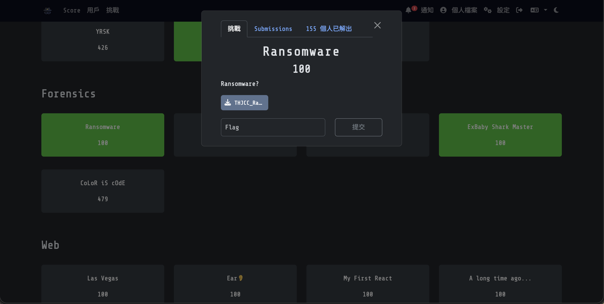
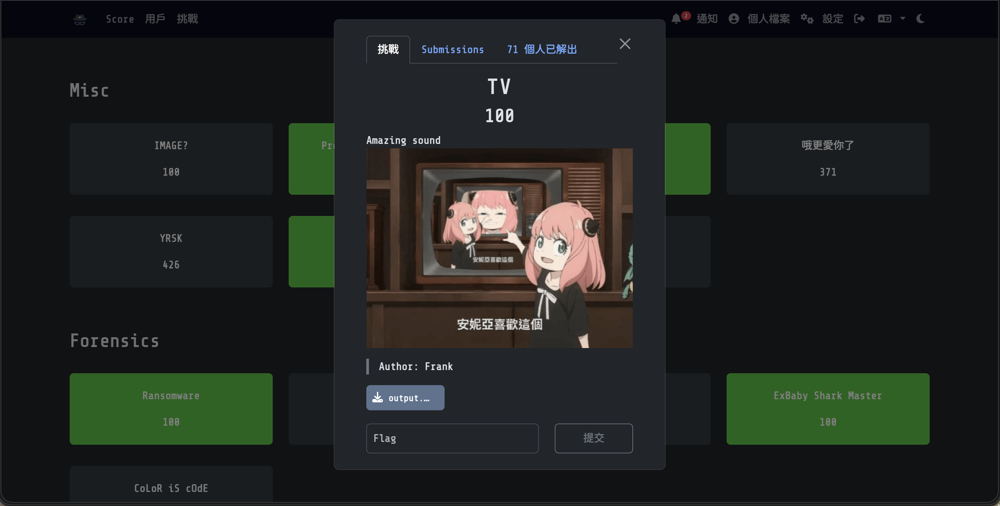
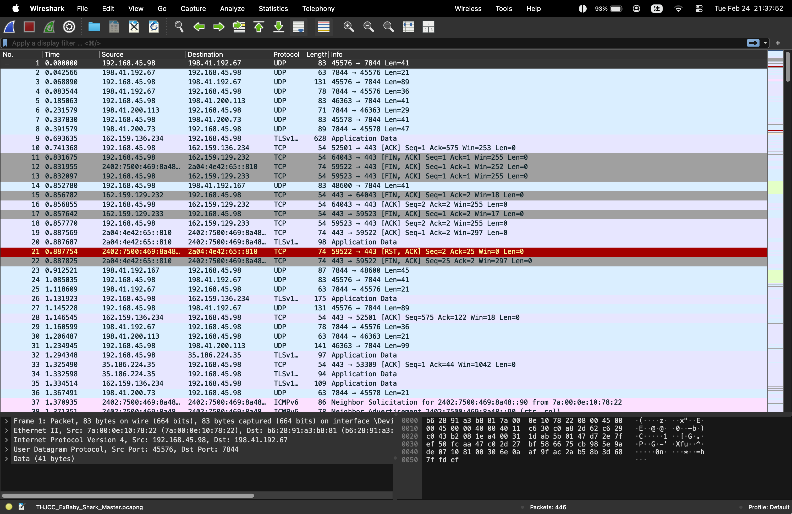

Forensics 題目是一種數位鑑識題...? 就是找東找西找到痕跡並且破譯Flag的樣子...?
> WP完成度： (5/5)

# Forensics分類：
## [Ransomware](https://ctf2026.thjcc.org/challenges#Ransomware-6) (100)

### 題目：
Ransomware?

:::Tip[Download Flie]
[THJCC_Ransomware.zip](https://file.pg72.tw/share/XHAJMpmp)
:::

### 解題心得：
這題說是一個勒索軟體，反正就來研究看看吧（？
首先先下載他的檔案，看看他裡面有什麼東東：

裡面有1個資料夾，資料夾裡面有4個桌面捷徑`.lnk`、`Uto.jpg`和`flag.txt.lock`，這看起來就是勒索軟體會做的事情，把檔案鎖起來後要你支付金錢才會給你密碼，那我們來研究一下`flag.txt.lock`的HxD看看：

全是亂碼欸～（被加密了當然看不懂啊==），那換看另外一個檔案好了：

另外一個檔案看起來是一個標準的檔案...? 那我們就來看檔案尾部好了：

恩？這怎麼這麼像Powershell的指令？我們把檔案改成`Uto.ps1`，然後丟Vscode 直接分析2進制檔案（省代碼，前面二進制亂碼就忽略）：
```ps1
$InputFile  = Join-Path -Path (Get-Location) -ChildPath 'flag.txt'
$OutputFile = "$InputFile.lock"

if (-not (Test-Path -LiteralPath $InputFile -PathType Leaf)) {
  throw "找不到檔案：$InputFile"
}

$UnixTime = [DateTimeOffset]::UtcNow.ToUnixTimeSeconds()

# key = MD5( UnixTimeSeconds as UTF-8 string ) -> 16 bytes (AES-128)
$md5 = [System.Security.Cryptography.MD5]::Create()
try {
  $keyMaterial = [Text.Encoding]::UTF8.GetBytes([string]$UnixTime)
  $Key = $md5.ComputeHash($keyMaterial)
} finally {
  $md5.Dispose()
}

# AES-CBC PKCS7
$AES = [System.Security.Cryptography.Aes]::Create()
$AES.Mode    = [System.Security.Cryptography.CipherMode]::CBC
$AES.Padding = [System.Security.Cryptography.PaddingMode]::PKCS7
$AES.Key     = $Key
$AES.GenerateIV()

$in  = [IO.File]::OpenRead($InputFile)
$out = [IO.File]::Create($OutputFile)

try {
  $unixBytes = [BitConverter]::GetBytes([int64]$UnixTime)
  $out.Write($unixBytes, 0, $unixBytes.Length)
  $out.Write($AES.IV, 0, $AES.IV.Length)

  $enc = $AES.CreateEncryptor()
  $crypto = New-Object System.Security.Cryptography.CryptoStream(
    $out, $enc, [System.Security.Cryptography.CryptoStreamMode]::Write
  )
  try {
    $in.CopyTo($crypto)
  } finally {
    $crypto.FlushFinalBlock()
    $crypto.Dispose()
  }
}
finally {
  $in.Dispose()
  $out.Dispose()
  $AES.Dispose()
  [Array]::Clear($Key, 0, $Key.Length)
}

Remove-Item -LiteralPath $InputFile -Force
```
那就開始解讀看看這個代碼，這個代碼他主要先抓當前Unix時間，然後再進行MD5雜湊，最後再進行`AES-128 (CBC 模式) `與`PKCS7 填充`加密，並生成一個初始化向量`IV`。  
接下來程式他將當前的Unix時間存在前8個byte，後面存16byte的IV，最後就是加密的內容。  
執行完上述的東西後，程式會刪除掉flag.txt。

那我們要怎麼還原呢？ 直接寫一個Python檔案來還原就好，啊如果像我一樣能力很差不會寫Python的就直接找AI讓他幫我們完成代碼！:spoiler[（AI還是太好用呢了:D）]
```py
import struct
import hashlib
from Crypto.Cipher import AES
from Crypto.Util.Padding import unpad

# Read the locked file
with open('flag.txt.lock', 'rb') as f:
    data = f.read()

# 1. Parse the file structure
# Bytes 0-7: Unix Timestamp (Int64, Little Endian)
# Bytes 8-23: AES IV (16 bytes)
# Bytes 24+: Ciphertext
unix_time_bytes = data[:8]
iv = data[8:24]
ciphertext = data[24:]

unix_time = struct.unpack('<q', unix_time_bytes)[0]
print("[*] Extracted Unix Time:", unix_time)

# 2. Reconstruct the AES key: MD5(UTF8(String(UnixTime)))
time_str = str(unix_time).encode('utf-8')
key = hashlib.md5(time_str).digest()
print("[*] Reconstructed Key:", key.hex())
print("[*] Extracted IV:", iv.hex())

# 3. Decrypt AES-CBC PKCS7
try:
    cipher = AES.new(key, AES.MODE_CBC, iv)
    decrypted_padded = cipher.decrypt(ciphertext)
    decrypted = unpad(decrypted_padded, AES.block_size)
    
    print("\n[!] Decryption Successful! Flag is:")
    print("-" * 40)
    print(decrypted.decode('utf-8', errors='ignore'))
    print("-" * 40)
        
except Exception as e:
    print("[-] Decryption failed:", e)
```
最後執行它，我們就會得到：
```bash
pg72@PGpenguin72:~/Downloads$ python3 Decryption_flag.py
[*] Extracted Unix Time: 1767534906
[*] Reconstructed Key: 04a34d6fbad6d84800f6890b0f82c20a
[*] Extracted IV: 36dd3b94e8062a5feaf3639de2686163

[!] Decryption Successful! Flag is:
----------------------------------------
THJCC{L1nK_R4Ns0mWar3_😭😭😭😭}
----------------------------------------
```

### Flag:
```THJCC{L1nK_R4Ns0mWar3_😭😭😭😭}```

## [I use arch btw](https://ctf2026.thjcc.org/challenges#I%20use%20arch%20btw-15) (100)

#### 題目：
Can you find the hidden message?
> Author: UmmIt Kin

:::Tip[Download Flie]
[THJCC_I_use_arch_btw.jpg](https://file.pg72.tw/share/UbH4vUCs)
:::

### 解題心得：
這題其實我解出來了，但我不相信他是答案就沒送出了== 具體怎麼解的就看我解吧！  
首先我們先下載這張圖片來看看：

恩...沒有什麼特別的，那就老樣子打開HxD來看看有沒有50 4B (PK) （也就是確認有沒有zip檔案藏裡面）：

恩，不意外，直接解壓縮看看裡面的`readme.xlsx`吧！  
打開後我發現他需要密碼，可是我又不知道密碼要怎麼辦呢...？  
當然是直接找線上工具爆破密碼啊（或是照官方解答說的提取hash破解，用`office2john`這個工具，不過我並不會用所以有興趣的可以看這個： https://ummit.dev/ctf/thjcc/2026 ）  

然後我使用了這個線上工具：[Password Find](https://www.password-find.com/crack_office_password.htm?js=on)  
這個線上工具幫我生成了一個xlsx檔案（也就是解密後的檔案）：

然後，我看著裡面的Flag...，我以為這個系統會自動把我的一些字元刪除然後要我付費解鎖，我在那裡卡了許久後就放棄了== 沒想到密碼其實就是跟上面說的一樣就是長這樣，我又破防了啊啊啊啊ㄚ

### Flag:
```THJCC{7h15_15_7h3_m3554g3....._1_u53_4rch_b7w}```

## [TV](https://ctf2026.thjcc.org/challenges#TV-31) (100)

### 題目：
Amazing sound
> Author: Frank

:::Tip[Download Flie]
[output.flac](https://file.pg72.tw/share/80h6z18l)
:::

### 解題心得：
這題是一個很酷的題目，超帥，這題檔案是一個音頻，然後題目是TV。我們聽這個音檔發現並不是正常的聲音檔案，那我們應該要怎麼做呢...?  
這時要提到一個技術叫SSTV的技術，反正簡單來說就是將特定頻率振幅的聲音轉成圖片的技術，又稱慢掃描電視，廢話不多說就直接看過程+結果吧！  

<iframe width="100%" height="468" src="https://www.youtube.com/embed/AyGhTHa2ZmA?si=wy83ZcG1sH1UfrNN" title="YouTube video player" frameborder="0" allow="accelerometer; autoplay; clipboard-write; encrypted-media; gyroscope; picture-in-picture; web-share" allowfullscreen></iframe>


### Flag:
```THJCC{sSTv-is_aMaZINg}```

## [ExBaby Shark Master](https://ctf2026.thjcc.org/challenges#ExBaby%20Shark%20Master-70) (100)

### 題目：
Just Search
> Author: Frank

:::Tip[Download Flie]
[THJCC_ExBaby_Shark_Master.pcapng](https://file.pg72.tw/share/SdPa9iQ3)
:::

### 解題心得：
這題還蠻簡單的，就是在一堆數據裡找到需要的東西。  
首先介紹一下`pcapng`這個檔案，他是一個網路抓包工具，也就是你的所有連線紀錄都會被存在這裡，我們可以使用[wireshark](https://www.wireshark.org/)來查看這個檔案：

然後接下來就是要在這裡面茫茫大海裡找到最SUS的紀錄......  
然後們發現這裡面有兩筆上傳紀錄在第166行和275行，這兩筆上傳紀錄幾乎一樣所以我們來看看：
```txt collapse={1-21, 30-32}
0000   b6 28 91 a3 b8 81 7a 00 0e 10 78 22 86 dd 60 04   .(....z...x"..`.
0010   03 ff 01 c4 06 fe 24 02 75 00 04 69 8a 48 b9 41   ......$.u..i.H.A
0020   83 73 65 17 2d 56 26 06 47 00 30 32 00 00 00 00   .se.-V&.G.02....
0030   00 00 ac 43 ab 24 cc 2c 00 50 6a 82 c7 9d 3e 87   ...C.$.,.Pj...>.
0040   12 f5 50 18 00 ff 6d fa 00 00 50 4f 53 54 20 2f   ..P...m...POST /
0050   75 70 6c 6f 61 64 20 48 54 54 50 2f 31 2e 31 0d   upload HTTP/1.1.
0060   0a 48 6f 73 74 3a 20 66 72 6b 2e 74 77 0d 0a 55   .Host: frk.tw..U
0070   73 65 72 2d 41 67 65 6e 74 3a 20 63 75 72 6c 2f   ser-Agent: curl/
0080   38 2e 31 37 2e 30 0d 0a 41 63 63 65 70 74 3a 20   8.17.0..Accept: 
0090   2a 2f 2a 0d 0a 43 6f 6e 74 65 6e 74 2d 4c 65 6e   */*..Content-Len
00a0   67 74 68 3a 20 32 34 32 0d 0a 43 6f 6e 74 65 6e   gth: 242..Conten
00b0   74 2d 54 79 70 65 3a 20 6d 75 6c 74 69 70 61 72   t-Type: multipar
00c0   74 2f 66 6f 72 6d 2d 64 61 74 61 3b 20 62 6f 75   t/form-data; bou
00d0   6e 64 61 72 79 3d 2d 2d 2d 2d 2d 2d 2d 2d 2d 2d   ndary=----------
00e0   2d 2d 2d 2d 2d 2d 2d 2d 2d 2d 2d 2d 2d 2d 76 66   --------------vf
00f0   44 36 78 63 66 41 7a 71 38 30 56 4f 6e 69 32 71   D6xcfAzq80VOni2q
0100   6c 5a 44 76 0d 0a 0d 0a 2d 2d 2d 2d 2d 2d 2d 2d   lZDv....--------
0110   2d 2d 2d 2d 2d 2d 2d 2d 2d 2d 2d 2d 2d 2d 2d 2d   ----------------
0120   2d 2d 76 66 44 36 78 63 66 41 7a 71 38 30 56 4f   --vfD6xcfAzq80VO
0130   6e 69 32 71 6c 5a 44 76 0d 0a 43 6f 6e 74 65 6e   ni2qlZDv..Conten
0140   74 2d 44 69 73 70 6f 73 69 74 69 6f 6e 3a 20 66   t-Disposition: f
0150   6f 72 6d 2d 64 61 74 61 3b 20 6e 61 6d 65 3d 22   orm-data; name="
0160   64 61 74 61 22 3b 20 66 69 6c 65 6e 61 6d 65 3d   data"; filename=
0170   22 65 78 62 61 62 79 2d 73 68 61 72 6b 2d 6d 61   "exbaby-shark-ma
0180   73 74 65 72 2e 74 78 74 22 0d 0a 43 6f 6e 74 65   ster.txt"..Conte
0190   6e 74 2d 54 79 70 65 3a 20 74 65 78 74 2f 70 6c   nt-Type: text/pl
01a0   61 69 6e 0d 0a 0d 0a 54 48 4a 43 43 7b 31 74 27   ain....THJCC{1t'
01b0   53 2d 33 41 73 79 2a 2d 72 31 67 68 37 3f 3f 3f   S-3Asy*-r1gh7???
01c0   3f 3f 7d 0a 0d 0a 2d 2d 2d 2d 2d 2d 2d 2d 2d 2d   ??}...----------
01d0   2d 2d 2d 2d 2d 2d 2d 2d 2d 2d 2d 2d 2d 2d 2d 2d   ----------------
01e0   76 66 44 36 78 63 66 41 7a 71 38 30 56 4f 6e 69   vfD6xcfAzq80VOni
01f0   32 71 6c 5a 44 76 2d 2d 0d 0a                     2qlZDv--..
```
欸嘿，我們就找到Flag了！那就直接填答案吧！
### Flag:
```THJCC{1t'S-3Asy*-r1gh7?????}```

## [CoLoR iS cOdE](https://ctf2026.thjcc.org/challenges#CoLoR%20iS%20cOdE-21) (479)

### 題目：
Yeah so I forgot the zip password.

Good luck getting in :D

btw, colors can say a lot.
> Author: xzhiyouu

:::Tip[Download Flie]
[THJCC_CoLoR_iS_cOdE.zip](https://file.pg72.tw/share/0L6m8jwo)
:::

### 解題心得：
這題有點困難，我看著大佬的影片跟著學的，有興趣可以看看到底要怎麼操作：
> [!NOTE]
> 大佬影片鏈結： [Youtube](https://youtu.be/0e9sybuGLU4)  

首先先把檔案下載下來，然後會發現這個檔案是zip檔，裡面有一個叫`rainbow.png`的圖片，但檔案加密了，沒辦法直接解壓縮，目前也不知道密碼，就只好使用這個工具來密碼明文攻擊啦！  
:spoiler[依據這題的創作者所述，這題密碼是這樣： **this_is_a_strong_passwd_for_CoLoR-iS- cOdE_challenge** ，如果暴力破解的話會花好數兆兆年...?（Gemini說的）]
::github{repo="kimci86/bkcrack/"}
這個工具安裝後，我們先加入一個`header.bin`：
> [!NOTE]
> header.bin 主要是這個工具破譯資料夾需要至少**12個位元組明文**，也就是原始檔案`png`的一些已知內容。那我們都知道png有固定的header：`89 50 4E 47 0D 0A 1A 0A`(Signature)`00 00 00 0D`(IHDR Length)`49 48 44 52`(IHDR Type)，所以我們直接把這個當標頭當作明文寫入`header.bin`中，這樣就可以破譯了！
```bash
pg72@PGpenguin72:~/Downloads/$ cd ./bkcrack-1.8.1-Linux-aarch64/
pg72@PGpenguin72:~/Downloads/bkcrack-1.8.1-Linux-aarch64/$ printf '\x89PNG\r\n\x1a\n\x00\x00\x00\x0D\x49\x48\x44\x52' > header.bin
pg72@PGpenguin72:~/Downloads/bkcrack-1.8.1-Linux-aarch64/$ ./bkcracker \
>	-C THJCC_CoLoR_iS_cOdE.zip \
>	-c rainbow.png \
>	-p header.bin
bkcrack 1.8.1 - 2025-10-25
[23:59:38] Z reduction using 9 bytes of known plaintext
100.0 % (9 / 9)
[23:59:38] Attack on 659629 Z values at index 6
Keys: d3b0bb05 2e88b90e ed7f7e33
74.2 % (489645 / 659629)
Found a solution. Stopping.
You may resume the attack with the option: --continue-attack 489645
[00:33:59] Keys
d3b0bb05 2e88b90e ed7f7e33
pg72@PGpenguin72:~/Downloads/bkcrack-1.8.1-Linux-aarch64/$ ./bkcracker \
>	-C THJCC_CoLoR_iS_cOdE.zip \
>	-c rainbow.png \
>	-k d3b0bb05 2e88b90e ed7f7e33 \
>	-D new.bin
bkcrack 1.8.1 - 2025-10-25
[00:39:55] Writing decrypted archive new.zip
100.0 % (1 / 1)
```

經過上面的破譯後，我們可以得到一個新的沒有加密的zip：`new.zip`，然後就可以直接解壓縮查看裡面的`rainbow.png`啦！

這個圖片再加上題目提示就看起來很像是一個代碼叫`npiet`，簡單來說就是用顏色寫程式碼。那就直接Online Decode就行！[我是線上解碼工具](https://www.bertnase.de/npiet/npiet-execute.php)
```txt
!0rful_img_m4d3_by_p1e7:>}
```
恩？ 只有這樣嗎？ 感覺怪怪的，開HxD檢查一下：

等等下面那串是啥？ OoK? 這不是Brainfuck的變種`Ook!`嗎？（就是一個很難讀的程式語言啦），然後就用`exfitool`把這些文字提取出來（是看影片才知道有這工具的，要不然我都不知道==）：
```bash collapse={2-23}
pg72@PGpenguin72:~/Downloads/bkcrack-1.8.1-Linux-aarch64/new$ exiftool rainbow.png 
ExifTool Version Number         : 13.10
File Name                       : rainbow.png
Directory                       : .
File Size                       : 10 kB
File Modification Date/Time     : 2025:11:07 23:21:05+08:00
File Access Date/Time           : 2026:02:24 23:59:45+08:00
File Inode Change Date/Time     : 2026:02:24 23:59:42+08:00
File Permissions                : -rw-r--r--
File Type                       : PNG
File Type Extension             : png
MIME Type                       : image/png
Image Width                     : 377
Image Height                    : 52
Bit Depth                       : 8
Color Type                      : RGB
Compression                     : Deflate/Inflate
Filter                          : Adaptive
Interlace                       : Noninterlaced
Exif Byte Order                 : Little-endian (Intel, II)
User Comment                    : Ook. Ook. Ook. Ook. Ook. Ook. Ook. Ook. Ook. Ook. Ook. Ook. Ook. Ook. Ook. Ook. Ook. Ook. Ook! Ook? Ook! Ook! Ook. Ook? Ook. Ook. Ook. Ook. Ook. Ook. Ook. Ook. Ook. Ook. Ook. Ook. Ook. Ook. Ook. Ook. Ook. Ook. Ook? Ook. Ook? Ook! Ook. Ook? Ook. Ook. Ook. Ook. Ook. Ook. Ook! Ook. Ook? Ook. Ook. Ook. Ook. Ook. Ook. Ook. Ook! Ook? Ook! Ook! Ook. Ook? Ook! Ook! Ook! Ook! Ook! Ook! Ook? Ook. Ook? Ook! Ook. Ook? Ook! Ook! Ook! Ook! Ook! Ook! Ook! Ook. Ook. Ook. Ook. Ook. Ook! Ook. Ook! Ook! Ook! Ook! Ook! Ook! Ook! Ook! Ook! Ook! Ook! Ook! Ook! Ook! Ook! Ook. Ook! Ook. Ook? Ook. Ook. Ook. Ook. Ook. Ook. Ook. Ook. Ook. Ook. Ook. Ook. Ook. Ook. Ook. Ook! Ook? Ook! Ook! Ook. Ook? Ook. Ook. Ook. Ook. Ook. Ook. Ook. Ook. Ook. Ook. Ook. Ook. Ook. Ook. Ook? Ook. Ook? Ook! Ook. Ook? Ook. Ook. Ook. Ook. Ook. Ook. Ook. Ook. Ook. Ook. Ook. Ook. Ook. Ook. Ook! Ook. Ook? Ook. Ook. Ook. Ook. Ook. Ook. Ook. Ook. Ook. Ook! Ook? Ook! Ook! Ook. Ook? Ook! Ook! Ook! Ook! Ook! Ook! Ook! Ook! Ook? Ook. Ook? Ook! Ook. Ook? Ook! Ook! Ook! Ook! Ook! Ook! Ook! Ook! Ook! Ook! Ook! Ook! Ook! Ook! Ook! Ook! Ook! Ook. Ook? Ook. Ook. Ook. Ook. Ook. Ook. Ook. Ook. Ook. Ook. Ook. Ook. Ook. Ook. Ook. Ook! Ook? Ook! Ook! Ook. Ook? Ook! Ook! Ook! Ook! Ook! Ook! Ook! Ook! Ook! Ook! Ook! Ook! Ook! Ook! Ook? Ook. Ook? Ook! Ook. Ook? Ook! Ook! Ook! Ook! Ook! Ook. Ook? Ook. Ook. Ook. Ook. Ook. Ook. Ook. Ook. Ook. Ook. Ook. Ook. Ook. Ook. Ook. Ook! Ook? Ook! Ook! Ook. Ook? Ook. Ook. Ook. Ook. Ook. Ook. Ook. Ook. Ook. Ook. Ook. Ook. Ook. Ook. Ook? Ook. Ook? Ook! Ook. Ook? Ook. Ook. Ook. Ook. Ook. Ook. Ook. Ook. Ook. Ook. Ook. Ook. Ook. Ook. Ook. Ook. Ook. Ook. Ook. Ook. Ook. Ook. Ook! Ook. Ook. Ook. Ook. Ook. Ook. Ook. Ook! Ook. Ook. Ook. Ook. Ook. Ook. Ook. Ook! Ook. Ook? Ook. Ook. Ook. Ook. Ook. Ook. Ook. Ook! Ook? Ook! Ook! Ook. Ook? Ook! Ook! Ook! Ook! Ook! Ook! Ook? Ook. Ook? Ook! Ook. Ook? Ook! Ook! Ook! Ook! Ook! Ook! Ook! Ook. Ook? Ook. Ook. Ook. Ook. Ook. Ook. Ook. Ook. Ook. Ook! Ook? Ook! Ook! Ook. Ook? Ook! Ook! Ook! Ook! Ook! Ook! Ook! Ook! Ook? Ook. Ook? Ook! Ook. Ook? Ook! Ook! Ook! Ook. Ook? Ook. Ook. Ook. Ook. Ook. Ook. Ook. Ook. Ook. Ook. Ook. Ook. Ook. Ook! Ook? Ook! Ook! Ook. Ook? Ook! Ook! Ook! Ook! Ook! Ook! Ook! Ook! Ook! Ook! Ook! Ook! Ook? Ook. Ook? Ook! Ook. Ook? Ook! Ook. Ook? Ook. Ook. Ook. Ook. Ook. Ook. Ook. Ook. Ook. Ook. Ook. Ook. Ook. Ook! Ook? Ook! Ook! Ook. Ook? Ook. Ook. Ook. Ook. Ook. Ook. Ook. Ook. Ook. Ook. Ook. Ook. Ook? Ook. Ook? Ook! Ook. Ook? Ook. Ook. Ook. Ook. Ook. Ook. Ook. Ook. Ook. Ook. Ook. Ook. Ook. Ook. Ook. Ook. Ook. Ook. Ook. Ook. Ook! Ook. Ook. Ook. Ook. Ook. Ook. Ook. Ook. Ook. Ook! Ook. Ook? Ook. Ook. Ook. Ook. Ook. Ook. Ook. Ook! Ook? Ook! Ook! Ook. Ook? Ook. Ook. Ook. Ook. Ook. Ook. Ook? Ook. Ook? Ook! Ook. Ook? Ook. Ook. Ook. Ook. Ook. Ook. Ook! Ook. Ook! Ook! Ook! Ook! Ook! Ook! Ook! Ook. Ook? Ook. Ook. Ook. Ook. Ook. Ook. Ook. Ook. Ook. Ook. Ook. Ook. Ook. Ook. Ook. Ook! Ook? Ook! Ook! Ook. Ook? Ook! Ook! Ook! Ook! Ook! Ook! Ook! Ook! Ook! Ook! Ook! Ook! Ook! Ook! Ook? Ook. Ook? Ook! Ook. Ook? Ook! Ook! Ook! Ook! Ook! Ook! Ook! Ook! Ook! Ook! Ook! Ook! Ook! Ook! Ook! Ook! Ook! Ook! Ook! Ook! Ook! Ook! Ook! Ook. Ook? Ook. Ook. Ook. Ook. Ook. Ook. Ook. Ook. Ook. Ook. Ook. Ook. Ook. Ook. Ook. Ook. Ook. Ook! Ook? Ook! Ook! Ook. Ook? Ook. Ook. Ook. Ook. Ook. Ook. Ook. Ook. Ook. Ook. Ook. Ook. Ook. Ook. Ook. Ook. Ook? Ook. Ook? Ook! Ook. Ook? Ook. Ook. Ook. Ook. Ook! Ook. Ook? Ook. Ook. Ook. Ook. Ook. Ook. Ook. Ook! Ook? Ook! Ook! Ook. Ook? Ook! Ook! Ook! Ook! Ook! Ook! Ook? Ook. Ook? Ook! Ook. Ook? Ook! Ook! Ook! Ook! Ook! Ook! Ook! Ook. Ook? Ook. Ook. Ook. Ook. Ook. Ook. Ook. Ook! Ook? Ook! Ook! Ook. Ook? Ook. Ook. Ook. Ook. Ook. Ook. Ook? Ook. Ook? Ook! Ook. Ook? Ook. Ook. Ook. Ook. Ook. Ook. Ook. Ook. Ook. Ook. Ook. Ook. Ook! Ook. Ook? Ook. Ook. Ook. Ook. Ook. Ook. Ook. Ook. Ook. Ook. Ook. Ook. Ook. Ook. Ook. Ook. Ook. Ook. Ook. Ook! Ook? Ook! Ook! Ook. Ook? Ook! Ook! Ook! Ook! Ook! Ook! Ook! Ook! Ook! Ook! Ook! Ook! Ook! Ook! Ook! Ook! Ook! Ook! Ook? Ook. Ook? Ook! Ook. Ook? Ook! Ook! Ook! Ook! Ook! Ook! Ook! Ook. Ook? Ook. Ook. Ook. Ook. Ook. Ook. Ook. Ook. Ook. Ook. Ook. Ook. Ook. Ook. Ook. Ook! Ook? Ook! Ook! Ook. Ook? Ook. Ook. Ook. Ook. Ook. Ook. Ook. Ook. Ook. Ook. Ook. Ook. Ook. Ook. Ook? Ook. Ook? Ook! Ook. Ook? Ook. Ook. Ook. Ook. Ook. Ook. Ook. Ook. Ook. Ook. Ook. Ook. Ook. Ook. Ook. Ook. Ook. Ook. Ook. Ook. Ook. Ook. Ook. Ook. Ook. Ook. Ook! Ook. Ook. Ook. Ook. Ook. Ook. Ook. Ook. Ook. Ook! Ook. Ook? Ook. Ook. Ook. Ook. Ook. Ook. Ook. Ook. Ook. Ook. Ook. Ook. Ook. Ook. Ook. Ook! Ook? Ook! Ook! Ook. Ook? Ook! Ook! Ook! Ook! Ook! Ook! Ook! Ook! Ook! Ook! Ook! Ook! Ook! Ook! Ook? Ook. Ook? Ook! Ook. Ook? Ook! Ook! Ook! Ook! Ook! Ook. Ook? Ook.
Image Size                      : 377x52
Megapixels                      : 0.020
```
然後把它丟到線上網站把它翻譯一下： [這是我用的Decoder網站](https://www.dcode.fr/ook-language)
```txt
THJCC{c0lorfU1_col0rfu!_c0
```
最後再把這兩個字串連接起來應該就是答案了！
### Flag:
```THJCC{c0lorfU1_col0rfu!_c0!0rful_img_m4d3_by_p1e7:>}```
