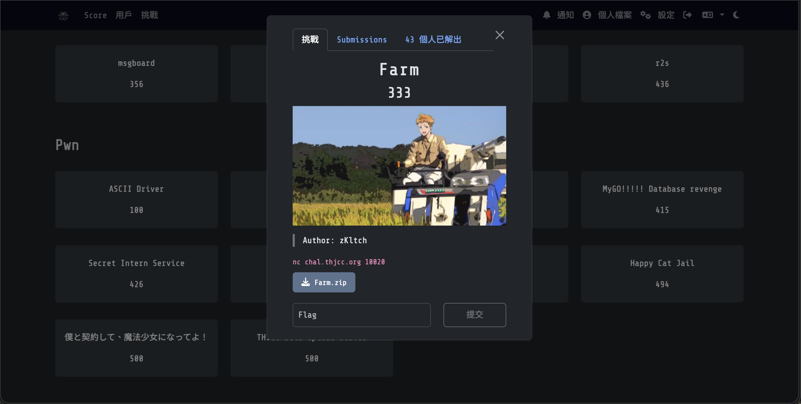
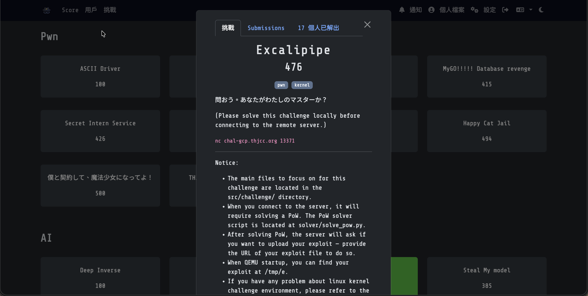
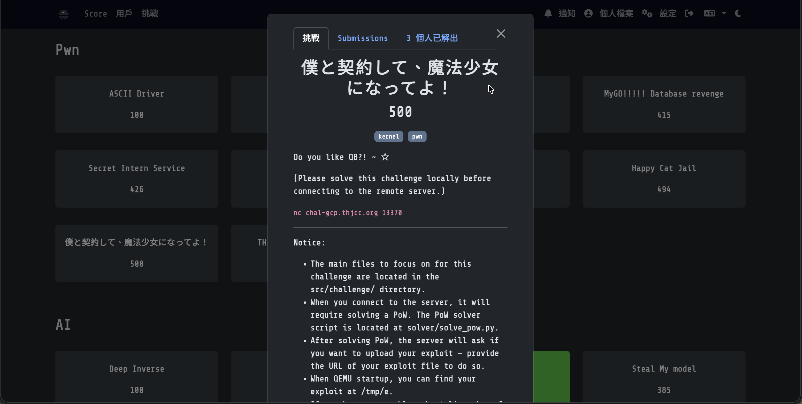

Pwn 就是要你去破億出遠端機器的漏洞然後打下來獲取Flag。（這種題目我超爛:\( ）
> WP完成度： (0/10)

# Pwn分類：
## [-ASCII Driver](100) (100)

### 題目：
> Author: zKltch

:::Tip[Download Flie]
[ASCII_Driver.zip](https://file.pg72.tw/share/QBu7Ym3F)
:::

:::Tip[Connection]
nc chal.thjcc.org 10022
:::

### 解題心得：
好吧這題其實沒有解出來，還在學習中，等學好了再放上來！

### Flag:
```THJCC{}```


## [-Farm](https://ctf2026.thjcc.org/challenges#Farm-35) (100)

### 題目：
> Author: zKltch

:::Tip[Download Flie]
[Farm.zip](https://file.pg72.tw/share/a4PCxqc0)
:::

:::Tip[Connection]
nc chal.thjcc.org 10020
:::

### 解題心得：
好吧這題其實沒有解出來，還在學習中，等學好了再放上來！

### Flag:
```THJCC{}```

## [-login as admin](https://ctf2026.thjcc.org/challenges#login%20as%20admin-37) (410)

### 題目：
I think I made a very secure login system, so no one can hack it
> Author: Auron

:::Tip[Download Flie]
[chal (2).zip](https://file.pg72.tw/share/mdC8p06G)
:::

:::Tip[Connection]
nc chal.thjcc.org 10003
:::

### 解題心得：
好吧這題其實沒有解出來，還在學習中，等學好了再放上來！

### Flag:
```THJCC{}```

## [-MyGO!!!!! Database revenge](https://ctf2026.thjcc.org/challenges#MyGO!!!!!%20Database%20revenge%20-46) (415)

### 題目：
> Author: zKltch

:::Tip[Download Flie]
[mygo_database_revenge.zip](https://file.pg72.tw/share/4TSnVZ5d)
:::

:::Tip[Connection]
nc chal.thjcc.org 10021
:::

### 解題心得：
好吧這題其實沒有解出來，還在學習中，等學好了再放上來！

### Flag:
```THJCC{}```

## [-Secret Intern Service](https://ctf2026.thjcc.org/challenges#Secret%20Intern%20Service-41) (426)

### 題目：
Exploit the “unexploitable” service and prove you’re truly the best of the best.

This challenge depends on Secret File Viewer, find something useful for you right there
> Author: Grissia

:::Tip[Download Flie]
[chal.c](https://file.pg72.tw/share/GGGE-Mip)
:::

:::Tip[Connection]
nc chal.thjcc.org 30001
:::

### 解題心得：
好吧這題其實沒有解出來，還在學習中，等學好了再放上來！

### Flag:
```THJCC{}```

## [-Baby PHP](https://ctf2026.thjcc.org/challenges#Baby%20PHP-72) (463)

### 題目：
This is a baby web challenge.  
\:>  
> Note: ASLR is 0  

http://chal-gcp.thjcc.org:60000/
> Author: whale120

:::Tip[Download Flie]
[baby-php-release.zip](https://file.pg72.tw/share/2sIOS_2o)
:::

### 解題心得：
好吧這題其實沒有解出來，還在學習中，等學好了再放上來！

### Flag:
```THJCC{}```

## [-Excalipipe](https://ctf2026.thjcc.org/challenges#Excalipipe-69) (476)

### 題目：
問おう。あなたがわたしのマスターか？

(Please solve this challenge locally before connecting to the remote server.)  
Notice:
- The main files to focus on for this challenge are located in the src/challenge/ directory.
- When you connect to the server, it will require solving a PoW. The PoW solver script is located at solver/solve_pow.py.
- After solving PoW, the server will ask if you want to upload your exploit — provide the URL of your exploit file to do so.
- When QEMU startup, you can find your exploit at /tmp/e.
- If you have any problem about linux kernel challenge environment, please refer to the challenge others source code.
> Author: naup96321

:::Tip[Download Flie]
[dist_excalipipe.zip](https://file.pg72.tw/share/iOPqQ4ho)
:::

:::Tip[Connection]
nc chal-gcp.thjcc.org 13371
:::

### 解題心得：
好吧這題其實沒有解出來，還在學習中，等學好了再放上來！

### Flag:
```THJCC{}```

## [-Happy Cat Jail](https://ctf2026.thjcc.org/challenges#Happy%20Cat%20Jail-16) (494)

### 題目：
meow ?
> Author: Frank

:::Tip[Download Flie]
[THJCC_Happy-Cat-Jail.go](https://file.pg72.tw/share/fezTl7uA)
:::

:::Tip[Connection]
nc chal.thjcc.org 9000
:::

### 解題心得：
好吧這題其實沒有解出來，還在學習中，等學好了再放上來！

### Flag:
```THJCC{}```

## [-僕と契約して、魔法少女になってよ！](https://ctf2026.thjcc.org/challenges#%E5%83%95%E3%81%A8%E5%A5%91%E7%B4%84%E3%81%97%E3%81%A6%E3%80%81%E9%AD%94%E6%B3%95%E5%B0%91%E5%A5%B3%E3%81%AB%E3%81%AA%E3%81%A3%E3%81%A6%E3%82%88%EF%BC%81-67) (500)

### 題目：
Do you like QB?! ~ ☆. 

(Please solve this challenge locally before connecting to the remote server.)  
Notice:

- The main files to focus on for this challenge are located in the src/challenge/ directory.
- When you connect to the server, it will require solving a PoW. The PoW solver script is located at solver/solve_pow.py.
- After solving PoW, the server will ask if you want to upload your exploit — provide the URL of your exploit file to do so.
- When QEMU startup, you can find your exploit at /tmp/e.
- If you have any problem about linux kernel challenge environment, please refer to the challenge others source code.
> Author: naup96321

:::Tip[Download Flie]
[dist_qb.zip](https://file.pg72.tw/share/gzcug8PT)
:::

:::Tip[Connection]
nc chal-gcp.thjcc.org 13370
:::

### 解題心得：
好吧這題其實沒有解出來，還在學習中，等學好了再放上來！

### Flag:
```THJCC{}```

## [-THJCC file upload server](https://ctf2026.thjcc.org/challenges#THJCC%20file%20upload%20server-68) (500)

### 題目：
here we go absolutely insane.

http://chal.thjcc.org:10100
> Author: zKltch

:::Tip[Download Flie]
[THJCC_file_upload_system.zip](https://file.pg72.tw/share/y9oBSmOR)
:::

### 解題心得：
好吧這題其實沒有解出來，還在學習中，等學好了再放上來！

### Flag:
```THJCC{}```
