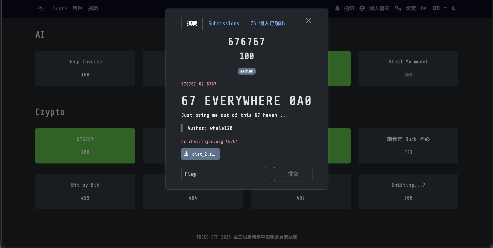
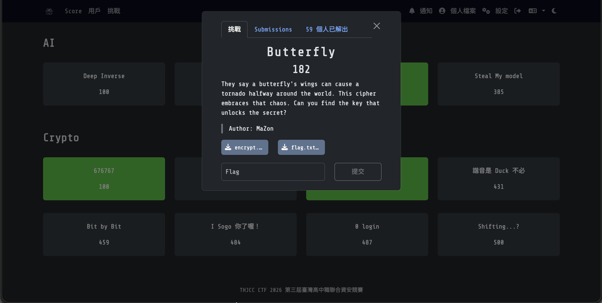
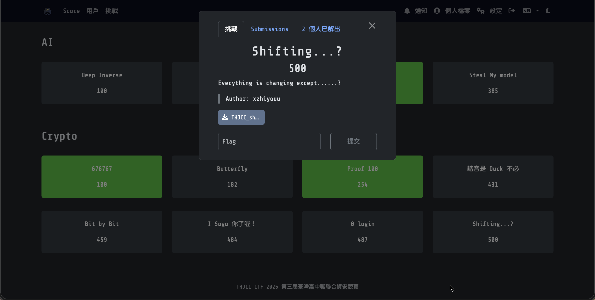

Crypto 分類是一堆密碼學的題目，會用到各式各樣和密碼相關的東西喔（好像有說等於沒說的樣子）。
> WP完成度：(3/8)

# Crypto
## [676767](https://ctf2026.thjcc.org/challenges#676767-52) (100)

### 題目：

676767 67 6767

67 EVERYWHERE 0A0
Just bring me out of this 67 haven ...

> Author: whale120 

:::Tip[Download Flie]
[dist_2.zip](https://file.pg72.tw/share/JcniRujv)
:::

:::Tip[Connection]
nc chal.thjcc.org 48764
:::

### 解題心得：
國際慣例先連線看看：
```bash
pg72@PGpenguin72:~/Downloads$ nc chal.thjcc.org 48764

< 105467477439494503995122596682027042818698368110315490007918738332100372820081
< 29029376026273430334612749732025301050591069160628864054981034803813830717800
< 19147121440537230639024646522649035967232321016024612310503929611663772399189
< 34419585374965838486061982920350722363618418927035614305820512680865623656584
< 88170863423113431205476538743733781572862975488784987551493797643429194691247
< 13950557201625185693303411236913393519537041515336758789016906950129258289749
< 39665619693844454918935717373343418855572609584835290650520286888449449837543
< 8853155468079458433177716280638223627105772163632724520027869225837297068292
< 22335663485004271104608220454817604745185031805098301474306892071231337598773
< 76280562645860449105030615067248915500348616838229042745249351942305493740558
a>123
b>456
> 111
[-] byebye
pg72@PGpenguin72:~/Downloads$ nc chal.thjcc.org 48764

< 8385590742257294698298127929543187139597860947851016540175037397463661194529
< 98694554096600261264406167538625898493075476848522011032453155578827199261844
< 46465512106702232123861354355890896543305336489561645880360076346088292782274
< 66072507284656677073863609959942663857555528716388495851388374812460640045977
< 8869650871311532009649057110741484175964467661087963754798241083036505762561
< 29273964995283496245426901704018692153251544250857903122794280657699535462626
< 52166275717427564102096723481748970367744730492147137646329966692448013064337
< 74457787636844140250381310785794128815826736041614316132155127255164777836766
< 42405172765834440010759265519635842227179798223562380591344903754409216472825
< 78846212695184132361060672241531967282946617866188450037450159256520209125091
a>123
b>123
> 111
[-] byebye
```
嘖，我發現他每次都在亂數，而且他要我輸入東西也不知道要輸入啥。於是我又去下載壓縮包來看看，解壓後看到裡面有很多東西，其中`chal.py`引起了我的注意：
```py
import random
from flags import flag

base = 86844066927987146567678238756515930889952488499230423029593188005934867676767
seed = random.getrandbits(6767)
random.seed(seed)

for i in range(10):
    print("<", random.getrandbits(256))


a = int(input("a>"))
b = int(input("b>"))

if a==0 or a==1:
    print("[-] bad hacker")
    exit()

random.seed(a*seed + b)

for i in range(10):
    cur = int(input("> "))
    if random.randrange(base) != cur:
        print("[-] byebye")
        exit()

print("[+]", flag)
```
我終於看得懂他要做什麼了，簡單來說就是他用seed來設定隨機的值，並且如果傳入的seed一樣，隨機出來的數字序列也會一樣。  
程式一開始的seed是一個 6767 bits 的隨機整數，然後再用`2^256次方`的範圍隨機取了十個數字給我們。題目有防止直接在 a 使用 0 和 1，避免我們直接複製出相同的隨機值。  
於是這時候又要說一個seed的特性，他會將傳入的值取絕對值，也就是說，a 如果帶 -1，b 帶 0，那這樣我們就有可能讓他產生跟剛剛一模一樣的十個超長數字，最後再比對。  
那這就簡單啦，直接自己一直複製貼上，應該就可以解出來了。所以經過許久：
```bash
pg72@PGpenguin72:~/Downloads$ nc chal.thjcc.org 48764

< 13830750606943059472950307002918046398820206043589394774417394717575619447446
< 62540013297096407130559409605563992339706699130350330418505521898923596267021
< 72785517373510361251005023035247005054892004469170082762310076831100342347665
< 83880105657730949243200671643004580066889664421496910003779832390398028441263
< 80230016704833776646862037295590333792919409999799400829610825180510507842212
< 76567230499838502789885333514074171786896299603224622920097756895607444631398
< 34886559143601779214490461795064368014693961059924787723651600401869956446363
< 33491781338198386334526920523607526343214921186235127544118671742582352360083
< 21416388699365685880179143741645845006468527889028906891434615995357300095744
< 37197508625742239427295852133866372905689821864535453648611877391316334994350
a>-1
b>0
> 13830750606943059472950307002918046398820206043589394774417394717575619447446
> 62540013297096407130559409605563992339706699130350330418505521898923596267021
> 72785517373510361251005023035247005054892004469170082762310076831100342347665
> 83880105657730949243200671643004580066889664421496910003779832390398028441263
> 80230016704833776646862037295590333792919409999799400829610825180510507842212
> 76567230499838502789885333514074171786896299603224622920097756895607444631398
> 34886559143601779214490461795064368014693961059924787723651600401869956446363
> 33491781338198386334526920523607526343214921186235127544118671742582352360083
> 21416388699365685880179143741645845006468527889028906891434615995357300095744
> 37197508625742239427295852133866372905689821864535453648611877391316334994350
[+] THJCC{676767676767676767676767_i_dont_like_those_brainnot_memes_XD}
```
### Flag:
```THJCC{676767676767676767676767_i_dont_like_those_brainnot_memes_XD}```

## [-Butterfly](https://ctf2026.thjcc.org/challenges?#Butterfly-29) (182)

### 題目：
They say a butterfly's wings can cause a tornado halfway around the world. This cipher embraces that chaos. Can you find the key that unlocks the secret?
> Author: MaZon

:::Tip[Download Flie]
[encrypt.py](https://file.pg72.tw/share/-UQZs8SW)、[flag.txt.enc](https://file.pg72.tw/share/fs5SqYS7)
:::

### 解題心得：
好吧這題其實沒有解出來，還在學習中，等學好了再放上來！

### Flag:
```THJCC{}```

## [Proof 100](https://ctf2026.thjcc.org/challenges?#Proof%20100-51) (254)

### 題目：
Proof me you love me 100 times ... WITH YOUR SIGNATURE!!!  
哼
> Author: whale120

:::Tip[Download Flie]
[dist_1.zip](https://file.pg72.tw/share/MLpp7N3T)
:::

:::Tip[Connection]
nc chal.thjcc.org 48763
:::

### 解題心得：
這題就直接下載解壓縮後來看代碼吧，一樣先開`chal.py`：
```py
from flags import flag
from Crypto.Util.number import *
from hashlib import md5
import os

p, q = getPrime(64), getPrime(64)
e = 0x10001
N = p * q
d = pow(e, -1, (p-1)*(q-1))

seed = os.urandom(16)

def sign(msg):
    global d, N
    m = bytes_to_long(md5(msg).digest())
    return pow(m, d, N)

used_keys = []
print(f"SEED: {seed.hex()}")
print(f"{e=}")

for i in range(100):
    print("My turn owo")
    cur_key = bytes.fromhex(input("key:"))
    print(sign(cur_key+seed))
    used_keys.append(cur_key)
    print("Your turn ^w^")
    cur_key = bytes.fromhex(input("key:"))
    if cur_key in used_keys:
        print("Can u be more creative LOL")
        exit()
    
    proof = int(input("proof:"))
    if proof != sign(cur_key+seed):
        print("Sorry u didn't proof anything ...")
        exit()
    used_keys.append(cur_key)
    print("PASS!")

phi = int(input("phi?"))

if phi != (p-1)*(q-1):
    print("FAILED at LAST haha")
    exit()

print("Well done", flag)
```
這題這樣看，代碼就是實作RSA簽章。RSA簡單來說就是先算雜湊，然後用私鑰簽名，接下來進行數學驗證是否為本人（一樣用雜湊），最後用公鑰還原簽章。如果兩個雜湊一樣就代表是本人且內容無誤。  
好講完了RSA簽章是什麼了，那就開始想一下要怎麼做，我想到的是生成一個相同的MD5 Hash（但不同內容）來直接把簽章送出接下來萃取N值破解私鑰，最後透過自己簽名後續的內容就可以拿到Flag了。  
但我對寫這類代碼不熟，所以就交給我們的老朋友Gemini來寫：

```py
from pwn import *
from Crypto.Util.number import bytes_to_long, inverse
from hashlib import md5
import math
import sympy
import sys

# 放寬 Python 對超大整數的限制 (因為 S^e 會非常大)
sys.set_int_max_str_digits(1000000)

# ==========================================
# 1. 準備好已知的 MD5 碰撞組合 (Hex String)
# 這兩個字串內容不同，但 MD5 Hash 值完全一樣
# ==========================================
col1_hex = "d131dd02c5e6eec4693d9a0698aff95c2fcab58712467eab4004583eb8fb7f8955ad340609f4b30283e488832571415a085125e8f7cdc99fd91dbdf280373c5bd8823e3156348f5bae6dacd436c919c6dd53e2b487da03fd02396306d248cda0e99f33420f577ee8ce54b67080a80d1ec69821bcb6a8839396f9652b6ff72a70"
col2_hex = "d131dd02c5e6eec4693d9a0698aff95c2fcab50712467eab4004583eb8fb7f8955ad340609f4b30283e4888325f1415a085125e8f7cdc99fd91dbd7280373c5bd8823e3156348f5bae6dacd436c919c6dd53e23487da03fd02396306d248cda0e99f33420f577ee8ce54b67080280d1ec69821bcb6a8839396f965ab6ff72a70"

# 連線到伺服器 (請替換成實際的 IP 與 Port)
r = remote('chal.thjcc.org', 48763)
#r = process(['python3', 'encrypt.py']) # 如果你在本地測試，用這行

# 接收 Seed 與 e
r.recvuntil(b"SEED: ")
seed_hex = r.recvline().strip().decode()
seed = bytes.fromhex(seed_hex)

r.recvuntil(b"e=")
e = int(r.recvline().strip().decode())
print(f"[+] 取得 Seed: {seed_hex}")
print(f"[+] 取得 e: {e}")

# ==========================================
# 第一回合：利用 MD5 碰撞「白嫖」簽章
# ==========================================
print("\n[+] 進入第一回合 (MD5 碰撞利用)...")
r.recvuntil(b"key:")
r.sendline(col1_hex.encode())
sig1 = int(r.recvline().strip().decode())

r.recvuntil(b"key:")
r.sendline(col2_hex.encode()) # 送出碰撞的另一個 key
r.recvuntil(b"proof:")
r.sendline(str(sig1).encode()) # 因為 MD5 一樣，拿第一個簽章當證明
r.recvline() # PASS!

# ==========================================
# 第二回合：隨便送一個 Key，並在空檔中萃取 N 與 d
# ==========================================
print("\n[+] 進入第二回合 (萃取 N 並破解私鑰)...")
key3_hex = "11223344"
r.recvuntil(b"key:")
r.sendline(key3_hex.encode())
sig3 = int(r.recvline().strip().decode())

# === 核心數學破解階段 ===
print("[!] 正在計算 m1 與 m3...")
m1 = bytes_to_long(md5(bytes.fromhex(col1_hex) + seed).digest())
m3 = bytes_to_long(md5(bytes.fromhex(key3_hex) + seed).digest())

print("[!] 正在計算 GCD 以萃取 N (這會花幾秒鐘)...")
# N 會是 (S^e - m) 的因數
val1 = pow(sig1, e) - m1
val2 = pow(sig3, e) - m3
N_candidate = math.gcd(val1, val2)

print("[!] 正在分解 N (128-bit 質因數分解)...")
# GCD 算出來的結果可能會是 N 乘上一個小常數，我們直接對其作質因數分解
factors = sympy.factorint(N_candidate)
primes = [p for p in factors.keys() if p.bit_length() > 60] # 濾掉小常數，只取 60 bit 以上的質數

p = primes[0]
q = primes[1]
N = p * q
phi = (p - 1) * (q - 1)
d = inverse(e, phi)

print(f"[+] 成功破解 RSA！")
print(f"    p = {p}")
print(f"    q = {q}")
print(f"    N = {N}")

# ==========================================
# 第二回合證明：我們已經有私鑰了，直接自己簽章
# ==========================================
key4_hex = "55667788"
r.recvuntil(b"key:")
r.sendline(key4_hex.encode())

# 自己算簽章
m4 = bytes_to_long(md5(bytes.fromhex(key4_hex) + seed).digest())
proof4 = pow(m4, d, N)

r.recvuntil(b"proof:")
r.sendline(str(proof4).encode())
r.recvline() # PASS!

# ==========================================
# 剩下 98 回合：暴力通關
# ==========================================
print("\n[+] 自動通關剩餘回合...")
for i in range(3, 101):
    # My turn
    key_my_hex = f"{i:08x}aa"  # <--- 這裡
    r.recvuntil(b"key:")
    r.sendline(key_my_hex.encode())
    r.recvline() # 伺服器給的 sig，我們不需要了
    
    # Your turn
    key_your_hex = f"{i:08x}bb" # <--- 這裡
    r.recvuntil(b"key:")
    r.sendline(key_your_hex.encode())
    
    # 自己簽
    m_your = bytes_to_long(md5(bytes.fromhex(key_your_hex) + seed).digest())
    my_proof = pow(m_your, d, N)
    
    r.recvuntil(b"proof:")
    r.sendline(str(my_proof).encode())
    
    if i % 10 == 0:
        print(f"    已完成 {i}/100 回合")

# ==========================================
# 最終挑戰：送出 phi，拿 Flag
# ==========================================
r.recvuntil(b"phi?")
r.sendline(str(phi).encode())
print("\n[🎉] 成功送出 phi！接收 Flag 中...")

r.interactive() # 進入互動模式，看噴出來的 Flag
```

好直接執行程式後我們就可以得到我們心心念念的Flag了！

```bash
pg72@PGpenguin72:~/Downloads$ python3 slove.py
[x] Opening connection to chal.thjcc.org on port 48763
[x] Opening connection to chal.thjcc.org on port 48763: Trying 23.146.248.121
[+] Opening connection to chal.thjcc.org on port 48763: Done
[+] 取得 Seed: 57bb397875a95a2ef8143b84fe3fe3b9
[+] 取得 e: 65537

[+] 進入第一回合 (MD5 碰撞利用)...

[+] 進入第二回合 (萃取 N 並破解私鑰)...
[!] 正在計算 m1 與 m3...
[!] 正在計算 GCD 以萃取 N (這會花幾秒鐘)...
[!] 正在分解 N (128-bit 質因數分解)...
[+] 成功破解 RSA！
    p = 10533841925238233807
    q = 9508897406216141077
    N = 100165222160388683318072549978622790139

[+] 自動通關剩餘回合...
    已完成 10/100 回合
    已完成 20/100 回合
    已完成 30/100 回合
    已完成 40/100 回合
    已完成 50/100 回合
    已完成 60/100 回合
    已完成 70/100 回合
    已完成 80/100 回合
    已完成 90/100 回合
    已完成 100/100 回合

[🎉] 成功送出 phi！接收 Flag 中...
[*] Switching to interactive mode
Well done THJCC{yay_u_r_a_perfect_signer_owob_hehe}
[*] Got EOF while reading in interactive
```
### Flag:
```THJCC{yay_u_r_a_perfect_signer_owob_hehe}```

## [-諧音是 Duck 不必](https://ctf2026.thjcc.org/challenges?#%E8%AB%A7%E9%9F%B3%E6%98%AF%20Duck%20%E4%B8%8D%E5%BF%85-57) (431)
)
### 題目：
要放棄諧音梗已經 Taiwan 了...

這裡有一篇被古典密碼層層套路的文章，祝好運

> Author: 軒伯

:::Tip[Download Flie]
[secret.txt](https://file.pg72.tw/share/yzDBlDlh)
:::

### 解題心得：
好吧這題其實沒有解出來，還在學習中，等學好了再放上來！

### Flag:
```THJCC{}```

## [-Bit by Bit](https://ctf2026.thjcc.org/challenges?#Bit%20by%20Bit-54) (459)

### 題目：
I encode every thing bit by bit via RSA.
> Author: whale120

:::Tip[Download Flie]
[chal (4).zip](https://file.pg72.tw/share/gWat7qJA)
:::

### 解題心得：
好吧這題其實沒有解出來，還在學習中，等學好了再放上來！

### Flag:
```THJCC{}```

## [-I Sogo 你了喔！](https://ctf2026.thjcc.org/challenges?#I%20Sogo%20%E4%BD%A0%E4%BA%86%E5%96%94%EF%BC%81-55) (484)

### 題目：
Sogo 台灣人的諧音梗了、、、
> Author: whale120

:::Tip[Download Flie]
[chal.sage](https://file.pg72.tw/share/4nC3rAaA)
:::

### 解題心得：
好吧這題其實沒有解出來，還在學習中，等學好了再放上來！

### Flag:
```THJCC{}```

## [-0 login](https://ctf2026.thjcc.org/challenges?#0%20login-53) (487)

### 題目：
Welcome to our fantasic web service 0-login, you can login without any input!
http://chal.thjcc.org:5000/
> Author: whale120

:::Tip[Download Flie]
[release_2.py](https://file.pg72.tw/share/ZjRTiNdm)
:::

### 解題心得：
好吧這題其實沒有解出來，還在學習中，等學好了再放上來！

### Flag:
```THJCC{}```

## [Shifting...?](https://ctf2026.thjcc.org/challenges?#Shifting...?-22) (500)

### 題目：
Everything is changing except......?
> Author: xzhiyouu

:::Tip[Download Flie]
[THJCC_shifting.txt](https://file.pg72.tw/share/fljcZB0a)
:::

### 解題心得：
這題我那個時候丟給個大AI（eg. Deepseek、ChagtGPT、Gemini、Perplexity）都沒有解出來，後面結束後看到大佬怎麼解我就去嘗試了下，就有以下的心得（？

反正打開下載的txt後會發現：
```txt
44GD44Cx44Cz44GS44GS44KH44KG44CW44G044KA44GZ44CA44Gj44CT44Gh44CZ44Gk44C344Gi44GZ44CW44Gp44KF44GZ44G144Gz44CW44Gp44G044Gh44CS44Gz44Go44CT44Gp44Gi44Ci44GT44KJ
```
這啥鬼啊，全亂碼？？？但經過各種洗禮的人會知道我們就嘗試直接Base64 Decode一下：
```txt
44GD44Cx44Cz44GS44GS44KH44KG44CW44G044KA44GZ44CA44Gj44CT44Gh44CZ44Gk44C344Gi44GZ44CW44Gp44KF44GZ44G144Gz44CW44Gp44G044Gh44CS44Gz44Go44CT44Gp44Gi44Ci44GT44KJ
=> ぃ〱〳げげょゆ〖ぴむす　っ〓ち〙つ〷ぢす〖どゅすふび〖どぴち〒びと〓どぢ〢こら
```
完全看不懂，於是就嘗試轉成Unicode：
```txt
ぃ〱〳げげょゆ〖ぴむす　っ〓ち〙つ〷ぢす〖どゅすふび〖どぴち〒びと〓どぢ〢こら
=> \u3043\u3031\u3033\u3052\u3052\u3087\u3086\u3016\u3074\u3080\u3059\u3000\u3063\u3013\u3061\u3019\u3064\u3037\u3062\u3059\u3016\u3069\u3085\u3059\u3075\u3073\u3016\u3069\u3074\u3061\u3012\u3073\u3068\u3013\u3069\u3062\u3022\u3053\u3089
```
這些我們在回想題目名稱：shifting，於是就可以想到可能和凱薩加密有關，然後我們就先把重複部分去掉：
```txt
\u3043\u3031\u3033\u3052\u3052\u3087\u3086\u3016\u3074\u3080\u3059\u3000\u3063\u3013\u3061\u3019\u3064\u3037\u3062\u3059\u3016\u3069\u3085\u3059\u3075\u3073\u3016\u3069\u3074\u3061\u3012\u3073\u3068\u3013\u3069\u3062\u3022\u3053\u3089
=> 43 31 33 52 52 87 86 16 74 80 59 00 63 13 61 19 64 37 62 59 16 69 85 59 75 73 16 69 74 61 12 73 68 13 69 62 22 53 89
```
留下這些數字後我們想了想flag的格式一定是`THJCC{}`，所以比對第五個數字87到`{`的ASCII值(123)共差了36，於是推敲出位移為36，那全部加上36後再拿去換回英文後會得到：
```txt
79 67 69 88 88 123 122 52 110 116 95 36 99 49 97 55 100 73 98 95 52 105 121 95 111 109 52 105 110 97 48 109 104 49 105 98 58 89 125
=> OCEXX{z4nt_$c1a7dIb_4iy_om4ina0mh1ib:Y}
```
Flag格式好像出來了，但英文全錯，看起來應該又是一次凱薩加密，那我們就簡單丟到[計算網頁](https://planetcalc.com/1434/)去計算吧（其實如果手算會發現應該是ROT5，但我懶得算所以一樣直接丟網頁）：
```txt collapse={1-5, 7-26}
ROT0	OCEXX{z4nt_$c1a7dIb_4iy_om4ina0mh1ib:Y}
ROT1	PDFYY{a4ou_$d1b7eJc_4jz_pn4job0ni1jc:Z}
ROT2	QEGZZ{b4pv_$e1c7fKd_4ka_qo4kpc0oj1kd:A}
ROT3	RFHAA{c4qw_$f1d7gLe_4lb_rp4lqd0pk1le:B}
ROT4	SGIBB{d4rx_$g1e7hMf_4mc_sq4mre0ql1mf:C}
ROT5	THJCC{e4sy_$h1f7iNg_4nd_tr4nsf0rm1ng:D}
ROT6	UIKDD{f4tz_$i1g7jOh_4oe_us4otg0sn1oh:E}
ROT7	VJLEE{g4ua_$j1h7kPi_4pf_vt4puh0to1pi:F}
ROT8	WKMFF{h4vb_$k1i7lQj_4qg_wu4qvi0up1qj:G}
ROT9	XLNGG{i4wc_$l1j7mRk_4rh_xv4rwj0vq1rk:H}
ROT10	YMOHH{j4xd_$m1k7nSl_4si_yw4sxk0wr1sl:I}
ROT11	ZNPII{k4ye_$n1l7oTm_4tj_zx4tyl0xs1tm:J}
ROT12	AOQJJ{l4zf_$o1m7pUn_4uk_ay4uzm0yt1un:K}
ROT13	BPRKK{m4ag_$p1n7qVo_4vl_bz4van0zu1vo:L}
ROT14	CQSLL{n4bh_$q1o7rWp_4wm_ca4wbo0av1wp:M}
ROT15	DRTMM{o4ci_$r1p7sXq_4xn_db4xcp0bw1xq:N}
ROT16	ESUNN{p4dj_$s1q7tYr_4yo_ec4ydq0cx1yr:O}
ROT17	FTVOO{q4ek_$t1r7uZs_4zp_fd4zer0dy1zs:P}
ROT18	GUWPP{r4fl_$u1s7vAt_4aq_ge4afs0ez1at:Q}
ROT19	HVXQQ{s4gm_$v1t7wBu_4br_hf4bgt0fa1bu:R}
ROT20	IWYRR{t4hn_$w1u7xCv_4cs_ig4chu0gb1cv:S}
ROT21	JXZSS{u4io_$x1v7yDw_4dt_jh4div0hc1dw:T}
ROT22	KYATT{v4jp_$y1w7zEx_4eu_ki4ejw0id1ex:U}
ROT23	LZBUU{w4kq_$z1x7aFy_4fv_lj4fkx0je1fy:V}
ROT24	MACVV{x4lr_$a1y7bGz_4gw_mk4gly0kf1gz:W}
ROT25	NBDWW{y4ms_$b1z7cHa_4hx_nl4hmz0lg1ha:X}
```
### Flag:
```THJCC{e4sy_$h1f7iNg_4nd_tr4nsf0rm1ng:D}```