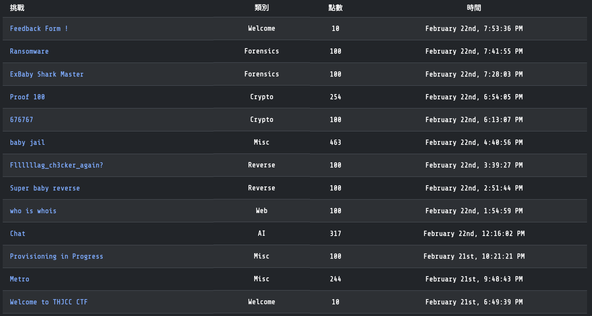
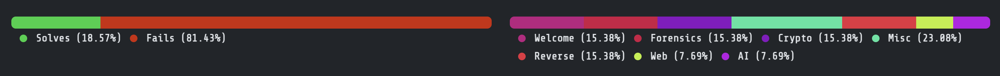
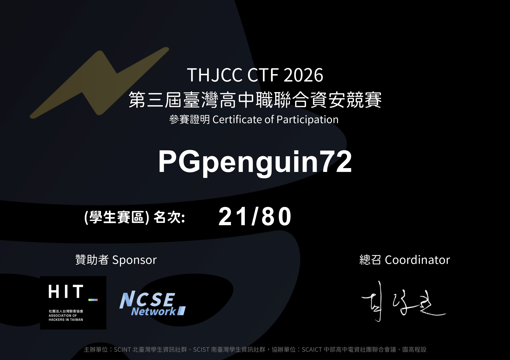

# 前言
## CTF簡介
簡單來說，CTF是一種尋寶活動，出題者會把旗子(Flag)藏在容易受攻擊的程序和網站中。參賽者須要想辦法透過各種方式找到旗子就贏了！
 
:::Note
Flag 旗子：通常會是 ```PGCTF{Y0u_F0und_7h15_Fl@5}``` 這種格式的文字，也有可能會拆開來藏在任何地方或用各種加密的方式藏起來。
:::

## CTF會接觸到哪些東西呢？
其實很多，各種你想得到的都有可能，如果你對資訊（特別是資訊安全）有興趣的話，一定要挑戰看看CTF，這會讓你很快的增加你的資訊知識！

## 要怎麼練習CTF呢？
CTF 練習的管道我自己是用 picoCTF 來練習啦，就是多做題目，查查資料這樣。

還有CTF真的很吃你的見識淺薄，所以CTF不外乎就是練習，要不就是去接觸更廣的知識。

::link{url="https://picoctf.org/" text="picoCTF官方網站"}


## THJCC 是什麼？
THJCC CTF 是一場**專為臺灣高中生舉辦的線上資安競賽**，由 SCINT 北臺灣學生資訊社群、全國志同道合的學生共同主辦，並獲得多個資安組織與單位支持。比賽採 **Jeopardy 題型**，題目涵蓋 Web、Reverse、Crypto、Pwn 與 Misc，兼顧入門學習與進階挑戰。賽事宗旨在於**推廣資訊安全教育，培養高中生對資安技術的興趣與實作能力**。在比賽時更有可能獲得**獎金**、**獎狀**等獎勵，讓選手在競賽過程中增加應對未來比賽的信心。

THJCC CTF 不僅是競爭舞台，更是學習與交流的平台。

> [!NOTE] 
> 以上介紹文字來自於 [THJCC 官方網站](https://thjcc.org/)。

---

# 心得
我第一次接觸到資安CTF是在`2025 資訊社團聯合工作坊`的課程中，當時第一次使用了PicoCTF平台，由於我自己平時就會看一些資訊的東西，再加上主辦方挑的題目也沒有特別的難...? 

所以就莫名其妙的就成為第三個解開[這堆謎題](https://hackmd.io/@MjmL3xnCT3epXL6i7aaUUg/BJW9kfLaJg)的人（有照片喔，當時的我不知道為什麼莫名其妙的嚴肅...?）

然後過了不久，原本看到了`THJCC CTF 2025`的活動消息，我就加入伺服器想著想要挑戰看看，結果一個不小心那個禮拜忘記了，沒有參加到QwQ 

於是我又等了一年，這次我就有記得了去報名了！

然後寫CTF的時候，我看到了很多題目，但由於許久沒有碰這些東西也有點忘記了... 

所以我就邊查資料邊寫這些題目，越寫越上手...? 於是：



反正最後就拿了個學生榜21?（如果算上那些原本可以對但沒看的題目來說的話... 可能可以到 學生榜12...? 我不知道，反正人生沒有如果，這些馬後炮就沒意義了）



既然不是很滿意這次的成績，我只好先在write-up的地方努力，把這次的題目都檢討一遍，能提升自己實力的同時，也有可能拿到潛力獎。

期待明年的`THJCC CTF 2027`，在這期間我會努力進步的！

---

# Bonus：
最近玩CTF玩到有點上頭了，於是我搞了一個「非常簡單」的小 CTF，主要用到這次 THJCC CTF 2026 的一些技巧（也有少數額外小延伸），有興趣可以來玩玩！

## 題目內容：
- 一個奇怪的檔案：https://file.pg72.tw/share/-ui1zDOk
- 繳交區：https://ctf.pg72.tw/

## 獎勵：
> 第一名 7-11 300 元商品卡乙張（記得截圖最後解出畫面 + DM 我）  
> (備註：非在台人士可兌換成`"Discord Nitro 1 Month"`)

## 規則 / 說明：
> 1. 題目都由「奇怪的音樂」這個檔案一路展開，請先下載再慢慢挖。
> 2. 本次所有題目都不需要攻擊伺服器，禁止對 *.pg72.tw 進行掃描、爆破或任何惡意攻擊。
> 3. 禁止暴力亂猜 Flag，如有異常大量提交或可疑行為，將直接取消資格。
> 4. 第一名請提交簡單 Writeup（過程筆記即可），如果沒有提交將會取消領獎資格並順位。
> 5. 第一名成功解題後將會公布官方WP，但還是可以繼續提交，就算排名而已。

> [!IMPORTANT]
> 規則最終解釋權由 [PGpenguin72](https://pg72.tw) 所有。

## Hint：
### First Hint, Release On Mar. 3rd：
- Part1 : :spoiler[.zip]
- Part2 : :spoiler[Slow scan TV]
- Part3 : :spoiler[00:14 ~ 00:17]

### Second Hint, Release On Mar. 4th:
- Part1 : :spoiler[Password is password]
- Part2 : :spoiler[Just shifting.]
- Part3 : :spoiler[How to see the sound?]
這次提示感覺給的不好 但我詞窮了:（

## 修補：
由於我第一次設計這種題目，然後我當時設定的時候不小心把密碼複製錯誤了，導致會沒辦法正確將 `某個.xslx` 解出來。

如果你已經遇到這個問題請使用這個xslx，並且我將移除裡面的加密鎖。

下載密碼為你解出的.xslx檔案名稱（不需要副檔名
https://file.pg72.tw/share/d6qSGFoW

---

# 更新歷史：
## 題目：
- 2025/02/23："Welcome/Welcome to THJCC CTF" to "Misc/Lock?"
- 2025/02/24："Forensics/Ransomware" to "Forensics/CoLoR iS cOdE"
- 2025/02/25："Web/Las Vegas" to "Web/A long time ago..."
- 2026/02/26："Web/Secret File Viewer" to "Web/0422"
- 2026/02/27："Web/msgboard" to "Crypto/676767"
- 2026/02/28："Crypto/Butterfly" to "Crypto/Proof 100"
- 2026/03/01："Crypto/Proof 100" to "Crypto/Shifting...?" 

---

# 版權：
1. 本文之封面圖攝取自 [THJCC官方網站](https://thjcc.org/)。
2. Bonus的音樂版權屬於 [Jamedo.com Daylight by.LEXMusic](https://www.jamendo.com/album/518469/daylight)  。