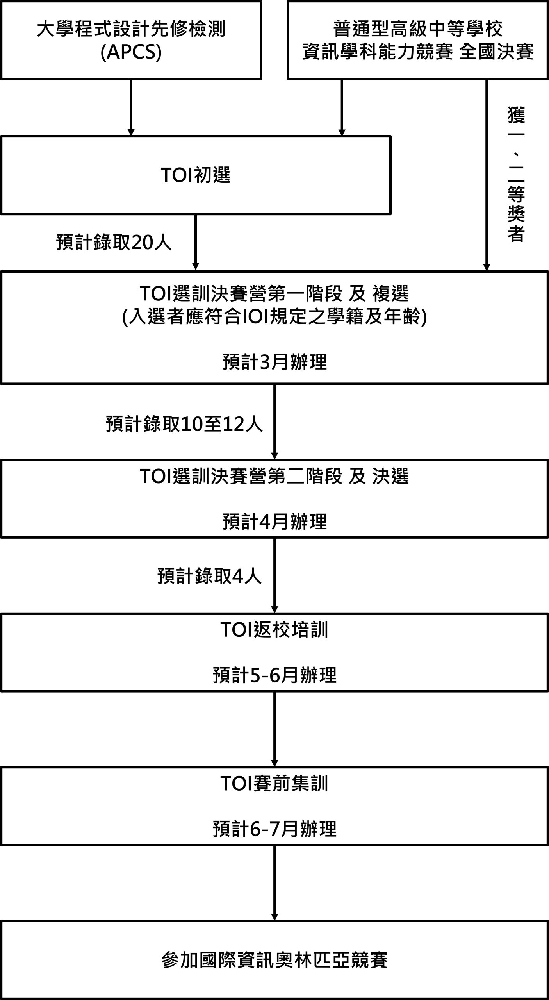
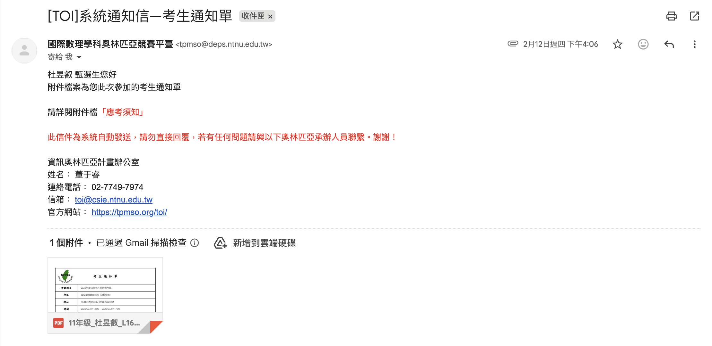
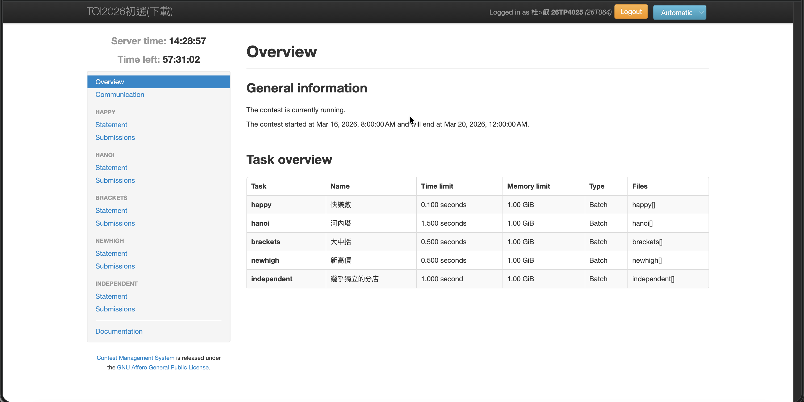
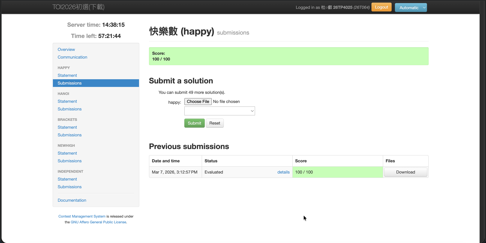
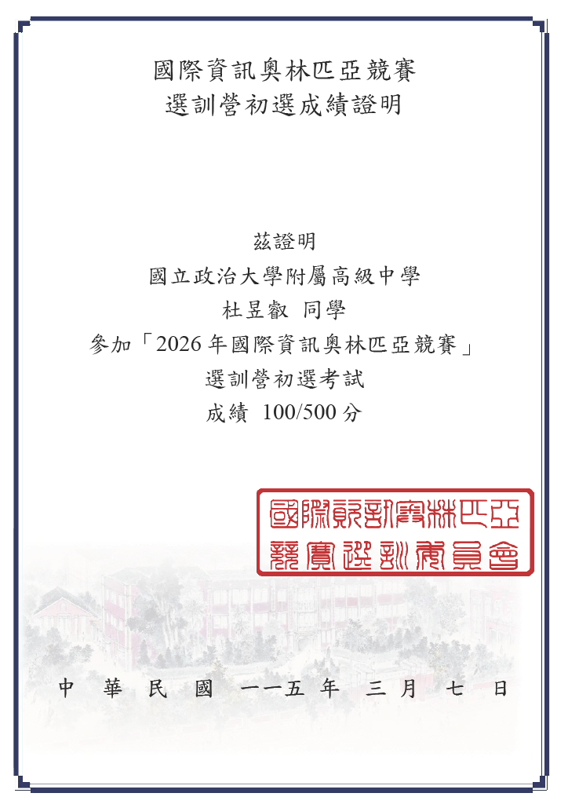

# 前言
## TOI簡介：
**臺灣國際資訊奧林匹亞(Taiwan Olympiad in Informatics; TOI)**，這個競賽主要是為了篩選出代表台灣的4位代表到國際上去和世界的資訊人才一起比TOI，競賽會要求使用各種演算法，還有限制程式運行的時間，具體競賽流程可以參考一下下面：

## IOI簡介：
**國際資訊奧林匹亞(International Olympiad in Informatics; IOI)**為國際間中等學校學生參與之一項學術競賽活動。 此項活動係1987年10月保加利亞籍教授Sendov 在第24屆聯合國教育、科學與文化組織(United Nations Educational, Scientific and Cultural Organization;UNESCO)大會提出國際資訊奧林匹亞的構想， 1989年5月,UNESCO首度發起並資助保加利亞之Pravetz市舉行第1屆國際資訊奧林匹亞競賽(IOI)活動。爾後每年均在不同國家舉行。 從1989年之首屆IOI, 到1997年之第9屆IOI, 參賽隊伍也由13個增至近60隊, 堪稱國際上一項重要之青少年學術競賽活動。

> [!NOTE] 
> 以上介紹文字來自於 [TOI 官方網站](https://tpmso.org/toi)。

## 要怎麼練習資奧呢？
我不知道，但我現在正在嘗試每日做 ZeroJudge 的題目，還有做歷屆考古題，並且買了一些競賽演算法的書來看。我認為就多讀一點書和多寫一點題目吧...?

---

# 心得
這次 TOI 我其實準備的很少，我打著我正好有APCS實作有3級然後就去考考看，~~反正看起來很酷就好~~，於是我就去和學校報TOI了：

考試當天，其實我很緊張，一來我對TOI不熟，二來我怕我連一題都寫不出來，而且前幾天考APCS模擬測驗考的也是一蹋糊塗，直到我因為太緊張又去刷TOI官網去了解TOI後我豁然了。  
全台灣只會選出20個人進一階，那我其實不用太緊張，畢竟我大概應該是考不過的，就當經驗經驗就好。  
於是我抱持著有點忐忑的心情慢慢地走過去考場--國立師範大學-公館分部。  
我到的時間是 13:40 左右，那個時候我就先簽到，並將貼紙（號碼牌）貼在我的身上。  
過了不久試務人員突然宣布考試整體延後30分鐘，不知道是啥原因，但就延誤了，反正我們等了30分鐘後就一起進場考試。  

::link{url="https://file.pg72.tw/share/GcRmsZKF" text="TOI 2026原題目" icon="https://file.pg72.tw/static/img/logo.svg"}
我看了這次的題本，裡面題目都看不懂😢，我真的寫不出來，但第一題勉強看得懂一點點，反正在 `15:12:57` 時就把第一題解出來了，然後後面就沒都沒寫了:L  

在考試途中有件很有趣的事情，我換了兩次電腦，第一次是因為我沒辦法打開Visual Studio Code，第二次是評測網頁打不開，好像被中斷連線了（？  
反正也不會寫，阿就一直換，後面好像 16:30 左右我就提前先交卷了，不會寫就不想浪費時間在這上面。  
考完後我和我以前內湖國中的同學一起去吃飯，聊了天就回家了。  
過了不知道幾天，成績就下來了，我也不意外的拿了一個很爛的成績。

好吧，這次真的考得不理想，但我想要努力去學習，爭取看看明年能不能進一階，這次就當經驗經驗，我會逐漸地把每題的解題思路和技巧寫下來（我會去詢問AI並努力學習。），並放在子文章中（可以回到網頁最上面選擇題目。）就醬吧，這次心得就到這裡喔:D

---

# 版權：
1. 本文之封面圖攝取自 [TOI 官方網站](https://tpmso.org/toi)。
2. 本試題原檔著作權為 [TOI 工作小組](https://tpmso.org/toi) 所有，僅授權作為非營利學習與教學使用之目的轉載與參考。任何超出前述範圍之重製、散布、公開傳輸、改作或其他利用行為，均須事前取得 TOI 工作小組或相關權利人之書面同意。